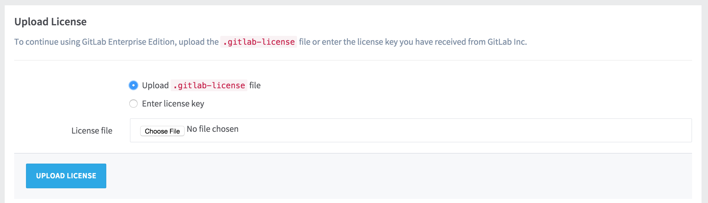
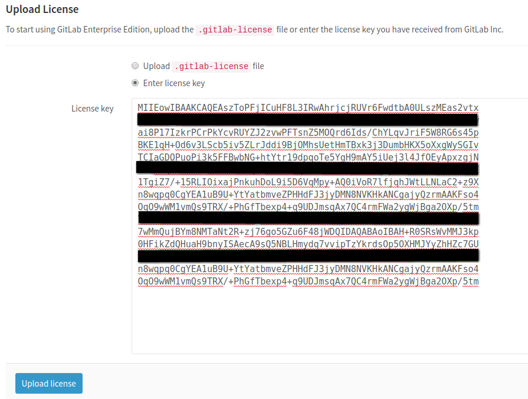
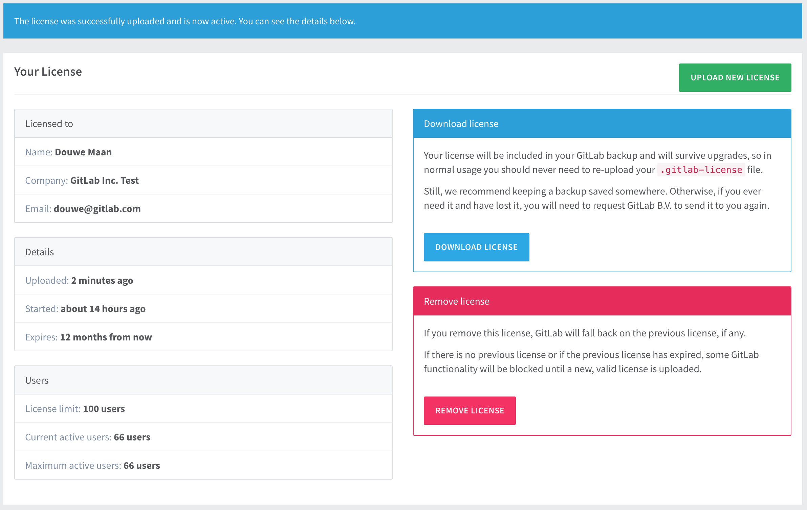
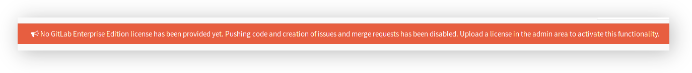

# Installing your license

To activate all GitLab Enterprise Edition functionality, you need to upload a
license. Once you've received your license from GitLab Inc., you can upload it
by signing into your GitLab instance as an admin, and navigating to
**Admin Area > License**.

If you've received a `.gitlab-license` file, you can upload it directly.

If you've received your license as plain text, you need to select the
"Enter license key" option, copy the license and paste it into the "License key"
field.

Once you've uploaded your license, all GitLab Enterprise Edition functionality
will be active until the end of the license period.

You can review the license details at any time in the License section of the
Admin Area.

## Notification before the license expires

One month before the license expires, a message informing when the expiration
is due to will be shown to GitLab admins. Make sure that you update your license
beforehand otherwise you will miss important features if it expires.

## What happens when my license expires?

In case your license expires, you will not be able to push any commits to
GitLab and creation of new issues and merge requests will be disabled.

A message to inform of the locked state of GitLab will be presented to
admins only.

