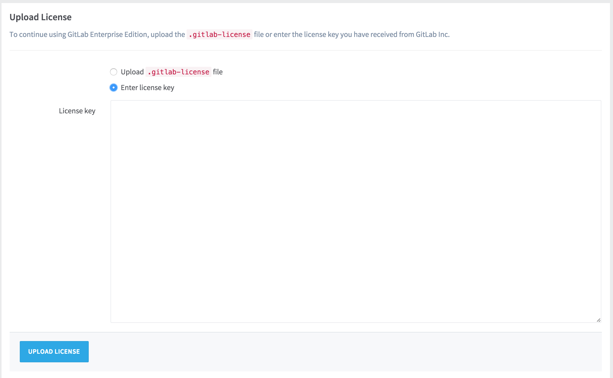

# Installing your license

To activate all GitLab Enterprise Edition functionality, you need to upload a license.
Once you've received your license from GitLab Inc., you can upload it by signing into your GitLab instance as an admin, and navigating to **Admin Area &gt; License**.

If you've received a `.gitlab-license` file, you can upload it directly.

If you've received your license as plain text, you need to select the "Enter license key" option, copy the license and paste it into the "License key" field.

Once you've uploaded your license, all GitLab Enterprise Edition functionality will be active until the end of the license period.

You can review the license details at any time in the License section of the Admin Area.

