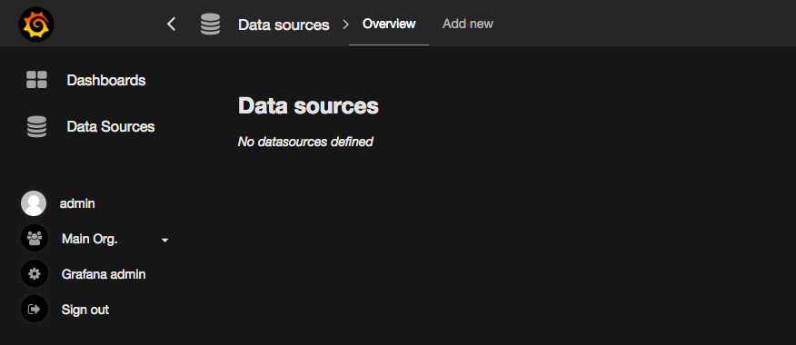
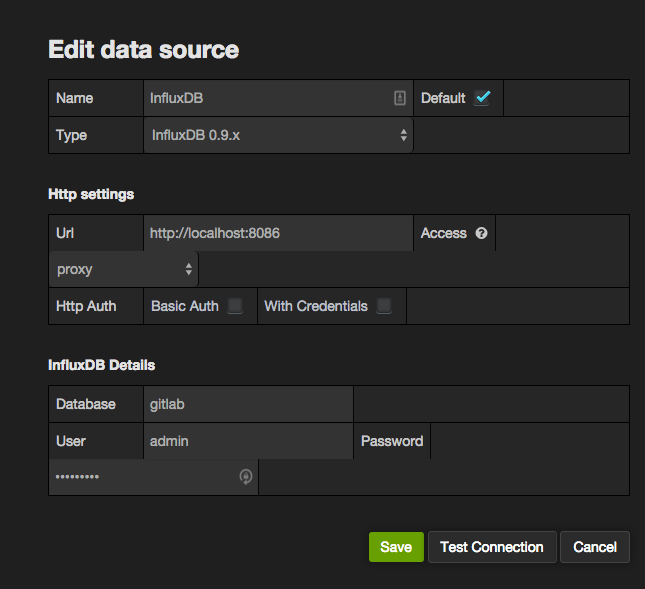
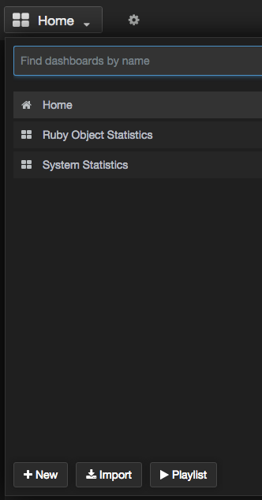
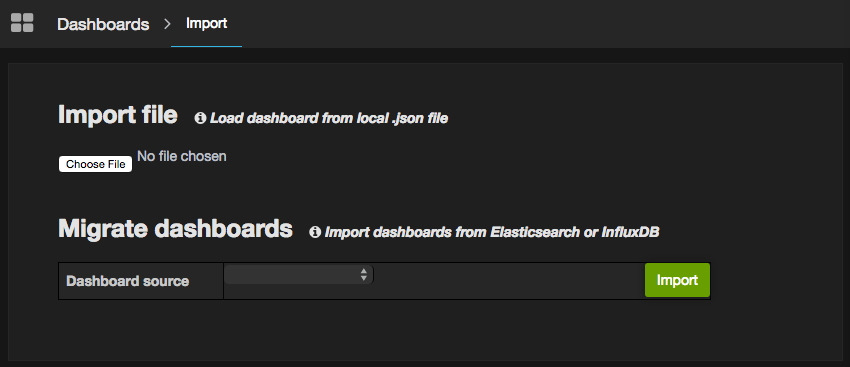
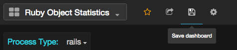

# Grafana Configuration

[Grafana](http://grafana.org/) is a tool that allows you to visualize time
series metrics through graphs and dashboards. It supports several backend
data stores, including InfluxDB. GitLab writes performance data to InfluxDB
and Grafana will allow you to query InfluxDB to display useful graphs.

For the easiest installation and configuration, install Grafana on the same
server as InfluxDB. For larger installations, you may want to split out these
services.

## Installation

Grafana supplies package repositories (Yum/Apt) for easy installation.
See [Grafana installation documentation](http://docs.grafana.org/installation/)
for detailed steps.

> **Note**: Before starting Grafana for the first time, set the admin user
and password in `/etc/grafana/grafana.ini`. Otherwise, the default password
will be `admin`.

## Configuration

Login as the admin user. Expand the menu by clicking the Grafana logo in the
top left corner. Choose 'Data Sources' from the menu. Then, click 'Add new'
in the top bar.



Fill in the configuration details for the InfluxDB data source. Save and
Test Connection to ensure the configuration is correct.

- **Name**: InfluxDB
- **Default**: Checked
- **Type**: InfluxDB 0.9.x (Even if you're using InfluxDB 0.10.x)
- **Url**: https://localhost:8086 (Or the remote URL if you've installed InfluxDB
on a separate server)
- **Access**: proxy
- **Database**: gitlab
- **User**: admin (Or the username configured when setting up InfluxDB)
- **Password**: The password configured when you set up InfluxDB



## Apply retention policies and create continuous queries

If you intend to import the GitLab provided Grafana dashboards, you will need to
set up the right retention policies and continuous queries. The easiest way of
doing this is by using the [influxdb-management](https://gitlab.com/gitlab-org/influxdb-management)
repository.

To use this repository you must first clone it:

```
git clone https://gitlab.com/gitlab-org/influxdb-management.git
cd influxdb-management
```

Next you must install the required dependencies:

```
gem install bundler
bundle install
```

Now you must configure the repository by first copying `.env.example` to `.env`
and then editing the `.env` file to contain the correct InfluxDB settings. Once
configured you can simply run `bundle exec rake` and the InfluxDB database will
be configured for you.

For more information see the [influxdb-management README](https://gitlab.com/gitlab-org/influxdb-management/blob/master/README.md).

## Import Dashboards

You can now import a set of default dashboards that will give you a good
start on displaying useful information. GitLab has published a set of default
[Grafana dashboards][grafana-dashboards] to get you started. Clone the
repository or download a zip/tarball, then follow these steps to import each
JSON file.

Open the dashboard dropdown menu and click 'Import'



Click 'Choose file' and browse to the location where you downloaded or cloned
the dashboard repository. Pick one of the JSON files to import.



Once the dashboard is imported, be sure to click save icon in the top bar. If
you do not save the dashboard after importing it will be removed when you
navigate away.



Repeat this process for each dashboard you wish to import.

Alternatively you can automatically import all the dashboards into your Grafana
instance. See the README of the [Grafana dashboards][grafana-dashboards]
repository for more information on this process.

[grafana-dashboards]: https://gitlab.com/gitlab-org/grafana-dashboards

---

Read more on:

- [Introduction to GitLab Performance Monitoring](introduction.md)
- [GitLab Configuration](gitlab_configuration.md)
- [InfluxDB Installation/Configuration](influxdb_configuration.md)
- [InfluxDB Schema](influxdb_schema.md)
