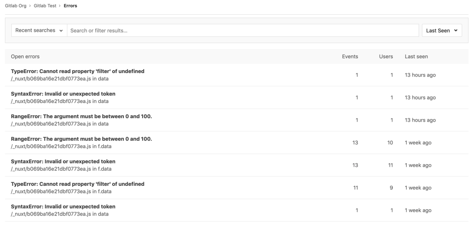
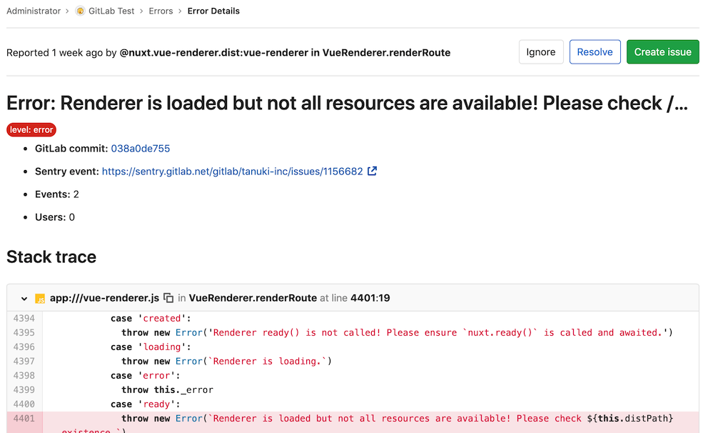

# Error Tracking **(FREE)**

> [Introduced](https://gitlab.com/groups/gitlab-org/-/epics/169) in GitLab 11.8.

Error Tracking allows developers to easily discover and view the errors that their application may be generating. By surfacing error information where the code is being developed, efficiency and awareness can be increased.

## Sentry error tracking

[Sentry](https://sentry.io/) is an open source error tracking system. GitLab allows administrators to connect Sentry to GitLab, to allow users to view a list of Sentry errors in GitLab.

### Deploying Sentry

You can sign up to the cloud hosted [Sentry](https://sentry.io), deploy your own [on-premise instance](https://github.com/getsentry/onpremise/), or use GitLab to [install Sentry to a Kubernetes cluster](../user/clusters/applications.md#install-sentry-using-gitlab-cicd). To make this easier, we are [considering shipping Sentry with GitLab](https://gitlab.com/gitlab-org/omnibus-gitlab/-/issues/5343).

### Enabling Sentry

GitLab provides an easy way to connect Sentry to your project. You need at
least Maintainer [permissions](../user/permissions.md) to enable the Sentry integration.

1. Sign up to Sentry.io or [deploy your own](#deploying-sentry) Sentry instance.
1. [Create](https://docs.sentry.io/product/sentry-basics/guides/integrate-frontend/create-new-project/) a new Sentry project. For each GitLab project that you want to integrate, we recommend that you create a new Sentry project.
1. [Find or generate](https://docs.sentry.io/api/auth/) a Sentry auth token for your Sentry project.
   Make sure to give the token at least the following scopes: `event:read`, `project:read`, and `event:write` (for resolving events).
1. In GitLab, navigate to your project's **Monitor > Error Tracking** page, and
   click **Enable Error Tracking**.
1. Navigate to your project's **Settings > Monitor**. In the **Error Tracking** section,
   ensure the **Active** checkbox is set.
1. In the **Sentry API URL** field, enter your Sentry hostname. For example, enter `https://sentry.example.com` if this is the address at which your Sentry instance is available. For the SaaS version of Sentry, the hostname is `https://sentry.io`.
1. In the **Auth Token** field, enter the token you previously generated.
1. Click the **Connect** button to test the connection to Sentry and populate the **Project** dropdown.
1. From the **Project** dropdown, choose a Sentry project to link to your GitLab project.
1. Click **Save changes** for the changes to take effect.
1. You can now visit **Monitor > Error Tracking** in your project's sidebar to [view a list](#error-tracking-list) of Sentry errors.

### Enabling GitLab issues links

You may also want to enable Sentry's GitLab integration by following the steps in the [Sentry documentation](https://docs.sentry.io/product/integrations/gitlab/)

## Error Tracking List

Users with at least Reporter [permissions](../user/permissions.md)
can find the Error Tracking list at **Monitor > Error Tracking** in your project's sidebar.
Here, you can filter errors by title or by status (one of Ignored , Resolved, or Unresolved) and sort in descending order by Frequency, First Seen, or Last Seen. By default, the error list is ordered by Last Seen and filtered to Unresolved errors.

## Error Details

From error list, users can navigate to the error details page by clicking the title of any error.

This page has:

- A link to the Sentry issue.
- A link to the GitLab commit if the Sentry [release ID/version](https://docs.sentry.io/product/releases/?platform=javascript#configure-sdk) on the Sentry Issue's first release matches a commit SHA in your GitLab hosted project.
- Other details about the issue, including a full stack trace.
- In [GitLab 12.7 and newer](https://gitlab.com/gitlab-org/gitlab/-/issues/36246), language and urgency are displayed.

By default, a **Create issue** button is displayed:

If you create a GitLab issue from the error, the **Create issue** button changes to a **View issue**
button and a link to the GitLab issue displays within the error detail section.

## Taking Action on errors

You can take action on Sentry Errors from within the GitLab UI.

### Ignoring errors

> [Introduced](https://gitlab.com/gitlab-org/gitlab/-/issues/39665) in GitLab 12.7.

From within the [Error Details](#error-details) page you can ignore a Sentry error by clicking the **Ignore** button near the top of the page.

Ignoring an error prevents it from appearing in the [Error Tracking List](#error-tracking-list), and silences notifications that were set up within Sentry.

### Resolving errors

> [Introduced](https://gitlab.com/gitlab-org/gitlab/-/issues/39825) in GitLab 12.7.

From within the [Error Details](#error-details) page you can resolve a Sentry error by
clicking the **Resolve** button near the top of the page.

Marking an error as resolved indicates that the error has stopped firing events. If a GitLab issue is linked to the error, then the issue closes.

If another event occurs, the error reverts to unresolved.
