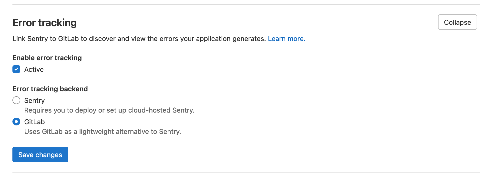
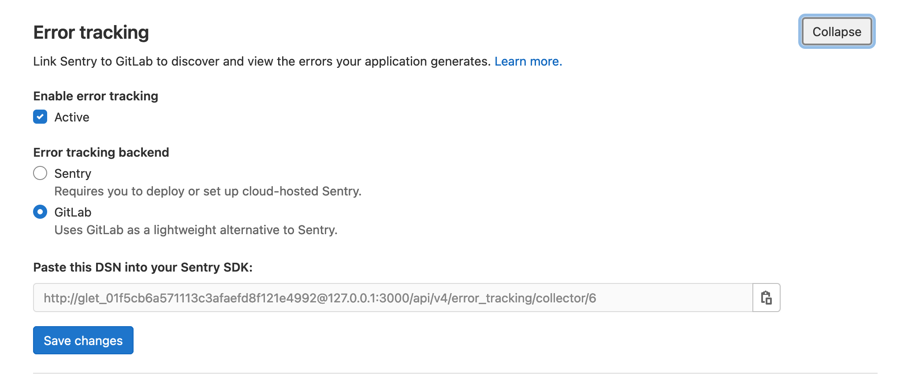

# Error Tracking **(FREE)**

Error Tracking allows developers to easily discover and view the errors that their application may be generating. By surfacing error information where the code is being developed, efficiency and awareness can be increased.

## How error tracking works

For error tracking to work, you need two pieces:

- **Your application with Sentry SDK:** when the error happens, Sentry SDK captures information
  about it and sends it over the network to the backend. The backend stores information about all
  errors.

- **Error tracking backend:** the backend can be either GitLab itself or Sentry. When it's GitLab,
  we name it _integrated error tracking_ because you don't need to set up a separate backend. It's
  already part of the product.

  - To use the GitLab backend, see [integrated error tracking](#integrated-error-tracking).
  - To use Sentry as the backend, see [Sentry error tracking](#sentry-error-tracking).

  No matter what backend you choose, the [error tracking UI](#error-tracking-list)
  is the same.

## Sentry error tracking

[Sentry](https://sentry.io/) is an open source error tracking system. GitLab allows administrators to connect Sentry to GitLab, to allow users to view a list of Sentry errors in GitLab.

### Deploying Sentry

You can sign up to the cloud hosted [Sentry](https://sentry.io), deploy your own [on-premise instance](https://github.com/getsentry/onpremise/), or use GitLab to [install Sentry to a Kubernetes cluster](../user/infrastructure/clusters/manage/management_project_applications/sentry.md).

### Enabling Sentry

GitLab provides an easy way to connect Sentry to your project. You need at
least Maintainer [permissions](../user/permissions.md) to enable the Sentry integration.

1. Sign up to Sentry.io or [deploy your own](#deploying-sentry) Sentry instance.
1. [Create](https://docs.sentry.io/product/sentry-basics/guides/integrate-frontend/create-new-project/) a new Sentry project. For each GitLab project that you want to integrate, we recommend that you create a new Sentry project.
1. Find or generate a [Sentry auth token](https://docs.sentry.io/api/auth/#auth-tokens).
   For the SaaS version of Sentry, you can find or generate the auth token at [https://sentry.io/api/](https://sentry.io/api/).
   Make sure to give the token at least the following scopes: `project:read`, `event:read`, and
   `event:write` (for resolving events).
1. In GitLab, enable error tracking:
   1. On the top bar, select **Menu > Projects** and find your project.
   1. On the left sidebar, select **Monitor > Error Tracking**.
   1. Select **Enable error tracking**.
1. In GitLab, ensure error tracking is active.
   1. On the left sidebar, select **Settings > Monitor**.
   1. Expand **Error Tracking**.
   1. Ensure the **Active** checkbox is selected.
1. In the **Sentry API URL** box, enter your Sentry hostname. For example, enter `https://sentry.example.com`. For the SaaS version of Sentry, the hostname is `https://sentry.io`.
1. In the **Auth Token** box, enter the token you previously generated.
1. To test the connection to Sentry and populate the **Project** dropdown, select **Connect**.
1. From the **Project** list, choose a Sentry project to link to your GitLab project.
1. Select **Save changes**.

You can now visit **Monitor > Error Tracking** in your project's sidebar to [view a list](#error-tracking-list) of Sentry errors.

### Enabling GitLab issues links

You may also want to enable Sentry's GitLab integration by following the steps in the [Sentry documentation](https://docs.sentry.io/product/integrations/gitlab/)

### Enable GitLab Runner

To configure GitLab Runner with Sentry, you must add the value for `sentry_dsn` to your GitLab
Runner's `config.toml` configuration file, as referenced in [GitLab Runner Advanced Configuration](https://docs.gitlab.com/runner/configuration/advanced-configuration.html).
While setting up Sentry, select **Go** if you're asked for the project type.

If you see the following error in your GitLab Runner logs, then you should specify the deprecated
DSN in **Sentry.io > Project Settings > Client Keys (DSN) > Show deprecated DSN**.

```plaintext
ERROR: Sentry failure builds=0 error=raven: dsn missing private key
```

## Error Tracking List

Users with at least Reporter [permissions](../user/permissions.md)
can find the Error Tracking list at **Monitor > Error Tracking** in your project's sidebar.
Here, you can filter errors by title or by status (one of Ignored , Resolved, or Unresolved) and sort in descending order by Frequency, First Seen, or Last Seen. By default, the error list is ordered by Last Seen and filtered to Unresolved errors.


## Error Details

From error list, users can navigate to the error details page by clicking the title of any error.

This page has:

- A link to the Sentry issue.
- A link to the GitLab commit if the Sentry [release ID/version](https://docs.sentry.io/product/releases/?platform=javascript#configure-sdk) on the Sentry Issue's first release matches a commit SHA in your GitLab hosted project.
- Other details about the issue, including a full stack trace.
- In [GitLab 12.7 and newer](https://gitlab.com/gitlab-org/gitlab/-/issues/36246), language and urgency are displayed.

By default, a **Create issue** button is displayed:


If you create a GitLab issue from the error, the **Create issue** button changes to a **View issue**
button and a link to the GitLab issue displays within the error detail section.

## Taking Action on errors

You can take action on Sentry Errors from within the GitLab UI. Marking errors ignored or resolved require at least Developer role.

### Ignoring errors

> [Introduced](https://gitlab.com/gitlab-org/gitlab/-/issues/39665) in GitLab 12.7.

From within the [Error Details](#error-details) page you can ignore a Sentry error by clicking the **Ignore** button near the top of the page.

Ignoring an error prevents it from appearing in the [Error Tracking List](#error-tracking-list), and silences notifications that were set up within Sentry.

### Resolving errors

> [Introduced](https://gitlab.com/gitlab-org/gitlab/-/issues/39825) in GitLab 12.7.

From within the [Error Details](#error-details) page you can resolve a Sentry error by
clicking the **Resolve** button near the top of the page.

Marking an error as resolved indicates that the error has stopped firing events. If a GitLab issue is linked to the error, then the issue closes.

If another event occurs, the error reverts to unresolved.

## Integrated error tracking

> - [Introduced](https://gitlab.com/gitlab-org/gitlab/-/issues/329596) in GitLab 14.4.
> - [Disabled](https://gitlab.com/gitlab-org/gitlab/-/issues/353639) in GitLab 14.9 [with a flag](../administration/feature_flags.md) named `integrated_error_tracking`. Disabled by default.

FLAG:
By default this feature is not available. To make it available on self-managed GitLab, ask an
administrator to [enable the feature flag](../administration/feature_flags.md)
named `integrated_error_tracking`. The feature is not ready for production use.
On GitLab.com, this feature is not available.

WARNING:
Turning on integrated error tracking may impact performance, depending on your error rates.

Integrated error tracking is a lightweight alternative to Sentry backend.
You still use Sentry SDK with your application. But you don't need to deploy Sentry
or set up for cloud-hosted Sentry. Instead, you use GitLab as a backend for it.

Sentry backend automatically assigns a Data Source Name (DSN) for every project you create.
GitLab does the same. You should be able to find a DSN for your project in the GitLab error tracking
settings. By using a GitLab-provided DSN, your application connects to GitLab to report an error.
Those errors are stored in the GitLab database and rendered by the GitLab UI, in the same way as
Sentry integration.

### Project settings

You can find the feature configuration at **Settings > Monitor > Error Tracking**.

#### How to enable

1. Select **GitLab** as the error tracking backend for your project:

    

1. Select **Save changes**. After page reload you should see a text field with the DSN string. Copy it.

    

1. Take the DSN from the previous step and configure your Sentry SDK with it. Errors are now
   reported to the GitLab collector and are visible in the [GitLab UI](#error-tracking-list).

#### Managing DSN

When you enable the feature you receive a DSN. It includes a hash used for authentication. This hash
is a client key. GitLab uses client keys to authenticate error tracking requests from your
application to the GitLab backend.

In some situations, you may want to create a new client key and remove an existing one.
You can do so by managing client keys with the [error tracking API](../api/error_tracking.md).

#### Limitations

The Integrated Error Tracking feature was built and tested with Sentry SDK for Ruby on Rails.
Support for other languages and frameworks is not guaranteed. For up-to-date information, see the
[compatibility issue](https://gitlab.com/gitlab-org/gitlab/-/issues/340178).
