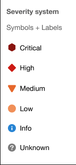
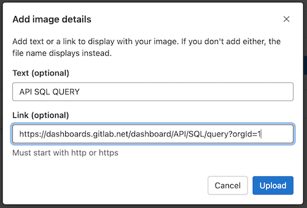
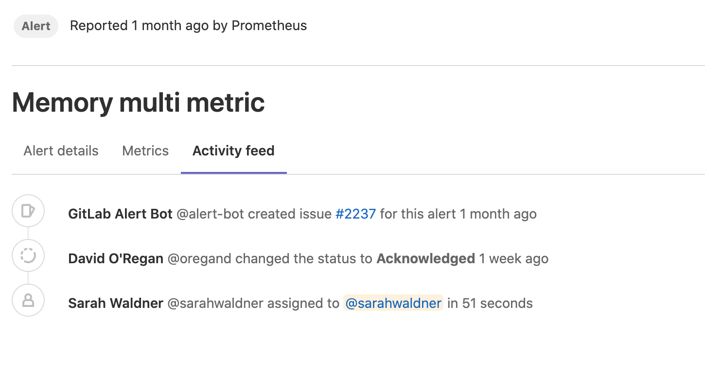
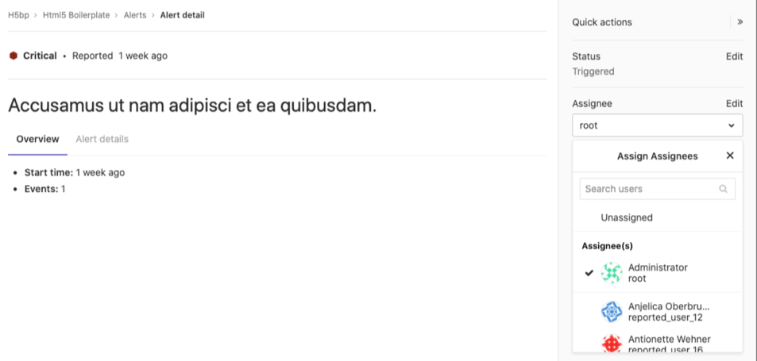

DETAILS:
**Tier:** Free, Premium, Ultimate
**Offering:** GitLab.com, GitLab Self-Managed, GitLab Dedicated

Alerts are a critical entity in your incident management workflow. They represent a notable event that might indicate a service outage or disruption. GitLab provides a list view for triage and detail view for deeper investigation of what happened.

## Alert list

Users with at least the Developer role can access the Alert list at **Monitor > Alerts** in your project's sidebar. The Alert list displays alerts sorted by start time, but you can change the sort order by selecting the headers in the Alert list.

The alert list displays the following information:

- **Search**: The alert list supports a simple free text search on the title,
  description, monitoring tool, and service fields.
- **Severity**: The current importance of a alert and how much attention it
  should receive. For a listing of all statuses, read [Alert Management severity](#alert-severity).
- **Start time**: How long ago the alert fired. This field uses the standard
  GitLab pattern of `X time ago`, but is supported by a granular date/time
  tooltip depending on the user's locale.
- **Alert description**: The description of the alert, which attempts to
  capture the most meaningful data.
- **Event count**: The number of times that an alert has fired.
- **Issue**: A link to the incident issue that has been created for the alert.
- **Status**: The current status of the alert:
  - **Triggered**: Investigation has not started.
  - **Acknowledged**: Someone is actively investigating the problem.
  - **Resolved**: No further work is required.
  - **Ignored**: No action is taken on the alert.

## Alert severity

Each level of alert contains a uniquely shaped and color-coded icon to help you identify the severity of a particular alert. These severity icons help you immediately identify which alerts you should prioritize investigating:

Alerts contain one of the following icons:

<!-- vale gitlab_base.SubstitutionWarning = NO -->

| Severity | Icon                    | Color (hexadecimal) |
|----------|-------------------------|---------------------|
| Critical | **{severity-critical}** | `#8b2615`           |
| High     | **{severity-high}**     | `#c0341d`           |
| Medium   | **{severity-medium}**   | `#fca429`           |
| Low      | **{severity-low}**      | `#fdbc60`           |
| Info     | **{severity-info}**     | `#418cd8`           |
| Unknown  | **{severity-unknown}**  | `#bababa`           |

<!-- vale gitlab_base.SubstitutionWarning = YES -->

## Alert details page

Go to the Alert details view by visiting the [Alert list](alerts.md) and selecting an alert from the list. You need at least the Developer role to access alerts. Select any alert in the list to examine its alert details page.

Alerts provide **Overview** and **Alert details** tabs to give you the right amount of information you need.

### Alert details tab

The **Alert details** tab has two sections. The top section provides a short list of critical details such as the severity, start time, number of events, and originating monitoring tool. The second section displays the full alert payload.

### Metrics tab

This tab shows a metrics chart for alerts coming from Prometheus. In many cases, alerts are associated to metrics. You can upload screenshots of metric charts in the **Metrics** tab.

To do so, either:

- Select **upload** and then select an image from your file browser.
- Drag a file from your file browser and drop it in the drop zone.

When you upload an image, you can add text to the image and link it to the original graph.

If you add a link, it is shown above the uploaded image.

### Activity feed tab

The **Activity feed** tab is a log of activity on the alert. When you take action on an alert, this is logged as a system note. This gives you a linear timeline of the alert's investigation and assignment history.

The following actions result in a system note:

- [Updating the status of an alert](#change-an-alerts-status)
- [Creating an incident based on an alert](manage_incidents.md#from-an-alert)
- [Assignment of an alert to a user](#assign-an-alert)
- [Escalation of an alert to on-call responders](paging.md#escalating-an-alert)

## Alert actions

There are different actions available in GitLab to help triage and respond to alerts.

### Change an alert's status

You can change the status of an alert.

The available statuses are:

- Triggered (default for new alerts)
- Acknowledged
- Resolved

Prerequisites:

- You must have at least the Developer role.

To change an alert's status:

- From the [alert list](#alert-list):

  1. In the **Status** column, next to an alert, select the status dropdown list.
  1. Select a status.

- From the [alert details page](#alert-details-page):

  1. On the right sidebar, select **Edit**.
  1. Select a status.

To stop email notifications for alert recurrences in projects with [email notifications enabled](paging.md#email-notifications-for-alerts), change the alert's status away from **Triggered**.

#### Resolve an alert by closing the linked incident

Prerequisites:

- You must have at least the Reporter role.

When you [close an incident](manage_incidents.md#close-an-incident) that is linked to an alert, GitLab [changes the alert's status](#change-an-alerts-status) to **Resolved**. You are then credited with the alert's status change.

#### As an on-call responder

DETAILS:
**Tier:** Premium, Ultimate
**Offering:** GitLab.com, GitLab Self-Managed, GitLab Dedicated

On-call responders can respond to [alert pages](paging.md#escalating-an-alert) by changing the alert status.

Changing the status has the following effects:

- To **Acknowledged**: limits on-call pages based on the project's [escalation policy](escalation_policies.md).
- To **Resolved**: silences all on-call pages for the alert.
- From **Resolved** to **Triggered**: restarts the alert escalating.

In GitLab 15.1 and earlier, updating the status of an [alert with an associated incident](manage_incidents.md#from-an-alert) also updates the incident status. In [GitLab 15.2 and later](https://gitlab.com/gitlab-org/gitlab/-/issues/356057), the incident status is independent and does not update when the alert status changes.

### Assign an alert

In large teams, where there is shared ownership of an alert, it can be difficult to track who is investigating and working on it. Assigning alerts eases collaboration and delegation by indicating which user is owning the alert. GitLab supports only a single assignee per alert.

To assign an alert:

1. Display the list of current alerts:

   1. On the left sidebar, select **Search or go to** and find your project.
   1. Select **Monitor > Alerts**.

1. Select your desired alert to display its details.

   

1. If the right sidebar is not expanded, select
   **Expand sidebar** (**{chevron-double-lg-right}**) to expand it.

1. On the right sidebar, locate the **Assignee**, and then select **Edit**.
   From the list, select each user you want to assign to the alert.
   GitLab creates a [to-do item](../../user/todos.md) for each user.

After completing their portion of investigating or fixing the alert, users can unassign themselves from the alert. To remove an assignee, select **Edit** next to the **Assignee** dropdown list and clear the user from the list of assignees, or select **Unassigned**.

### Create a to-do item from an alert

You can manually create a [to-do item](../../user/todos.md) for yourself from an alert, and view it later on your **To-Do List**.

To add a to-do item, on the right sidebar, select **Add a to-do item**.

### Trigger actions from alerts

DETAILS:
**Tier:** Ultimate
**Offering:** GitLab.com, GitLab Self-Managed, GitLab Dedicated

Turn on creating [incidents](incidents.md) automatically whenever an alert is triggered.

Prerequisites:

- You must have at least the Maintainer role for the project.

To configure the actions:

1. On the left sidebar, select **Search or go to** and find your project.
1. Select **Settings > Monitor**.
1. Expand the **Alerts** section, then select the **Alert settings** tab.
1. Select the **Create an incident** checkbox.
1. Optional. To customize the incident, from the **Incident template**, select a template to be
   appended to the [incident summary](incidents.md#summary).
   If the dropdown list is empty,
   [create an issue template](../../user/project/description_templates.md#create-an-issue-template) first.
1. Optional. To send [an email notification](paging.md#email-notifications-for-alerts), select the
   **Send a single email notification to Owners and Maintainers for new alerts** checkbox.
1. Select **Save changes**.
