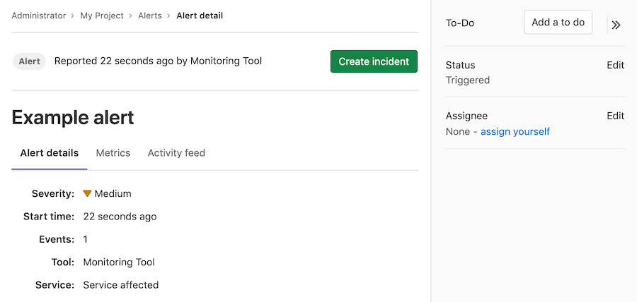

# Alerts **(FREE)**

Alerts are a critical entity in your incident management workflow. They represent a notable event that might indicate a service outage or disruption. GitLab provides a list view for triage and detail view for deeper investigation of what happened.

## Alert List

Users with at least the Developer role can
access the Alert list at **Monitor > Alerts** in your project's
sidebar. The Alert list displays alerts sorted by start time, but
you can change the sort order by clicking the headers in the Alert list.

The alert list displays the following information:

- **Search**: The alert list supports a simple free text search on the title,
  description, monitoring tool, and service fields.
  ([Introduced](https://gitlab.com/gitlab-org/gitlab/-/issues/213884) in GitLab 13.1.)
- **Severity**: The current importance of a alert and how much attention it
  should receive. For a listing of all statuses, read [Alert Management severity](#alert-severity).
- **Start time**: How long ago the alert fired. This field uses the standard
  GitLab pattern of `X time ago`, but is supported by a granular date/time
  tooltip depending on the user's locale.
- **Alert description**: The description of the alert, which attempts to
  capture the most meaningful data.
- **Event count**: The number of times that an alert has fired.
- **Issue**: A link to the incident issue that has been created for the alert.
- **Status**: The current status of the alert:
  - **Triggered**: Investigation has not started.
  - **Acknowledged**: Someone is actively investigating the problem.
  - **Resolved**: No further work is required.
  - **Ignored**: No action will be taken on the alert.

NOTE:
Check out a live example available from the
[`tanuki-inc` project page](https://gitlab-examples-ops-incident-setup-everyone-tanuki-inc.34.69.64.147.nip.io/)
in GitLab to examine alerts in action.

## Alert severity

Each level of alert contains a uniquely shaped and color-coded icon to help
you identify the severity of a particular alert. These severity icons help you
immediately identify which alerts you should prioritize investigating:

Alerts contain one of the following icons:

<!-- vale gitlab.SubstitutionWarning = NO -->

| Severity | Icon                    | Color (hexadecimal) |
|----------|-------------------------|---------------------|
| Critical | **{severity-critical}** | `#8b2615`           |
| High     | **{severity-high}**     | `#c0341d`           |
| Medium   | **{severity-medium}**   | `#fca429`           |
| Low      | **{severity-low}**      | `#fdbc60`           |
| Info     | **{severity-info}**     | `#418cd8`           |
| Unknown  | **{severity-unknown}**  | `#bababa`           |

<!-- vale gitlab.SubstitutionWarning = YES -->

## Alert details page

Navigate to the Alert details view by visiting the [Alert list](alerts.md)
and selecting an alert from the list. You need at least the Developer role
to access alerts.

NOTE:
To review live examples of GitLab alerts, visit the
[alert list](https://gitlab.com/gitlab-examples/ops/incident-setup/everyone/tanuki-inc/-/alert_management)
for this demo project. Select any alert in the list to examine its alert details
page.

Alerts provide **Overview** and **Alert details** tabs to give you the right
amount of information you need.

### Alert details tab

The **Alert details** tab has two sections. The top section provides a short list of critical details such as the severity, start time, number of events, and originating monitoring tool. The second section displays the full alert payload.

### Metrics tab

> - [Introduced](https://gitlab.com/gitlab-org/gitlab/-/issues/217768) in GitLab 13.2.
> - [Changed](https://gitlab.com/gitlab-org/gitlab/-/issues/340852) in GitLab 14.10. In GitLab 14.9 and earlier, this tab shows a metrics chart for alerts coming from Prometheus.

In many cases, alerts are associated to metrics. You can upload screenshots of metric
charts in the **Metrics** tab.

To do so, either:

- Select **upload** and then select an image from your file browser.
- Drag a file from your file browser and drop it in the drop zone.

When you upload an image, you can add text to the image and link it to the original graph.

If you add a link, it is shown above the uploaded image.

#### View an alert's logs

> - [Introduced](https://gitlab.com/gitlab-org/gitlab/-/issues/201846) in GitLab Ultimate 12.8.
> - [Improved](https://gitlab.com/gitlab-org/gitlab/-/issues/217768) in GitLab 13.3.
> - [Moved](https://gitlab.com/gitlab-org/gitlab/-/merge_requests/25455) from GitLab Ultimate to GitLab Free in 12.9.

Viewing logs from a metrics panel can be useful if you're triaging an
application incident and need to [explore logs](../metrics/dashboards/index.md#chart-context-menu)
from across your application. These logs help you understand what's affecting
your application's performance and how to resolve any problems.

Prerequisite:

- You must have at least the Developer role.

To view the logs for an alert:

1. On the top bar, select **Menu > Projects** and find your project.
1. On the left sidebar, select **Monitor > Alerts**.
1. Select the alert you want to view.
1. Below the title of the alert, select the **Metrics** tab.
1. Select the [menu](../metrics/dashboards/index.md#chart-context-menu) of
   the metric chart to view options.
1. Select **View logs**.

### Activity feed tab

> [Introduced](https://gitlab.com/groups/gitlab-org/-/epics/3066) in GitLab 13.1.

The **Activity feed** tab is a log of activity on the alert. When you take action on an alert, this is logged as a system note. This gives you a linear
timeline of the alert's investigation and assignment history.

The following actions result in a system note:

- [Updating the status of an alert](#update-an-alerts-status)
- [Creating an incident based on an alert](#create-an-incident-from-an-alert)
- [Assignment of an alert to a user](#assign-an-alert)
- [Escalation of an alert to on-call responders](paging.md#escalating-an-alert)

## Alert actions

There are different actions available in GitLab to help triage and respond to alerts.

### Update an alert's status

**Triggered** is the default status for new alerts. For users with the Developer role or higher, the
alert status can be updated from these locations:

- [Alert list](#alert-list): select the status dropdown corresponding to an alert, then select an
  alternate status.
- [Alert details page](#alert-details-page): select **Edit** in the right-hand side bar, then select
  an alternate status.

To stop email notifications for alert reoccurrences in projects with [email notifications enabled](paging.md#email-notifications-for-alerts),
[change the alert's status](alerts.md#update-an-alerts-status) away from **Triggered**.

In projects with GitLab Premium, on-call responders can respond to [alert pages](paging.md#escalating-an-alert)
by changing the status. Setting the status to:

- **Resolved** silences all on-call pages for the alert.
- **Acknowledged** limits on-call pages based on the project's [escalation policy](escalation_policies.md).
- **Triggered** from **Resolved** restarts the alert escalating from the beginning.

In GitLab 15.1 and earlier, updating the status of an [alert with an associated incident](alerts.md#create-an-incident-from-an-alert)
also updates the incident status. In [GitLab 15.2 and later](https://gitlab.com/gitlab-org/gitlab/-/issues/356057),
the incident status is independent and does not update when the alert status changes.

### Create an incident from an alert

> [Introduced](https://gitlab.com/gitlab-org/gitlab/-/issues/217745) in GitLab 13.1.

The Alert detail view enables you to create an issue with a
description populated from an alert. To create the issue,
select the **Create Issue** button. You can then view the issue from the
alert by selecting the **View Issue** button.

You can also [create incidents for alerts automatically](incidents.md#create-incidents-automatically).

Closing a GitLab issue associated with an alert [changes the alert's status](#update-an-alerts-status) to
**Resolved**. See [Alert List](#alert-list) for more details
about alert statuses.

### Assign an alert

> [Introduced](https://gitlab.com/groups/gitlab-org/-/epics/3066) in GitLab 13.1.

In large teams, where there is shared ownership of an alert, it can be
difficult to track who is investigating and working on it. Assigning alerts eases collaboration and delegation by indicating which user is owning the alert. GitLab supports only a single assignee per alert.

To assign an alert:

1. Display the list of current alerts:

   1. On the top bar, select **Menu > Projects** and find your project.
   1. On the left sidebar, select **Monitor > Alerts**.

1. Select your desired alert to display its details.

   

1. If the right sidebar is not expanded, select
   **Expand sidebar** (**{chevron-double-lg-right}**) to expand it.

1. On the right sidebar, locate the **Assignee**, and then select **Edit**.
   From the list, select each user you want to assign to the alert.
   GitLab creates a [to-do item](../../user/todos.md) for each user.

After completing their portion of investigating or fixing the alert, users can
unassign themselves from the alert. To remove an assignee, select **Edit** next to the **Assignee** dropdown menu
and clear the user from the list of assignees, or select **Unassigned**.

### Create a to-do item from an alert

> [Introduced](https://gitlab.com/groups/gitlab-org/-/epics/3066) in GitLab 13.1.

You can manually create [To-Do list items](../../user/todos.md) for yourself
from the Alert details screen, and view them later on your **To-Do List**. To
add a to-do item:

1. Display the list of current alerts:

   1. On the top bar, select **Menu > Projects** and find your project.
   1. On the left sidebar, select **Monitor > Alerts**.

1. Select your desired alert to display its **Alert Management Details View**.
1. On the right sidebar, select **Add a to do**:

   

To view your To-Do List, on the top bar, select **To-Do List** (**{todo-done}**).
