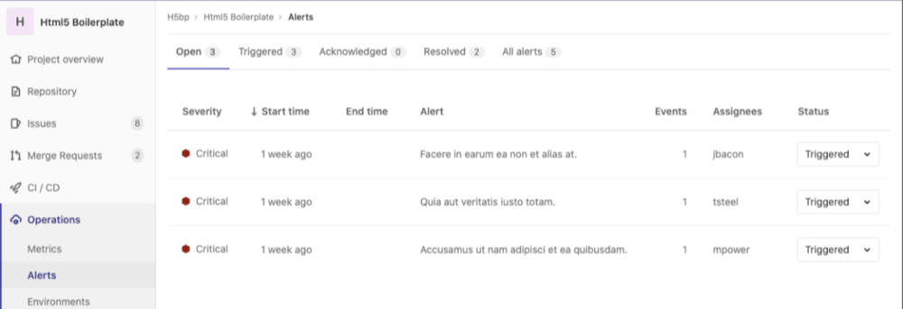
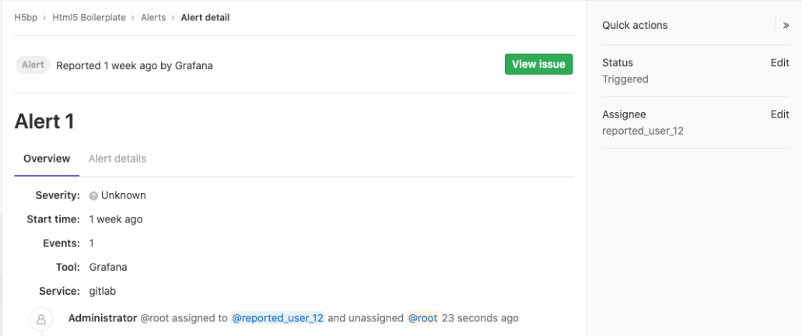
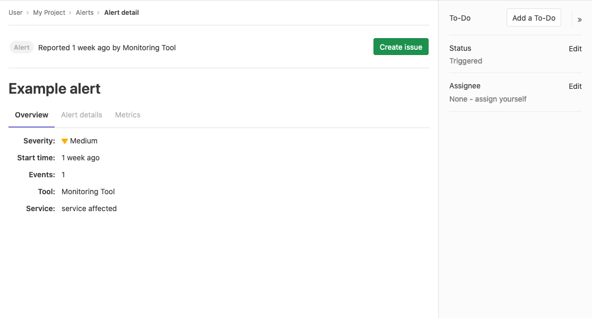
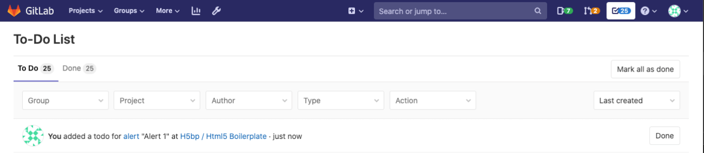
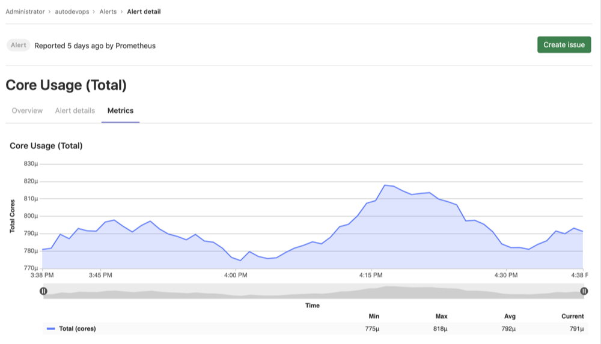

# Create and manage alerts in GitLab

Users with at least Developer [permissions](../../user/permissions.md) can
access the Alert Management list at **Operations > Alerts** in your project's
sidebar. The Alert Management list displays alerts sorted by start time, but
you can change the sort order by clicking the headers in the Alert Management list.
([Introduced](https://gitlab.com/gitlab-org/gitlab/-/issues/217745) in GitLab 13.1.)

The alert list displays the following information:

- **Search**: The alert list supports a simple free text search on the title,
  description, monitoring tool, and service fields.
  ([Introduced](https://gitlab.com/gitlab-org/gitlab/-/issues/213884) in GitLab 13.1.)
- **Severity**: The current importance of a alert and how much attention it
  should receive. For a listing of all statuses, read [Alert Management severity](#alert-severity).
- **Start time**: How long ago the alert fired. This field uses the standard
  GitLab pattern of `X time ago`, but is supported by a granular date/time
  tooltip depending on the user's locale.
- **Alert description**: The description of the alert, which attempts to
  capture the most meaningful data.
- **Event count**: The number of times that an alert has fired.
- **Issue**: A link to the incident issue that has been created for the alert.
- **Status**: The current status of the alert:
  - **Triggered**: No one has begun investigation.
  - **Acknowledged**: Someone is actively investigating the problem.
  - **Resolved**: No further work is required.

TIP: **Tip:**
Check out a live example available from the
[`tanuki-inc` project page](https://gitlab-examples-ops-incident-setup-everyone-tanuki-inc.34.69.64.147.nip.io/)
in GitLab to examine alerts in action.

## Enable Alerts

NOTE: **Note:**
You need at least Maintainer [permissions](../../user/permissions.md) to enable
the Alerts feature.

There are several ways to accept alerts into your GitLab project. Enabling any
of these methods enables the Alert list. After configuring alerts, visit
**Operations > Alerts** in your project's sidebar to view the list of alerts.

### Enable GitLab-managed Prometheus alerts

You can install the GitLab-managed Prometheus application on your Kubernetes
cluster. For more information, see
[Managed Prometheus on Kubernetes](../../user/project/integrations/prometheus.md#managed-prometheus-on-kubernetes).
When GitLab-managed Prometheus is installed, the Alerts list is also enabled.

To populate the alerts with data, see
[GitLab-Managed Prometheus instances](../metrics/alerts.md#managed-prometheus-instances).

### Enable external Prometheus alerts

You can configure an externally-managed Prometheus instance to send alerts
to GitLab. To set up this configuration, read the
[configuring Prometheus](../metrics/alerts.md#external-prometheus-instances)
documentation. Activating the external Prometheus configuration also enables
the Alerts list.

To populate the alerts with data, see [External Prometheus instances](../metrics/alerts.md#external-prometheus-instances).

### Enable a Generic Alerts endpoint

GitLab provides the Generic Alerts endpoint so you can accept alerts from a
third-party alerts service. Read the [instructions for toggling generic alerts](generic_alerts.md#setting-up-generic-alerts)
to add this option. After configuring the endpoint, the Alerts list is enabled.

To populate the alerts with data, see [Customizing the payload](generic_alerts.md#customizing-the-payload)
for requests to the alerts endpoint.

### Opsgenie integration **(PREMIUM)**

> [Introduced](https://gitlab.com/groups/gitlab-org/-/epics/3066) in [GitLab Premium](https://about.gitlab.com/pricing/) 13.2.

You can monitor alerts using a GitLab integration with [Opsgenie](https://www.atlassian.com/software/opsgenie).

NOTE: **Note:**
If you enable the Opsgenie integration, you can't have other GitLab alert
services, such as [Generic Alerts](generic_alerts.md) or Prometheus alerts,
active at the same time.

To enable Opsgenie integration:

1. Sign in as a user with Maintainer or Owner [permissions](../../user/permissions.md).
1. Navigate to **Operations > Alerts**.
1. In the **Integrations** select box, select **Opsgenie**.
1. Select the **Active** toggle.
1. In the **API URL** field, enter the base URL for your Opsgenie integration,
   such as `https://app.opsgenie.com/alert/list`.
1. Select **Save changes**.

After you enable the integration, navigate to the Alerts list page at
**Operations > Alerts**, and then select **View alerts in Opsgenie**.

## Alert severity

Each level of alert contains a uniquely shaped and color-coded icon to help
you identify the severity of a particular alert. These severity icons help you
immediately identify which alerts you should prioritize investigating:

Alerts contain one of the following icons:

| Severity | Icon                    | Color (hexadecimal) |
|----------|-------------------------|---------------------|
| Critical | **{severity-critical}** | `#8b2615`           |
| High     | **{severity-high}**     | `#c0341d`           |
| Medium   | **{severity-medium}**   | `#fca429`           |
| Low      | **{severity-low}**      | `#fdbc60`           |
| Info     | **{severity-info}**     | `#418cd8`           |
| Unknown  | **{severity-unknown}**  | `#bababa`           |

## Alert details page

Navigate to the Alert details view by visiting the [Alert list](./alerts.md)
and selecting an alert from the list. You need least Developer [permissions](../../user/permissions.md)
to access alerts.

TIP: **Tip:**
To review live examples of GitLab alerts, visit the
[alert list](https://gitlab.com/gitlab-examples/ops/incident-setup/everyone/tanuki-inc/-/alert_management)
for this demo project. Select any alert in the list to examine its alert details
page.

Alerts provide **Overview** and **Alert details** tabs to give you the right
amount of information you need.

### Alert overview tab

The **Overview** tab provides basic information about the alert:

### Alert details tab

#### Update an alert's status

The Alert detail view enables you to update the Alert Status.
See [Create and manage alerts in GitLab](./alerts.md) for more details.

#### Create an issue from an alert

> [Introduced](https://gitlab.com/gitlab-org/gitlab/-/issues/217745) in GitLab 13.1.

The Alert detail view enables you to create an issue with a
description populated from an alert. To create the issue,
select the **Create Issue** button. You can then view the issue from the
alert by selecting the **View Issue** button.

Closing a GitLab issue associated with an alert changes the alert's status to
Resolved. See [Create and manage alerts in GitLab](alerts.md) for more details
about alert statuses.

#### Update an alert's assignee

> [Introduced](https://gitlab.com/groups/gitlab-org/-/epics/3066) in GitLab 13.1.

The Alert detail view allows users to update the Alert assignee.

In large teams, where there is shared ownership of an alert, it can be
difficult to track who is investigating and working on it. The Alert detail
view enables you to update the Alert assignee:

NOTE: **Note:**
GitLab supports only a single assignee per alert.

1. To display the list of current alerts, navigate to **Operations > Alerts**:

   

1. Select your desired alert to display its **Alert Details View**:

   

1. If the right sidebar is not expanded, select
   **{angle-double-right}** **Expand sidebar** to expand it.
1. In the right sidebar, locate the **Assignee**, and then select **Edit**.
   From the dropdown menu, select each user you want to assign to the alert.
   GitLab creates a [to-do list item](../../user/todos.md) for each user.

   

To remove an assignee, select **Edit** next to the **Assignee** dropdown menu
and deselect the user from the list of assignees, or select **Unassigned**.

#### Alert system notes

> [Introduced](https://gitlab.com/groups/gitlab-org/-/epics/3066) in GitLab 13.1.

When you take action on an alert, this is logged as a system note,
which is visible in the Alert Details view. This gives you a linear
timeline of the alert's investigation and assignment history.

The following actions will result in a system note:

- [Updating the status of an alert](#update-an-alerts-status)
- [Creating an issue based on an alert](#create-an-issue-from-an-alert)
- [Assignment of an alert to a user](#update-an-alerts-assignee)

#### Create a to-do from an alert

> [Introduced](https://gitlab.com/groups/gitlab-org/-/epics/3066) in GitLab 13.1.

You can manually create [To-Do list items](../../user/todos.md) for yourself
from the Alert details screen, and view them later on your **To-Do List**. To
add a to-do:

1. To display the list of current alerts, navigate to **Operations > Alerts**.
1. Select your desired alert to display its **Alert Management Details View**.
1. Select the **Add a To-Do** button in the right sidebar:

   

Select the **To-Do** **{todo-done}** in the navigation bar to view your current to-do list.

#### View an alert's metrics data

> [Introduced](https://gitlab.com/gitlab-org/gitlab/-/issues/217768) in GitLab 13.2.

To view the metrics for an alert:

   1. Sign in as a user with Developer or higher [permissions](../../user/permissions.md).
   1. Navigate to **Operations > Alerts**.
   1. Select the alert you want to view.
   1. Below the title of the alert, select the **Metrics** tab.

For GitLab-managed Prometheus instances, metrics data is available for the
alert, making it easy to see surrounding behavior. For information about
setting up alerts, see [Managed Prometheus instances](../metrics/alerts.md#managed-prometheus-instances).

For externally-managed Prometheus instances, you can configure your alerting
rules to display a chart in the alert. For information about how to configure
your alerting rules, see [Embedding metrics based on alerts in incident issues](../metrics/embed.md#embedding-metrics-based-on-alerts-in-incident-issues). See
[External Prometheus instances](../metrics/alerts.md#external-prometheus-instances)
for information about setting up alerts for your self-managed Prometheus
instance.

### Use cases for assigning alerts

Consider a team formed by different sections of monitoring, collaborating on a
single application. After an alert surfaces, it's extremely important to route
the alert to the team members who can address and resolve the alert.

Assigning Alerts eases collaboration and delegation. All assignees are shown in
your team's work-flows, and all assignees receive notifications, simplifying
communication and ownership of the alert.

After completing their portion of investigating or fixing the alert, users can
unassign their account from the alert when their role is complete. You can
update the alert on the [Alert list](./alerts.md) to reflect if the alert has
been resolved.

### View an alert's logs

> [Introduced](https://gitlab.com/gitlab-org/gitlab/-/issues/217768) in GitLab 13.3.

To view the logs for an alert:

   1. Sign in as a user with Developer or higher [permissions](../../user/permissions.md).
   1. Navigate to **Operations > Alerts**.
   1. Select the alert you want to view.
   1. Below the title of the alert, select the **Metrics** tab.
   1. Select the [menu](../metrics/dashboards/index.md#chart-context-menu) of
      the metric chart to view options.
   1. Select **View logs**.

For additional information, see [View logs from metrics panel](#view-logs-from-metrics-panel).

### Embed metrics in incidents and issues

You can embed metrics anywhere [GitLab Markdown](../../user/markdown.md) is
used, such as descriptions, comments on issues, and merge requests. Embedding
metrics helps you share them when discussing incidents or performance issues.
You can output the dashboard directly into any issue, merge request, epic, or
any other Markdown text field in GitLab by
[copying and pasting the link to the metrics dashboard](../metrics/embed.md#embedding-gitlab-managed-kubernetes-metrics).

You can embed both [GitLab-hosted metrics](../metrics/embed.md) and
[Grafana metrics](../metrics/embed_grafana.md) in incidents and issue
templates.

#### Context menu

You can view more details about an embedded metrics panel from the context
menu. To access the context menu, select the **{ellipsis_v}** **More actions**
dropdown box above the upper right corner of the panel. For a list of options,
see [Chart context menu](../metrics/dashboards/index.md#chart-context-menu).

##### View logs from metrics panel

> - [Introduced](https://gitlab.com/gitlab-org/gitlab/-/issues/201846) in GitLab Ultimate 12.8.
> - [Moved](https://gitlab.com/gitlab-org/gitlab/-/merge_requests/25455) to [GitLab Core](https://about.gitlab.com/pricing/) 12.9.

Viewing logs from a metrics panel can be useful if you're triaging an
application incident and need to [explore logs](../metrics/dashboards/index.md#chart-context-menu)
from across your application. These logs help you understand what's affecting
your application's performance and how to resolve any problems.
