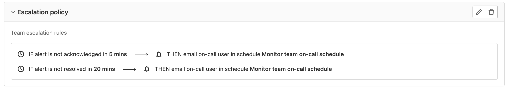

DETAILS:
**Tier:** Premium, Ultimate
**Offering:** GitLab.com, GitLab Self-Managed, GitLab Dedicated

Escalation policies protect your company from missed critical alerts. Escalation policies contain
time-boxed steps that automatically page the next responder in the escalation step if the responder
in the previous step has not responded. You can create an escalation policy in the GitLab project
where you manage [on-call schedules](oncall_schedules.md).

## Add an escalation policy

Prerequisites:

- You must have at least the Maintainer role.
- You must have an [on-call schedule](oncall_schedules.md).

To create an escalation policy:

1. On the left sidebar, select **Search or go to** and find your project.
1. Select **Monitor > Escalation Policies**.
1. Select **Add an escalation policy**.
1. Enter the policy's name and description, and
   escalation rules to follow when a primary responder misses an alert.
1. Select **Add escalation policy**.

### Select the responder of an escalation rule

When configuring an escalation rule, you can designate who to page:

- **Email on-call user in schedule:** notifies the users who are on-call when the rule is triggered,
  covering all rotations on the specified [on-call schedule](oncall_schedules.md).
- **Email user:** notifies the specified user directly.

When a notification is sent to a user through an on-call schedule or directly, a system note listing
the paged users is created on the alert.

The time specified for an escalation rule must be between 0 and 1440 minutes.

## Edit an escalation policy

To update an escalation policy:

1. On the left sidebar, select **Search or go to** and find your project.
1. Select **Monitor > Escalation Policies**.
1. Select **Edit escalation policy** (**{pencil}**).
1. Edit the information.
1. Select **Save changes**.

## Delete an escalation policy

To delete an escalation policy:

1. On the left sidebar, select **Search or go to** and find your project.
1. Select **Monitor > Escalation Policies**.
1. Select **Delete escalation policy** (**{remove}**).
1. On the confirmation dialog, select **Delete escalation policy**.
