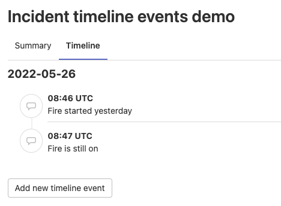
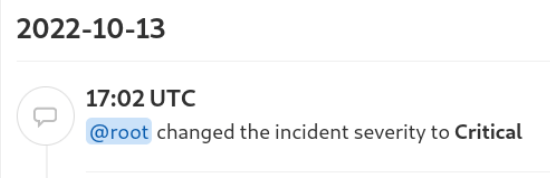

> - [Introduced](https://gitlab.com/gitlab-org/gitlab/-/issues/344059) in GitLab 15.2 [with a flag](../../administration/feature_flags.md) named `incident_timeline`. Enabled by default.
> - [Enabled on GitLab.com](https://gitlab.com/gitlab-org/gitlab/-/issues/353426) in GitLab 15.3.
> - [Generally available](https://gitlab.com/gitlab-org/gitlab/-/issues/353426) in GitLab 15.5. [Feature flag `incident_timeline`](https://gitlab.com/gitlab-org/gitlab/-/issues/343386) removed.

Incident timelines are an important part of record keeping for incidents.
Timelines can show executives and external viewers what happened during an incident,
and which steps were taken for it to be resolved.

## View the timeline

Incident timeline events are listed in ascending order of the date and time.
They are grouped with dates and are listed in ascending order of the time when they occurred:

To view the event timeline of an incident:

1. On the left sidebar, select **Search or go to** and find your project.
1. Select **Monitor > Incidents**.
1. Select an incident.
1. Select the **Timeline** tab.

## Create an event

You can create a timeline event in many ways in GitLab.

### Using the form

Create a timeline event manually using the form.

Prerequisites:

- You must have at least the Developer role for the project.

To create a timeline event:

1. On the left sidebar, select **Search or go to** and find your project.
1. Select **Monitor > Incidents**.
1. Select an incident.
1. Select the **Timeline** tab.
1. Select **Add new timeline event**.
1. Complete the required fields.
1. Select **Save** or **Save and add another event**.

### Using a quick action

> - [Introduced](https://gitlab.com/gitlab-org/gitlab/-/issues/368721) in GitLab 15.4.

You can create a timeline event using the `/timeline` [quick action](../../user/project/quick_actions.md).

### From a comment on the incident

> - [Introduced](https://gitlab.com/gitlab-org/gitlab/-/issues/344058) in GitLab 15.4.

Prerequisites:

- You must have at least the Developer role for the project.

To create a timeline event from a comment on the incident:

1. On the left sidebar, select **Search or go to** and find your project.
1. Select **Monitor > Incidents**.
1. Select an incident.
1. Create a comment or choose an existing comment.
1. On the comment you want to add, select **Add comment to incident timeline** (**{clock}**).

The comment is shown on the incident timeline as a timeline event.

### When incident severity changes

> - [Introduced](https://gitlab.com/gitlab-org/gitlab/-/issues/375280) in GitLab 15.6.

A new timeline event is created when someone [changes the severity](manage_incidents.md#change-severity)
of an incident.

### When labels change

DETAILS:
**Status:** Experiment

> - [Introduced](https://gitlab.com/gitlab-org/gitlab/-/issues/365489) in GitLab 15.3 [with a flag](../../administration/feature_flags.md) named `incident_timeline_events_from_labels`. Disabled by default.

FLAG:
The availability of this feature is controlled by a feature flag.
For more information, see the history.
This feature is available for testing, but not ready for production use.

A new timeline event is created when someone adds or removes [labels](../../user/project/labels.md) on an incident.

## Delete an event

> - Ability to delete an event when editing it [introduced](https://gitlab.com/gitlab-org/gitlab/-/issues/372265) in GitLab 15.7.

You can also delete timeline events.

Prerequisites:

- You must have at least the Developer role for the project.

To delete a timeline event:

1. On the left sidebar, select **Search or go to** and find your project.
1. Select **Monitor > Incidents**.
1. Select an incident.
1. Select the **Timeline** tab.
1. On the right of a timeline event, select **More actions** (**{ellipsis_v}**) and then select **Delete**.
1. To confirm, select **Delete Event**.

Alternatively:

1. On the right of a timeline event, select **More actions** (**{ellipsis_v}**) and then select **Edit**.
1. Select **Delete**.
1. To confirm, select **Delete event**.

## Incident tags

> - [Introduced](https://gitlab.com/groups/gitlab-org/-/epics/8741) in GitLab 15.9 [with a flag](../../administration/feature_flags.md) named `incident_event_tags`. Disabled by default.
> - [Enabled on GitLab.com](https://gitlab.com/gitlab-org/gitlab/-/issues/387647) in GitLab 15.9.
> - [Enabled on GitLab Self-Managed](https://gitlab.com/gitlab-org/gitlab/-/issues/387647) in GitLab 15.10.
> - [Generally available](https://gitlab.com/gitlab-org/gitlab/-/issues/387647) in GitLab 15.11. Feature flag `incident_event_tags` removed.

[When creating an event using the form](#using-the-form) or editing it,
you can specify incident tags to capture relevant incident timestamps.
Timeline tags are optional. You can choose more than one tag per event.
When you create a timeline event and select the tags, the event note
is populated with a default message.
This allows for a quick event creation. If a note has already been set, it isn't changed.
Added tags are displayed next to the timestamp.

## Formatting rules

Incident timeline events support the following [GitLab Flavored Markdown](../../user/markdown.md) features.

- [Code](../../user/markdown.md#code-spans-and-blocks).
- [Emoji](../../user/markdown.md#emoji).
- [Emphasis](../../user/markdown.md#emphasis).
- [GitLab-specific references](../../user/markdown.md#gitlab-specific-references).
- [Images](../../user/markdown.md#images), rendered as a link to the uploaded image.
- [Links](../../user/markdown.md#links).
