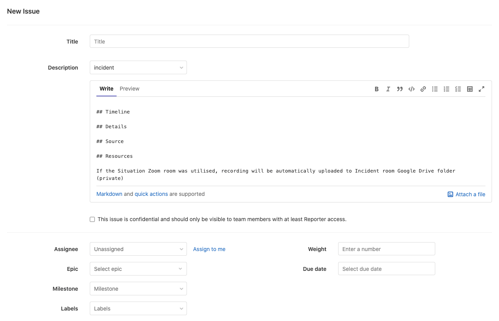
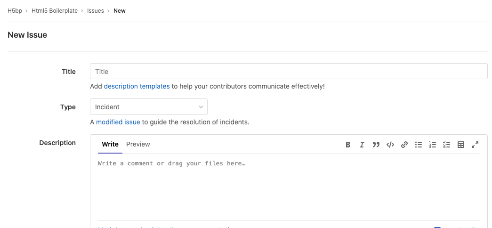
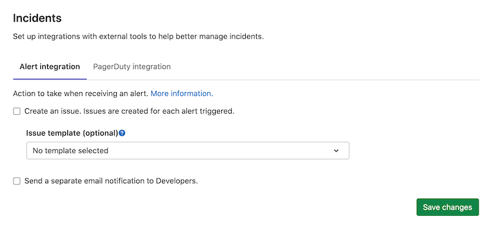
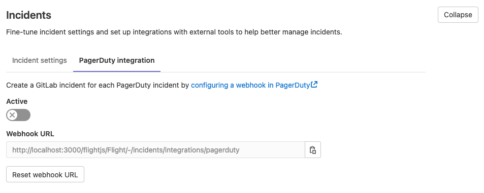
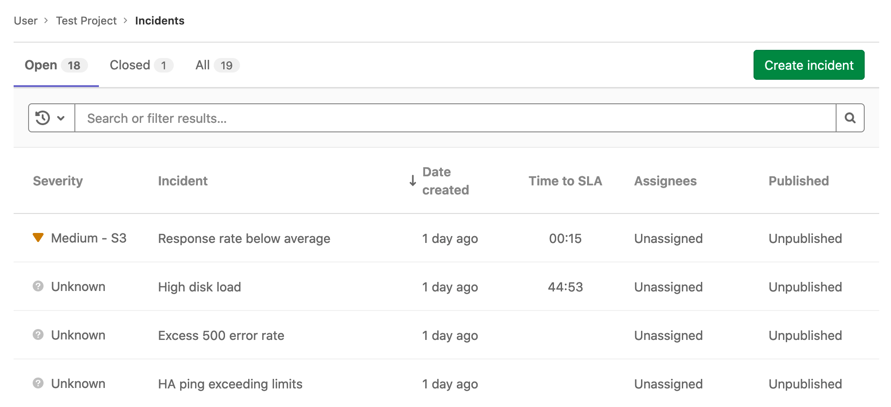
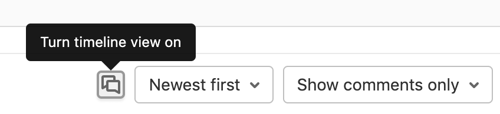

# Incidents

Incidents are critical entities in incident management workflows. They represent
a service disruption or outage that needs to be restored urgently. GitLab provides
tools for the triage, response, and remediation of incidents.

## Incident Creation

You can create an incident manually or automatically.

### Create incidents manually

If you have at least Guest [permissions](../../user/permissions.md), to create an
Incident, you have two options to do this manually.

**From the Incidents List:**

> [Moved](https://gitlab.com/gitlab-org/monitor/health/-/issues/24) to GitLab core in 13.3.

- Navigate to **Operations > Incidents** and click **Create Incident**.
- Create a new issue using the `incident` template available when creating it.
- Create a new issue and assign the `incident` label to it.

**From the Issues List:**

> [Introduced](https://gitlab.com/gitlab-org/gitlab/-/issues/230857) in GitLab 13.4.

- Navigate to **Issues > List** and click **Create Issue**.
- Create a new issue using the `type` drop-down and select `Incident`.
- The page refreshes and the page only displays fields relevant to Incidents.

### Create incidents automatically

> [Introduced](https://gitlab.com/gitlab-org/gitlab/-/issues/4925) in GitLab Ultimate 11.11.

With Maintainer or higher [permissions](../../user/permissions.md), you can enable
 GitLab to create incident automatically whenever an alert is triggered:

1. Navigate to **Settings > Operations > Incidents** and expand **Incidents**:

   

1. Check the **Create an incident** checkbox.
1. To customize the incident, select an
   [issue template](../../user/project/description_templates.md#creating-issue-templates).
1. To send [an email notification](alert_notifications.md#email-notifications) to users
   with [Developer permissions](../../user/permissions.md), select
   **Send a separate email notification to Developers**. Email notifications are
   also sent to users with **Maintainer** and **Owner** permissions.
1. Click **Save changes**.

### Create incidents via the PagerDuty webhook

> [Introduced](https://gitlab.com/gitlab-org/gitlab/-/issues/119018) in GitLab 13.3.

You can set up a webhook with PagerDuty to automatically create a GitLab incident
for each PagerDuty incident. This configuration requires you to make changes
in both PagerDuty and GitLab:

1. Sign in as a user with Maintainer [permissions](../../user/permissions.md).
1. Navigate to **Settings > Operations > Incidents** and expand **Incidents**.
1. Select the **PagerDuty integration** tab:

   

1. Activate the integration, and save the changes in GitLab.
1. Copy the value of **Webhook URL** for use in a later step.
1. Follow the steps described in the
   [PagerDuty documentation](https://support.pagerduty.com/docs/webhooks)
   to add the webhook URL to a PagerDuty webhook integration.

To confirm the integration is successful, trigger a test incident from PagerDuty to
confirm that a GitLab incident is created from the incident.

## Incident list

For users with at least Guest [permissions](../../user/permissions.md), the
Incident list is available at **Operations > Incidents**
in your project's sidebar. The list contains the following metrics:

- **Status** - To filter incidents by their status, click **Open**, **Closed**,
  or **All** above the incident list.
- **Search** - The Incident list supports a simple free text search, which filters
  on the **Title** and **Incident** fields.
- **Severity** - Severity of a particular incident, which can be one of the following
  values:
  - **{severity-critical}** **Critical - S1**
  - **{severity-high}** **High - S2**
  - **{severity-medium}** **Medium - S3**
  - **{severity-low}** **Low - S4**
  - **{severity-unknown}** **Unknown**

  [Editing incident severity](#change-severity) on the incident details page was
  [introduced](https://gitlab.com/gitlab-org/gitlab/-/issues/229402) in GitLab 13.4.

- **Incident** - The description of the incident, which attempts to capture the
  most meaningful data.
- **Date created** - How long ago the incident was created. This field uses the
  standard GitLab pattern of `X time ago`, but is supported by a granular date/time
  tooltip depending on the user's locale.
- **Assignees** - The user assigned to the incident.
- **Published** - Displays a green check mark (**{check-circle}**) if the incident is published
  to a [Status Page](status_page.md). **(ULTIMATE)**

The Incident list displays incidents sorted by incident created date.
([Introduced](https://gitlab.com/gitlab-org/gitlab/-/issues/229534) to GitLab core in 13.3.)
To see if a column is sortable, point your mouse at the header. Sortable columns
display an arrow next to the column name.

Incidents share the [Issues API](../../user/project/issues/index.md).

TIP: **Tip:**
For a live example of the incident list in action, visit this
[demo project](https://gitlab.com/gitlab-examples/ops/incident-setup/everyone/tanuki-inc/-/incidents).

## Incident details

> [Introduced](https://gitlab.com/gitlab-org/gitlab/-/issues/230847) in GitLab 13.4.

Users with at least Reporter [permissions](../../user/permissions.md) can view
the Incident Details page. Navigate to **Operations > Incidents** in your project's
sidebar, and select an incident from the list.

When you take any of these actions on an incident, GitLab logs a system note and
displays it in the Incident Details view:

- Updating the severity of an incident
  ([Introduced](https://gitlab.com/gitlab-org/gitlab/-/merge_requests/42358) in GitLab 13.5.)

For live examples of GitLab incidents, visit the `tanuki-inc` project's
[incident list page](https://gitlab.com/gitlab-examples/ops/incident-setup/everyone/tanuki-inc/-/incidents).
Click any incident in the list to display its incident details page.

### Summary

The summary section for incidents provides both critical details about and the
contents of the issue template (if one was used). The highlighted bar at the top
of the incident displays from left to right:

- The link to the original alert.
- The alert start time.
- The event count.

Beneath the highlight bar, GitLab displays a summary that includes the following fields:

- Start time
- Severity
- `full_query`
- Monitoring tool

Comments are displayed in threads, but can be displayed chronologically
[in a timeline view](#timeline-view).

### Alert details

Incidents show the details of linked alerts in a separate tab. To populate this
tab, the incident must have been created with a linked alert. Incidents
created automatically from alerts have this
field populated.

### Timeline view

> [Introduced](https://gitlab.com/gitlab-org/gitlab/-/issues/227836) in [GitLab Premium](https://about.gitlab.com/pricing/) 13.5.

To quickly see the latest updates on an incident, click
**{comments}** **Turn timeline view on** in the comment bar to display comments
un-threaded and ordered chronologically, newest to oldest:

### Service Level Agreement countdown timer

> [Introduced](https://gitlab.com/gitlab-org/gitlab/-/issues/241663) in [GitLab Premium](https://about.gitlab.com/pricing/) 13.5.

You can enable the Service Level Agreement Countdown timer on incidents to track
the Service Level Agreements (SLAs) you hold with your customers. The timer is
automatically started when the incident is created, and shows the time
remaining before the SLA period expires. To configure the timer:

1. Navigate to **Settings > Operations**.
1. Scroll to **Incidents** and click **Expand**, then select the
   **Incident settings** tab.
1. Select **Activate "time to SLA" countdown timer**.
1. Set a time limit in increments of 15 minutes.
1. Click **Save changes**.

After you enable the SLA countdown timer, the **Time to SLA** attribute is displayed
as a column in the Incidents List, and as a field on newly created Incidents. If
the incident isn't closed before the SLA period ends, GitLab adds a `missed::SLA`
label to the incident.

## Incident Actions

There are different actions available to help triage and respond to incidents.

### Assign incidents

Assign incidents to users that are actively responding. Select **Edit** in the
right-hand side bar to select or deselect assignees.

### Change severity

See [Incident List](#incident-list) for a full description of the severity levels available.
Select **Edit** in the right-hand side bar to change the severity of an incident.

### Add a to-do item

Add a to-do for incidents that you want to track in your to-do list. Click the
**Add a to do** button at the top of the right-hand side bar to add a to-do item.

### Manage incidents from Slack

Slack slash commands allow you to control GitLab and view GitLab content without leaving Slack.

Learn how to [set up Slack slash commands](../../user/project/integrations/slack_slash_commands.md)
and how to [use the available slash commands](../../integration/slash_commands.md).

### Associate Zoom calls

GitLab enables you to [associate a Zoom meeting with an issue](../../user/project/issues/associate_zoom_meeting.md)
for synchronous communication during incident management. After starting a Zoom
call for an incident, you can associate the conference call with an issue. Your
team members can join the Zoom call without requesting a link.

### Embed metrics in incidents

You can embed metrics anywhere [GitLab Markdown](../../user/markdown.md) is
used, such as descriptions, comments on issues, and merge requests. Embedding
metrics helps you share them when discussing incidents or performance issues.
You can output the dashboard directly into any issue, merge request, epic, or
any other Markdown text field in GitLab by
[copying and pasting the link to the metrics dashboard](../metrics/embed.md#embedding-gitlab-managed-kubernetes-metrics).

You can embed both [GitLab-hosted metrics](../metrics/embed.md) and
[Grafana metrics](../metrics/embed_grafana.md) in incidents and issue
templates.
