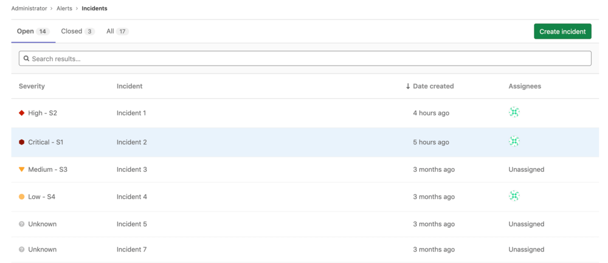

# Create and manage incidents in GitLab

While no configuration is required to use the [manual features](#create-an-incident-manually)
of incident management, some simple [configuration](#configure-incidents) is needed to automate incident creation.

For users with at least Guest [permissions](../../user/permissions.md), the
Incident Management list is available at **Operations > Incidents**
in your project's sidebar. The list contains the following metrics:

- **Status** - To filter incidents by their status, click **Open**, **Closed**,
  or **All** above the incident list.
- **Search** - The Incident list supports a simple free text search, which filters
  on the **Title** and **Incident** fields.
- **Severity** - Severity of a particular incident, which can be one of the following
  values:
  - **{severity-critical}** **Critical - S1**
  - **{severity-high}** **High - S2**
  - **{severity-medium}** **Medium - S3**
  - **{severity-low}** **Low - S4**
  - **{severity-unknown}** **Unknown**

  NOTE: **Note:**
  Editing incident severity on the incident details page was
  [introduced](https://gitlab.com/gitlab-org/gitlab/-/issues/229402) in GitLab 13.4.

- **Incident** - The description of the incident, which attempts to capture the
  most meaningful data.
- **Date created** - How long ago the incident was created. This field uses the
  standard GitLab pattern of `X time ago`, but is supported by a granular date/time
  tooltip depending on the user's locale.
- **Assignees** - The user assigned to the incident.
- **Published** - Displays a green check mark (**{check-circle}**) if the incident is published
  to a [Status Page](status_page.md). **(ULTIMATE)**

The Incident list displays incidents sorted by incident created date.
([Introduced](https://gitlab.com/gitlab-org/gitlab/-/issues/229534) to GitLab core in 13.3.)
To see if a column is sortable, point your mouse at the header. Sortable columns
display an arrow next to the column name.

TIP: **Tip:**
For a live example of the incident list in action, visit this
[demo project](https://gitlab.com/gitlab-examples/ops/incident-setup/everyone/tanuki-inc/-/incidents).

NOTE: **Note:**
Incidents share the [Issues API](../../user/project/issues/index.md).

## Configure incidents

> [Introduced](https://gitlab.com/gitlab-org/gitlab/-/issues/4925) in GitLab Ultimate 11.11.

With Maintainer or higher [permissions](../../user/permissions.md), you can enable
or disable Incident Management features in the GitLab user interface
to create issues when alerts are triggered:

1. Navigate to **Settings > Operations > Incidents** and expand
   **Incidents**:

   

1. For GitLab versions 11.11 and greater, you can select the **Create an issue**
   checkbox to create an issue based on your own
   [issue templates](../../user/project/description_templates.md#creating-issue-templates).
   For more information, see
   [Trigger actions from alerts](../metrics/alerts.md#trigger-actions-from-alerts) **(ULTIMATE)**.
1. To create issues from alerts, select the template in the **Issue Template**
   select box.
1. To send [separate email notifications](alert_notifications.md#email-notifications) to users
   with [Developer permissions](../../user/permissions.md), select
   **Send a separate email notification to Developers**.
1. Click **Save changes**.

Appropriately configured alerts include an
[embedded chart](../metrics/embed.md#embedding-metrics-based-on-alerts-in-incident-issues)
for the query corresponding to the alert. You can also configure GitLab to
[close issues](../metrics/alerts.md#trigger-actions-from-alerts)
when you receive notification that the alert is resolved.

## Create an incident manually

If you have at least Guest [permissions](../../user/permissions.md), to create an Incident, you have two options.

### From the Incidents List

> [Moved](https://gitlab.com/gitlab-org/monitor/health/-/issues/24) to GitLab core in 13.3.

- Navigate to **Operations > Incidents** and click **Create Incident**.
- Create a new issue using the `incident` template available when creating it.
- Create a new issue and assign the `incident` label to it.

### From the Issues List

> [Introduced](https://gitlab.com/gitlab-org/gitlab/-/issues/230857) in GitLab 13.4.

- Navigate to **Issues > List** and click **Create Issue**.
- Create a new issue using the `type` drop-down and select `Incident`.
- The page refreshes and the page only displays fields relevant to Incidents.

## Configure PagerDuty integration

> [Introduced](https://gitlab.com/gitlab-org/gitlab/-/issues/119018) in GitLab 13.3.

You can set up a webhook with PagerDuty to automatically create a GitLab issue
for each PagerDuty incident. This configuration requires you to make changes
in both PagerDuty and GitLab:

1. Sign in as a user with Maintainer [permissions](../../user/permissions.md).
1. Navigate to **Settings > Operations > Incidents** and expand **Incidents**.
1. Select the **PagerDuty integration** tab:

   

1. Activate the integration, and save the changes in GitLab.
1. Copy the value of **Webhook URL** for use in a later step.
1. Follow the steps described in the
   [PagerDuty documentation](https://support.pagerduty.com/docs/webhooks)
   to add the webhook URL to a PagerDuty webhook integration.

To confirm the integration is successful, trigger a test incident from PagerDuty to
confirm that a GitLab issue is created from the incident.

## Incident details

> [Introduced](https://gitlab.com/gitlab-org/gitlab/-/issues/230847) in GitLab 13.4.

### Summary

The summary section for incidents provides both critical details about and the
contents of the issue template (if one was used). The highlighted bar at the top
of the incident displays from left to right: the link to the original alert, the
alert start time, and the event count. Beneath the highlight bar, GitLab
displays a summary that includes the following fields:

- Start time
- Severity
- `full_query`
- Monitoring tool

### Alert details

Incidents show the details of linked alerts in a separate tab. To populate this
tab, the incident must have been created with a linked alert. Incidents
[created automatically](#configure-incidents) from alerts will have this
field populated.

