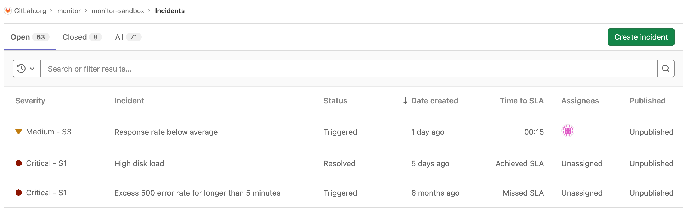
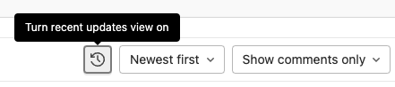

# Incidents **(FREE)**

Incidents are critical entities in incident management workflows. They represent
a service disruption or outage that needs to be restored urgently. GitLab provides
tools for the triage, response, and remediation of incidents.

Users with at least Guest [permissions](../../user/permissions.md) can access
incidents [on public projects](../../user/permissions.md#project-members-permissions).

## Incident creation

You can create an incident manually or automatically.

### Create incidents manually

> - [Moved](https://gitlab.com/gitlab-org/monitor/monitor/-/issues/24) to GitLab Free in 13.3.
> - [Permission changed](https://gitlab.com/gitlab-org/gitlab/-/issues/336624) from Guest to Reporter in GitLab 14.5.
> - Automatic application of the `incident` label [removed](https://gitlab.com/gitlab-org/gitlab/-/issues/290964) in GitLab 14.8.

If you have at least Reporter [permissions](../../user/permissions.md),
you can create an incident manually from the Incidents List or the Issues List.

To create an incident from the Incidents List:

1. Navigate to **Monitor > Incidents** and select **Create Incident**.
1. Create a new issue using the `incident` template.

To create an incident from the Issues List:

> [Introduced](https://gitlab.com/gitlab-org/gitlab/-/issues/230857) in GitLab 13.4.

1. Go to **Issues > List**, and select **New issue**.
1. In the **Type** dropdown, select **Incident**. Only fields relevant to
   incidents are displayed on the page.
1. Create the incident as needed, and select **Create issue** to save the
   incident.

### Create incidents automatically **(ULTIMATE)**

With at least the Maintainer role, you can enable
GitLab to create incident automatically whenever an alert is triggered:

1. Navigate to **Settings > Monitor > Incidents** and expand **Incidents**.
1. Check the **Create an incident** checkbox.
1. To customize the incident, select an
   [issue template](../../user/project/description_templates.md#create-an-issue-template),
   to include in the [incident summary](#summary).
1. To send [an email notification](paging.md#email-notifications-for-alerts) to users
   with the Developer role, select
   **Send a separate email notification to Developers**. Email notifications are
   also sent to users with the **Maintainer** and **Owner** roles.
1. Select **Save changes**.

### Create incidents via the PagerDuty webhook

> [Introduced](https://gitlab.com/gitlab-org/gitlab/-/issues/119018) in GitLab 13.3.

You can set up a webhook with PagerDuty to automatically create a GitLab incident
for each PagerDuty incident. This configuration requires you to make changes
in both PagerDuty and GitLab:

1. Sign in as a user with the Maintainer role.
1. Navigate to **Settings > Monitor > Incidents** and expand **Incidents**.
1. Select the **PagerDuty integration** tab:

   

1. Activate the integration, and save the changes in GitLab.
1. Copy the value of **Webhook URL** for use in a later step.
1. Follow the steps described in the
   [PagerDuty documentation](https://support.pagerduty.com/docs/webhooks)
   to add the webhook URL to a PagerDuty webhook integration.

To confirm the integration is successful, trigger a test incident from PagerDuty to
confirm that a GitLab incident is created from the incident.

## Incident list

For users with at least Guest [permissions](../../user/permissions.md), the
Incident list is available at **Monitor > Incidents**
in your project's sidebar. The list contains the following metrics:

- **State** - To filter incidents by their state, select **Open**, **Closed**,
  or **All** above the incident list.
- **Search** - The Incident list supports a simple free text search, which filters
  on the **Title** and **Incident** fields.
- **Severity** - Severity of a particular incident, which can be one of the following
  values:
  - **{severity-critical}** **Critical - S1**
  - **{severity-high}** **High - S2**
  - **{severity-medium}** **Medium - S3**
  - **{severity-low}** **Low - S4**
  - **{severity-unknown}** **Unknown**

  [Editing incident severity](#change-severity) on the incident details page was
  [introduced](https://gitlab.com/gitlab-org/gitlab/-/issues/229402) in GitLab 13.4.

- **Incident** - The description of the incident, which attempts to capture the
  most meaningful data.
- **Status** - The status of the incident, which can be one of the following values:
  - **Triggered**
  - **Acknowledged**
  - **Resolved**

  In GitLab Premium, this field is also linked to [on-call escalation](paging.md#escalating-an-incident) for the incident.

- **Date created** - How long ago the incident was created. This field uses the
  standard GitLab pattern of `X time ago`, but is supported by a granular date/time
  tooltip depending on the user's locale.
- **Assignees** - The user assigned to the incident.
- **Published** - Displays a green check mark (**{check-circle}**) if the incident is published
  to a [Status Page](status_page.md).

The Incident list displays incidents sorted by incident created date.
([Introduced](https://gitlab.com/gitlab-org/gitlab/-/issues/229534) in GitLab 13.3.)
To see if a column is sortable, point your mouse at the header. Sortable columns
display an arrow next to the column name.

Incidents share the [Issues API](../../api/issues.md).

NOTE:
For a live example of the incident list in action, visit this
[demo project](https://gitlab.com/gitlab-examples/ops/incident-setup/everyone/tanuki-inc/-/incidents).

## Incident details

> [Introduced](https://gitlab.com/gitlab-org/gitlab/-/issues/230847) in GitLab 13.4.

Users with at least Guest [permissions](../../user/permissions.md) can view
the Incident Details page. Navigate to **Monitor > Incidents** in your project's
sidebar, and select an incident from the list.

When you take any of these actions on an incident, GitLab logs a system note and
displays it in the Incident Details view:

- Updating the severity of an incident
  ([Introduced](https://gitlab.com/gitlab-org/gitlab/-/merge_requests/42358) in GitLab 13.5.)

For live examples of GitLab incidents, visit the `tanuki-inc` project's
[incident list page](https://gitlab.com/gitlab-examples/ops/incident-setup/everyone/tanuki-inc/-/incidents).
Select any incident in the list to display its incident details page.

### Summary

The summary section for incidents provides both critical details about the
incident and the contents of the issue template (if applicable). The highlighted
bar at the top of the incident displays from left to right:

- The link to the original alert.
- The alert start time.
- The event count.

Beneath the highlight bar, GitLab displays a summary that includes the following fields:

- Start time
- Severity
- `full_query`
- Monitoring tool

The incident summary can be further customized using
[GitLab Flavored Markdown](../../user/markdown.md). If the corresponding alert
[provided Markdown for the incident](../metrics/alerts.md#trigger-actions-from-alerts),
then the Markdown is appended to the summary after the above alert fields. If an
[incident template](#create-incidents-automatically) is configured for the
project, then the template content is appended at the end.

Comments are displayed in threads, but can be displayed chronologically
[by toggling on the recent updates view](#recent-updates-view).

### Metrics **(PREMIUM)**

> [Introduced](https://gitlab.com/gitlab-org/gitlab/-/issues/235994) in GitLab 13.8.

In many cases, incidents are associated to metrics. You can upload screenshots of metric
charts in the **Metrics** tab:

When you upload an image, you can associate the image with text or a link to the original graph.

If you add a link, you can access the original graph by clicking the hyperlink above the uploaded image.

### Alert details

Incidents show the details of linked alerts in a separate tab. To populate this
tab, the incident must have been created with a linked alert. Incidents
created automatically from alerts have this
field populated.

### Timeline events

> [Introduced](https://gitlab.com/gitlab-org/gitlab/-/issues/344059) in GitLab 15.2 [with a flag](../../administration/feature_flags.md) named `incident_timeline`. Enabled on GitLab.com. Disabled on self-managed.

FLAG:
On self-managed GitLab, by default this feature is not available. To make it available, ask an administrator to [enable the feature flag](../../administration/feature_flags.md) named `incident_timeline`.
On GitLab.com, this feature is available.

Incident timelines are an important part of record keeping for incidents.
They give a high-level overview, to executives and external viewers, of what happened during the incident,
and the steps that were taken for it to be resolved.

#### View the event timeline

Incident timeline events are listed in ascending order of the date and time.
They are grouped with dates and are listed in ascending order of the time when they occured:

To view the event timeline of an incident:

1. On the top bar, select **Menu > Projects** and find your project.
1. On the left sidebar, select **Monitor > Incidents**.
1. Select an incident.
1. Select the **Timeline** tab.

#### Create a timeline event

Create a timeline event manually using the form.

Prerequisites:

- You must have at least the Developer role for the project.

To create a timeline event:

1. On the top bar, select **Menu > Projects** and find your project.
1. On the left sidebar, select **Monitor > Incidents**.
1. Select an incident.
1. Select the **Timeline** tab.
1. Select **Add new timeline event**.
1. Complete the required fields.
1. Select **Save** or **Save and add another event**.

#### Delete a timeline event

You can also delete timeline events.

Prerequisites:

- You must have at least the Developer role for the project.

To delete a timeline event:

1. On the top bar, select **Menu > Projects** and find your project.
1. On the left sidebar, select **Monitor > Incidents**.
1. Select an incident.
1. Select the **Timeline** tab.
1. On the right of a timeline event, select **More actions** (**{ellipsis_v}**) and then select **Delete**.
1. To confirm, select **Delete Event**.

### Recent updates view **(PREMIUM)**

> [Introduced](https://gitlab.com/gitlab-org/gitlab/-/issues/227836) in GitLab 13.5.

To quickly see the latest updates on an incident, select
**{history}** **Turn recent updates view on** in the comment bar to display comments
un-threaded and ordered chronologically, newest to oldest:

### Service Level Agreement countdown timer **(PREMIUM)**

> [Introduced](https://gitlab.com/gitlab-org/gitlab/-/issues/241663) in GitLab 13.5.

You can enable the Service Level Agreement Countdown timer on incidents to track
the Service Level Agreements (SLAs) you hold with your customers. The timer is
automatically started when the incident is created, and shows the time
remaining before the SLA period expires. The timer is also dynamically updated
every 15 minutes so you do not have to refresh the page to see the time remaining.
To configure the timer:

1. Navigate to **Settings > Monitor**.
1. Scroll to **Incidents** and select **Expand**, then select the
   **Incident settings** tab.
1. Select **Activate "time to SLA" countdown timer**.
1. Set a time limit in increments of 15 minutes.
1. Select **Save changes**.

After you enable the SLA countdown timer, the **Time to SLA** attribute is displayed
as a column in the Incidents List, and as a field on newly created Incidents. If
the incident isn't closed before the SLA period ends, GitLab adds a `missed::SLA`
label to the incident.

## Incident actions

There are different actions available to help triage and respond to incidents.

### Assign incidents

Assign incidents to users that are actively responding. Select **Edit** in the
right-hand side bar to select or clear assignees.

### Associate a milestone

Associate an incident to a milestone by selecting **Edit** next to the milestone feature in the right-hand side bar.

### Change severity

See [Incident List](#incident-list) for a full description of the severity levels available.
Select **Edit** in the right-hand side bar to change the severity of an incident.

You can also change the severity using the [`/severity` quick action](../../user/project/quick_actions.md).

### Add a to-do item

Add a to-do for incidents that you want to track in your to-do list. Select
**Add a to do** at the top of the right-hand side bar to add a to-do item.

### Change incident status

> - [Introduced](https://gitlab.com/groups/gitlab-org/-/epics/5716) in GitLab 14.9 [with a flag](../../administration/feature_flags.md) named `incident_escalations`. Disabled by default.
> - [Enabled on GitLab.com and self-managed](https://gitlab.com/gitlab-org/gitlab/-/issues/345769) in GitLab 14.10.
> - [Feature flag `incident_escalations`](https://gitlab.com/gitlab-org/gitlab/-/issues/345769) removed in GitLab 15.1.

For users with the Developer role or higher, select **Edit** in the **Status** section of the
right-hand side bar of an incident, then select a status. **Triggered** is the default status for
new incidents.

In projects with GitLab Premium, on-call responders can respond to [incident pages](paging.md#escalating-an-incident)
by changing the status. Setting the status to:

- **Resolved** silences on-call pages for the alert.
- **Acknowledged** limits on-call pages based on the selected [escalation policy](#change-escalation-policy).
- **Triggered** from **Resolved** restarts the incident escalating from the beginning.

In GitLab 15.1 and earlier, updating the status of an [incident created from an alert](alerts.md#create-an-incident-from-an-alert)
also updates the alert status. In [GitLab 15.2 and later](https://gitlab.com/gitlab-org/gitlab/-/issues/356057),
the alert status is independent and does not update when the incident status changes.

### Change escalation policy **(PREMIUM)**

> - [Introduced](https://gitlab.com/groups/gitlab-org/-/epics/5716) in GitLab 14.9 [with a flag](../../administration/feature_flags.md) named `incident_escalations`. Disabled by default.
> - [Enabled on GitLab.com and self-managed](https://gitlab.com/gitlab-org/gitlab/-/issues/345769) in GitLab 14.10.
> - [Feature flag `incident_escalations`](https://gitlab.com/gitlab-org/gitlab/-/issues/345769) removed in GitLab 15.1.

For users with the Developer role or higher, select **Edit** in the **Escalation policy** section of
the right-hand side bar of an incident, then select a policy. By default, new incidents do not have
an escalation policy selected.

Selecting an escalation policy updates the incident status to **Triggered** and begins
[escalating the incident to on-call responders](paging.md#escalating-an-incident).
Deselecting an escalation policy halts escalation. Refer to the [incident status](#change-incident-status)
to manage on-call paging once escalation has begun.

In GitLab 15.1 and earlier, the escalation policy for [incidents created from alerts](alerts.md#create-an-incident-from-an-alert)
reflects the alert's escalation policy and cannot be changed. In [GitLab 15.2 and later](https://gitlab.com/gitlab-org/gitlab/-/issues/356057),
the incident escalation policy is independent and can be changed.

### Manage incidents from Slack

Slack slash commands allow you to control GitLab and view GitLab content without leaving Slack.

Learn how to [set up Slack slash commands](../../user/project/integrations/slack_slash_commands.md)
and how to [use the available slash commands](../../integration/slash_commands.md).

### Associate Zoom calls

GitLab enables you to [associate a Zoom meeting with an issue](../../user/project/issues/associate_zoom_meeting.md)
for synchronous communication during incident management. After starting a Zoom
call for an incident, you can associate the conference call with an issue. Your
team members can join the Zoom call without requesting a link.

### Linked resources

In an incident, you can [links to various resources](linked_resources.md),
for example:

- The incident Slack channel
- Zoom meeting
- Resources for resolving the incidents

### Embed metrics in incidents

You can embed metrics anywhere [GitLab Markdown](../../user/markdown.md) is
used, such as descriptions, comments on issues, and merge requests. Embedding
metrics helps you share them when discussing incidents or performance issues.
You can output the dashboard directly into any issue, merge request, epic, or
any other Markdown text field in GitLab by
[copying and pasting the link to the metrics dashboard](../metrics/embed.md#embedding-gitlab-managed-kubernetes-metrics).

You can embed both [GitLab-hosted metrics](../metrics/embed.md) and
[Grafana metrics](../metrics/embed_grafana.md) in incidents and issue
templates.

### Automatically close incidents via recovery alerts

> - [Introduced for Prometheus Integrations](https://gitlab.com/gitlab-org/gitlab/-/issues/13401) in GitLab 12.5.
> - [Introduced for HTTP Integrations](https://gitlab.com/gitlab-org/gitlab/-/issues/13402) in GitLab 13.4.

With at least the Maintainer role, you can enable
 GitLab to close an incident automatically when a **Recovery Alert** is received:

1. Navigate to **Settings > Monitor > Incidents** and expand **Incidents**.
1. Check the **Automatically close associated Incident** checkbox.
1. Select **Save changes**.

When GitLab receives a **Recovery Alert**, it closes the associated incident.
This action is recorded as a system message on the incident indicating that it
was closed automatically by the GitLab Alert bot.
