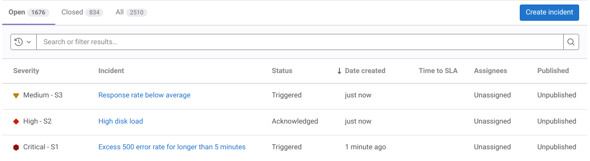
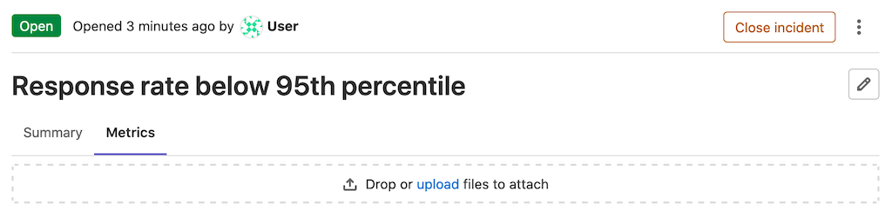
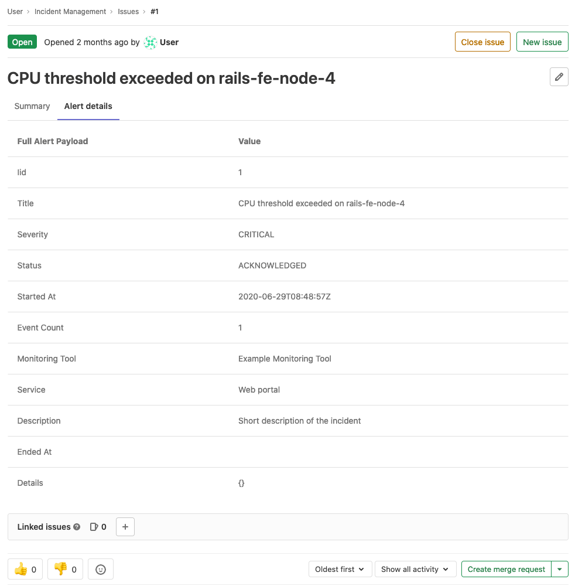

DETAILS:
**Tier:** Free, Premium, Ultimate
**Offering:** GitLab.com, GitLab Self-Managed, GitLab Dedicated

An incident is a service disruption or outage that needs to be restored urgently.
Incidents are critical in incident management workflows.
Use GitLab to triage, respond, and remediate incidents.

## Incidents list

When you [view the incidents list](manage_incidents.md#view-a-list-of-incidents), it contains the following:

- **State**: To filter incidents by their state, select **Open**, **Closed**,
  or **All** above the incident list.
- **Search**: Search for incident titles and descriptions or [filter the list](#filter-the-incidents-list).
- **Severity**: Severity of a particular incident, which can be one of the following
  values:

  - **{severity-critical}** Critical - S1
  - **{severity-high}** High - S2
  - **{severity-medium}** Medium - S3
  - **{severity-low}** Low - S4
  - **{severity-unknown}** Unknown

- **Incident**: The title of the incident, which attempts to capture the
  most meaningful information.
- **Status**: The status of the incident, which can be one of the following values:

  - Triggered
  - Acknowledged
  - Resolved

  In the Premium or Ultimate tier, this field is also linked to [on-call escalation](paging.md#escalating-an-incident) for the incident.

- **Date created**: How long ago the incident was created. This field uses the
  standard GitLab pattern of `X time ago`. Hover over this value to see the exact date and time formatted according to your locale.
- **Assignees**: The user assigned to the incident.
- **Published**: Whether the incident is published to a [status page](status_page.md).

For an example of the incident list in action, see this
[demo project](https://gitlab.com/gitlab-org/monitor/monitor-sandbox/-/incidents).

### Sort the incident list

The incident list shows incidents sorted by incident created date, showing the newest first.

To sort by another column, or to change the sorting order, select the column.

The columns you can sort by:

- Severity
- Status
- Time to SLA
- Published

### Filter the incidents list

To filter the incident list by author or assignee, enter these values in the search box.

## Incident details

### Summary

The summary section for incidents provides critical details about the
incident and the contents of the issue template (if [selected](alerts.md#trigger-actions-from-alerts)). The highlighted
bar at the top of the incident displays from left to right:

- The link to the original alert.
- The alert start time.
- The event count.

Below the highlight bar, a summary includes the following fields:

- Start time
- Severity
- `full_query`
- Monitoring tool

The incident summary can be further customized using
[GitLab Flavored Markdown](../../user/markdown.md).

If an incident is [created from an alert](alerts.md#trigger-actions-from-alerts)
that provided Markdown for the incident, then the Markdown is appended to the summary.
If an incident template is configured for the project, then the template content is appended at the end.

Comments are displayed in threads, but can be displayed chronologically
[by toggling on the recent updates view](#recent-updates-view).

When you make changes to an incident, GitLab creates [system notes](../../user/project/system_notes.md) and
displays them below the summary.

### Metrics

DETAILS:
**Tier:** Premium, Ultimate
**Offering:** GitLab.com, GitLab Self-Managed, GitLab Dedicated

In many cases, incidents are associated to metrics. You can upload screenshots of metric
charts in the **Metrics** tab:

When you upload an image, you can associate the image with text or a link to the original graph.

If you add a link, you can access the original graph by selecting the hyperlink above the uploaded image.

### Alert details

Incidents show the details of linked alerts in a separate tab. To populate this
tab, the incident must have been created with a linked alert. Incidents
created automatically from alerts have this
field populated.

### Timeline events

Incident timelines give a high-level overview of what happened
during an incident, and the steps that were taken for it to be resolved.

Read more about [timeline events](incident_timeline_events.md) and how to enable this feature.

### Recent updates view

DETAILS:
**Tier:** Premium, Ultimate
**Offering:** GitLab.com, GitLab Self-Managed, GitLab Dedicated

To see the latest updates on an incident, select
**Turn recent updates view on** (**{history}**) on the comment bar. Comments display
un-threaded and chronologically, newest to oldest.

### Service Level Agreement countdown timer

DETAILS:
**Tier:** Premium, Ultimate
**Offering:** GitLab.com, GitLab Self-Managed, GitLab Dedicated

You can enable the Service Level Agreement Countdown timer on incidents to track
the Service Level Agreements (SLA) you hold with your customers. The timer is
automatically started when the incident is created, and shows the time
remaining before the SLA period expires. The timer is also dynamically updated
every 15 minutes so you do not have to refresh the page to see the time remaining.

Prerequisites:

- You must have at least the Maintainer role for the project.

To configure the timer:

1. On the left sidebar, select **Search or go to** and find your project.
1. Select **Settings > Monitor**.
1. Expand the **Incidents** section, then select the **Incident settings** tab.
1. Select **Activate "time to SLA" countdown timer**.
1. Set a time limit in increments of 15 minutes.
1. Select **Save changes**.

After you enable the SLA countdown timer, the **Time to SLA** column is available in the
incidents list and as a field on new incidents. If
the incident isn't closed before the SLA period ends, GitLab adds a `missed::SLA`
label to the incident.

## Related topics

- [Create an incident](manage_incidents.md#create-an-incident)
- [Create an incident automatically](alerts.md#trigger-actions-from-alerts)
  whenever an alert is triggered
- [View incidents list](manage_incidents.md#view-a-list-of-incidents)
- [Assign to a user](manage_incidents.md#assign-to-a-user)
- [Change incident severity](manage_incidents.md#change-severity)
- [Change incident status](manage_incidents.md#change-status)
- [Change escalation policy](manage_incidents.md#change-escalation-policy)
- [Close an incident](manage_incidents.md#close-an-incident)
- [Automatically close incidents via recovery alerts](manage_incidents.md#automatically-close-incidents-via-recovery-alerts)
- [Add a to-do item](../../user/todos.md#create-a-to-do-item)
- [Add labels](../../user/project/labels.md)
- [Assign a milestone](../../user/project/milestones/_index.md)
- [Make an incident confidential](../../user/project/issues/confidential_issues.md)
- [Set a due date](../../user/project/issues/due_dates.md)
- [Toggle notifications](../../user/profile/notifications.md#edit-notification-settings-for-issues-merge-requests-and-epics)
- [Track spent time](../../user/project/time_tracking.md)
- [Add a Zoom meeting to an incident](../../user/project/issues/associate_zoom_meeting.md) the same
  way you add it to an issue
- [Linked resources in incidents](linked_resources.md)
- Create incidents and receive incident notifications [directly from Slack](slack.md)
- Use the [Issues API](../../api/issues.md) to interact with incidents
