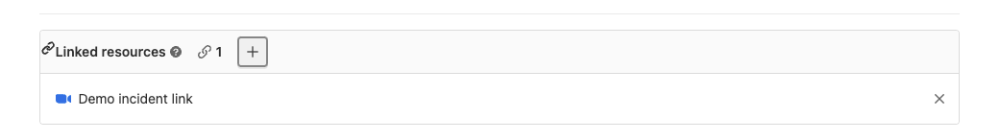

DETAILS:
**Tier:** Premium, Ultimate
**Offering:** GitLab.com, GitLab Self-Managed, GitLab Dedicated

> - [Introduced](https://gitlab.com/gitlab-org/gitlab/-/issues/230852) in GitLab 15.3 [with a flag](../../administration/feature_flags.md) named `incident_resource_links_widget`. Disabled by default.
> - [Enabled on GitLab.com](https://gitlab.com/gitlab-org/gitlab/-/issues/364755) in GitLab 15.3.
> - [Generally available](https://gitlab.com/gitlab-org/gitlab/-/issues/364755) in GitLab 15.5. Feature flag `incident_resource_links_widget` removed.

To help your team members find the important links without having to search through many comments,
you can add linked resources to an incident issue.

Resources you might want link to:

- The incident Slack channel
- Zoom meeting
- Resources for resolving the incidents

## View linked resources of an incident

Linked resources for an incident are listed under the **Summary** tab.



To view the linked resources of an incident:

1. On the left sidebar, select **Search or go to** and find your project.
1. Select **Monitor > Incidents**.
1. Select an incident.

## Add a linked resource

Add a linked resource manually from an incident.

Prerequisites:

- You must have at least the Reporter role for the project.

To add a linked resource:

1. On the left sidebar, select **Search or go to** and find your project.
1. Select **Monitor > Incidents**.
1. Select an incident.
1. In the **Linked resources** section, select the plus icon (**{plus-square}**).
1. Complete the required fields.
1. Select **Add**.

### Using a quick action

> - [Introduced](https://gitlab.com/gitlab-org/gitlab/-/issues/374964) in GitLab 15.5.

To add multiple links to an incident, use the `/link`
[quick action](../../user/project/quick_actions.md):

```plaintext
/link https://example.link.us/j/123456789
```

You can also submit a short description with the link.
The description shows instead of the URL in the **Linked resources** section of the incident:

```plaintext
/link https://example.link.us/j/123456789 multiple alerts firing
```

### Link Zoom meetings from an incident

> - [Introduced](https://gitlab.com/gitlab-org/gitlab/-/issues/230853) in GitLab 15.4.

Use the `/zoom` [quick action](../../user/project/quick_actions.md) to add multiple Zoom links to an incident:

```plaintext
/zoom https://example.zoom.us/j/123456789
```

You can also submit a short optional description with the link. The description shows instead of the URL in the **Linked resources** section of the incident issue:

```plaintext
/zoom https://example.zoom.us/j/123456789 Low on memory incident
```

## Remove a linked resource

You can also remove a linked resource.

Prerequisites:

- You must have at least the Reporter role for the project.

To remove a linked resource:

1. On the left sidebar, select **Search or go to** and find your project.
1. Select **Monitor > Incidents**.
1. Select an incident.
1. In the **Linked resources** section, select **Remove** (**{close}**).
