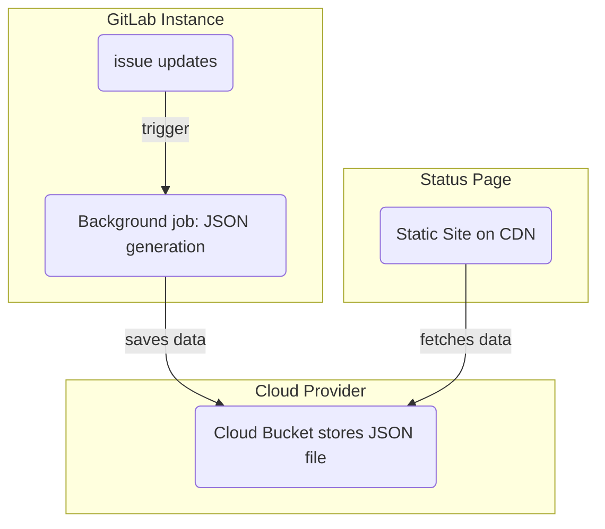

# Status Page **(ULTIMATE)**

> [Introduced](https://gitlab.com/groups/gitlab-org/-/epics/2479) in [GitLab Ultimate](https://about.gitlab.com/pricing/) 12.10.

With a GitLab Status Page, you can create and deploy a static website to communicate
efficiently to users during an incident. The Status Page landing page displays an
overview of recent incidents:

Clicking an incident displays a detail page with more information about a particular incident:

- Status on the incident, including when the incident was last updated.
- The incident title, including any emojis.
- The description of the incident, including emojis.
- Any file attachments provided in the incident description, or comments with a
  valid image extension. [Introduced](https://gitlab.com/gitlab-org/gitlab/-/issues/205166) in GitLab 13.1.
- A chronological ordered list of updates to the incident.

## Set up a Status Page

To configure a GitLab Status Page you must:

1. [Configure GitLab](#configure-gitlab-with-cloud-provider-information) with your
   cloud provider information.
1. [Configure your AWS account](#configure-your-aws-account).
1. [Create a Status Page project](#create-a-status-page-project) on GitLab.
1. [Sync incidents to the Status Page](#sync-incidents-to-the-status-page).

### Configure GitLab with cloud provider information

Only AWS S3 is supported as a deploy target.

To provide GitLab with the AWS account information needed to push content to your Status Page:

1. Sign into GitLab as a user with Maintainer or greater [permissions](../../user/permissions.md).
1. Navigate to **{settings}** **Settings > Monitor**. Next to **Status Page**,
   click **Expand**.
1. Click **Active** to enable the Status Page feature.
1. In **Status Page URL**, provide the URL to your external status page.
1. Provide the **S3 Bucket name**. For more information, see
   [Bucket configuration documentation](https://docs.aws.amazon.com/AmazonS3/latest/dev/HostingWebsiteOnS3Setup.html).
1. Provide the **AWS region** for your bucket. For more information, see the
   [AWS documentation](https://github.com/aws/aws-sdk-ruby#configuration).
1. Provide your **AWS access key ID** and **AWS Secret access key**.
1. Click **Save changes**.

### Configure your AWS account

1. Within your AWS account, create two new IAM policies, using the following files
   as examples:
    - [Create bucket](https://gitlab.com/gitlab-org/status-page/-/blob/master/deploy/etc/s3_create_policy.json).
    - [Update bucket contents](https://gitlab.com/gitlab-org/status-page/-/blob/master/deploy/etc/s3_update_bucket_policy.json) (Remember replace `S3_BUCKET_NAME` with your bucket name).
1. Create a new AWS access key with the permissions policies created in the first step.

### Create a status page project

After configuring your AWS account, you must add the Status Page project and configure
the necessary CI/CD variables to deploy the Status Page to AWS S3:

1. Fork the [Status Page](https://gitlab.com/gitlab-org/status-page) project.
   You can do this through [Repository Mirroring](https://gitlab.com/gitlab-org/status-page#repository-mirroring),
   which ensures you get the up-to-date Status Page features.
1. Navigate to **{settings}** **Settings > CI/CD**.
1. Scroll to **Variables**, and click **Expand**.
1. Add the following variables from your Amazon Console:
   - `S3_BUCKET_NAME` - The name of the Amazon S3 bucket.
     If no bucket with the provided name exists, the first pipeline run creates
     one and configures it for
     [static website hosting](https://docs.aws.amazon.com/AmazonS3/latest/dev/HostingWebsiteOnS3Setup.html).

   - `AWS_DEFAULT_REGION` - The AWS region.
   - `AWS_ACCESS_KEY_ID` - The AWS access key ID.
   - `AWS_SECRET_ACCESS_KEY` - The AWS secret.
1. Navigate to **CI/CD > Pipelines > Run Pipeline**, and run the pipeline to
   deploy the Status Page to S3.

WARNING:
Consider limiting who can access issues in this project, as any user who can view
the issue can potentially [publish comments to your GitLab Status Page](#publish-comments-on-incidents).

### Sync incidents to the Status Page

After creating the CI/CD variables, configure the Project you want to use for
Incident issues:

1. To view the Status Page settings, navigate to **{settings}** **Settings > Monitor > Status Page**.
1. Fill in your cloud provider's credentials and make sure to select the **Active** checkbox.
1. Select **Save changes**.

## How to use your GitLab Status Page

After configuring your GitLab instance, relevant updates trigger a background job
that pushes JSON-formatted data about the incident to your external cloud provider.
Your status page website periodically fetches this JSON-formatted data. It formats
and displays it to users, providing information about ongoing incidents without
extra effort from your team:

### Publish an incident

To publish an incident:

1. Create an issue in the project you enabled the GitLab Status Page settings in.
1. A [project or group owner](../../user/permissions.md) must use the
   `/publish` [quick action](../../user/project/quick_actions.md) to publish the
   issue to the GitLab Status Page. Confidential issues can't be published.

A background worker publishes the issue onto the Status Page using the credentials
you provided during setup. As part of publication, GitLab:

- Anonymizes user and group mentions with `Incident Responder`.
- Removes titles of non-public [GitLab references](../../user/markdown.md#gitlab-specific-references).
- Publishes any files attached to incident issue descriptions, up to 5000 per issue.
  ([Introduced in GitLab 13.1](https://gitlab.com/gitlab-org/gitlab/-/issues/205166).)

After publication, you can access the incident's details page by clicking the
**Published on status page** button displayed under the Incident's title.

### Update an incident

To publish an update to the Incident, update the incident issue's description.

WARNING:
When referenced issues are changed (such as title or confidentiality) the incident
they were referenced in is not updated.

### Publish comments on incidents

To publish comments to the Status Page Incident:

- Create a comment on the incident issue.
- When you're ready to publish the comment, mark the comment for publication by
  adding a microphone [award emoji](../../user/award_emojis.md)
  reaction (`:microphone:` 🎤) to the comment.
- Any files attached to the comment (up to 5000 per issue) are also published.
  ([Introduced in GitLab 13.1](https://gitlab.com/gitlab-org/gitlab/-/issues/205166).)

WARNING:
Anyone with access to view the Issue can add an emoji award to a comment, so
consider limiting access to issues to team members only.

### Update the incident status

To change the incident status from `open` to `closed`, close the incident issue
within GitLab. Closing the issue triggers a background worker to update the
GitLab Status Page website.

If you make a published issue confidential, GitLab unpublishes it from your
GitLab Status Page website.
