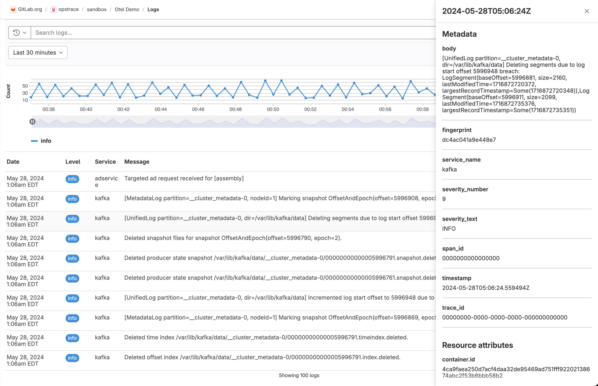

# Logs

DETAILS:
**Tier:** Ultimate
**Offering:** GitLab.com, Self-managed
**Status:** Beta

> - [Introduced](https://gitlab.com/gitlab-org/gitlab/-/merge_requests/143027) in GitLab 16.10 [with a flag](../administration/feature_flags.md) named `observability_logs`. Disabled by default. This feature is in [beta](../policy/experiment-beta-support.md#beta).
> - Feature flag [changed](https://gitlab.com/gitlab-org/gitlab/-/merge_requests/158786) in GitLab 17.3 to the `observability_features` [feature flag](../administration/feature_flags.md), disabled by default. The previous feature flag (`observability_logs`) was removed.
> - [Introduced](https://gitlab.com/groups/gitlab-org/opstrace/-/epics/100) for self-managed in GitLab 17.3.

FLAG:
The availability of this feature is controlled by a feature flag.
For more information, see the history.
This feature is available for testing, but not ready for production use.

GitLab supports centralized application and infrastructure logs collection, storage, and analysis.
GitLab Logging provides insight about the operational health of monitored systems.
Use logs to learn more about your systems and applications in a given range of time.

## Configure logging

Configure logging to enable it for a project.

Prerequisites:

- You must have at least the Maintainer role for the project.

1. Create an access token:
   1. On the left sidebar, select **Search or go to** and find your project.
   1. Select **Settings > Access tokens**.
   1. Create an access token with the `api` scope and **Developer** role or greater.
      Save the access token value for later.
1. To configure your application to send GitLab logs, set the following environment variables:

   ```shell
   OTEL_EXPORTER = "otlphttp"
   OTEL_EXPORTER_OTLP_ENDPOINT = "https://gitlab.example.com/api/v4/projects/<gitlab-project-id>/observability/"
   OTEL_EXPORTER_OTLP_HEADERS = "PRIVATE-TOKEN=<gitlab-access-token>"
   ```

   Use the following values:

   - `gitlab.example.com` - The hostname for your self-managed instance, or `gitlab.com`
   - `gitlab-project-id` - The project ID
   - `gitlab-access-token` - The access token you created

Logs are configured for your project.
When you run your application, the OpenTelemetry exporter sends logs to GitLab.

## View logs

You can view the logs for a given project:

1. On the left sidebar, select **Search or go to** and find your project.
1. Select **Monitor > Logs**.

A list of logs is displayed. Currently log date, level, service, and message are supported.
Select a log line to view its details.

You can either filter logs by attribute or query log strings with the search bar.
The log volume chart at the top shows the number of logs ingested over the given time period.


### View logs details

It is also possible to see log line details such as metadata and resource attributes.


