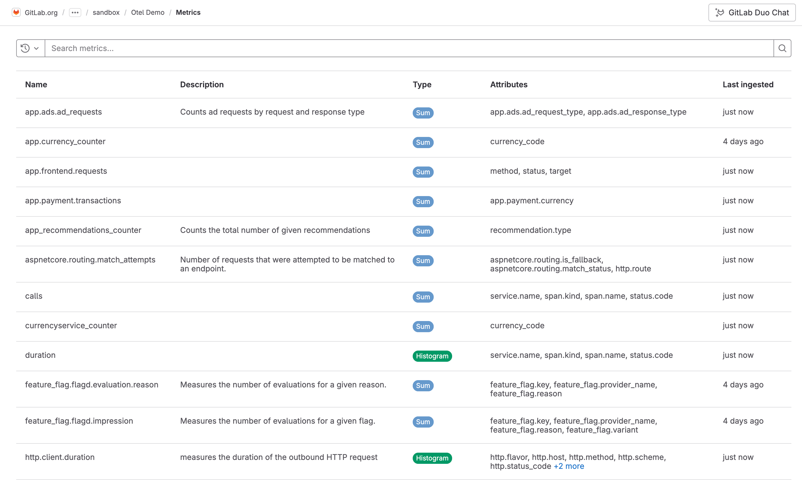

# Metrics

DETAILS:
**Tier:** Ultimate
**Offering:** GitLab.com
**Status:** Beta

> - [Introduced](https://gitlab.com/gitlab-org/gitlab/-/merge_requests/124966) in GitLab 16.7 [with a flag](../administration/feature_flags.md) named `observability_metrics`. Disabled by default. This feature is an [experiment](../policy/experiment-beta-support.md#experiment).
> - Feature flag [changed](https://gitlab.com/gitlab-org/gitlab/-/merge_requests/158786) in GitLab 17.3 to the `observability_features` [feature flag](../administration/feature_flags.md), disabled by default. The previous feature flag (`observability_metrics`) was removed.

FLAG:
The availability of this feature is controlled by a feature flag.
For more information, see the history.
This feature is available for testing, but not ready for production use.

Metrics provide insight about the operational health of monitored systems.
Use metrics to learn more about your systems and applications in a given time range.

Metrics are structured as time series data, and are:

- Indexed by timestamp
- Continuously expanding as additional data is gathered
- Usually aggregated, downsampled, and queried by range
- Have write-intensive requirements

## Configure metrics

Configure metrics to enable them for a project.

Prerequisites:

You must have at least the Maintainer role for the project.

1. Create an access token and enable metrics:
   1. On the left sidebar, select **Search or go to** and find your project.
   1. Select **Settings > Access tokens**.
   1. Create an access token with the following scopes: `read_api`, `read_observability`, `write_observability`. Be sure to save the access token value for later.
   1. Select **Monitor > Metrics**, and then select **Enable**.
1. To configure your application to send GitLab metrics, set the following environment variables:

   ```shell
   OTEL_EXPORTER = "otlphttp"
   OTEL_EXPORTER_OTLP_METRICS_ENDPOINT = "https://observe.gitlab.com/v3/<namespace-id>/<gitlab-project-id>/ingest/metrics"
   OTEL_EXPORTER_OTLP_METRICS_HEADERS = "PRIVATE-TOKEN=<gitlab-access-token>"
   ```

   Use the following values:

   - `namespace-id` - The top-level group ID that contains the project
   - `gitlab-project-id` - The project ID
   - `gitlab-access-token` - The access token you created

Metrics are configured for your project.
When you run your application, the OpenTelemetry exporter sends metrics to GitLab.

## View metrics

You can view the metrics for a given project:

1. On the left sidebar, select **Search or go to** and find your project.
1. Select **Monitor > Metrics**.

A list of metrics is displayed.
Select a metric to view its details.



Each metric contains one or more attributes. You can filter
metrics by attribute with the search bar.

### Metric details

Metrics are displayed as either a sum, a gauge, or a histogram.
The metric details page displays a chart depending on the type of metric.

On the metric details page, you can also view metrics for a specific time range, and
aggregate metrics by attribute:


To make data lookups fast, depending on what time period you filter by,
GitLab automatically chooses the proper aggregation.
For example, if you search for more than seven days of data, the API returns only daily aggregates.

### Aggregations by search period

The following table shows what type of aggregation is used for each search period:

|Period|Aggregation used|
|---|---|
| Less than 30 minutes | Raw data as ingested |
| More than 30 minutes and less than one hour | By minute |
| More than one hour and less than 72 hours | Hourly |
| More than 72 hours | Daily |

### Data retention

GitLab has a retention limit of 30 days for all ingested metrics.
