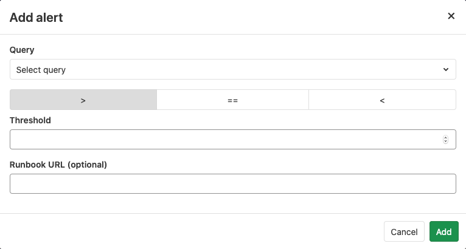
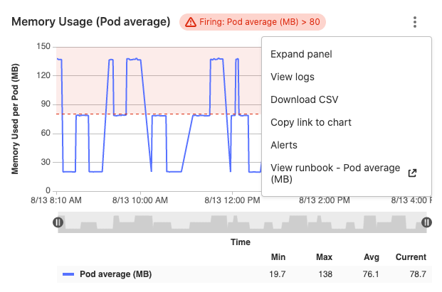

# Set up alerts for Prometheus metrics **(CORE)**

> [Moved from Ultimate to Core](https://gitlab.com/gitlab-org/gitlab/-/issues/42640) in GitLab 12.10.

After [configuring metrics for your CI/CD environment](index.md), you can set up
alerting for Prometheus metrics depending on the location of your instances, and
[trigger actions from alerts](#trigger-actions-from-alerts) to notify
your team when environment performance falls outside of the boundaries you set.

## Managed Prometheus instances

> [Introduced](https://gitlab.com/gitlab-org/gitlab/-/merge_requests/6590) in [GitLab Ultimate](https://about.gitlab.com/pricing/) 11.2 for [custom metrics](index.md#adding-custom-metrics), and GitLab 11.3 for [library metrics](../../user/project/integrations/prometheus_library/index.md).

For managed Prometheus instances using auto configuration, you can
[configure alerts for metrics](index.md#adding-custom-metrics) directly in the
[metrics dashboard](index.md). To set an alert:

1. In your project, navigate to **Operations > Metrics**,
1. Identify the metric you want to create the alert for, and click the
   **ellipsis** **{ellipsis_v}** icon in the top right corner of the metric.
1. Choose **Alerts**.
1. Set threshold and operator.
1. (Optional) Add a Runbook URL.
1. Click **Add** to save and activate the alert.



To remove the alert, click back on the alert icon for the desired metric, and click **Delete**.

### Link runbooks to alerts

> Runbook URLs [introduced](https://gitlab.com/gitlab-org/gitlab/-/merge_requests/39315) in GitLab 13.3.

When creating alerts from the metrics dashboard for [managed Prometheus instances](#managed-prometheus-instances),
you can also link a runbook. When the alert triggers, the
[chart context menu](dashboards/index.md#chart-context-menu) on the metrics chart
links to the runbook, making it easy for you to locate and access the correct runbook
as soon as the alert fires:



## External Prometheus instances

> - [Introduced](https://gitlab.com/gitlab-org/gitlab/-/issues/9258) in [GitLab Ultimate](https://about.gitlab.com/pricing/) 11.8.
> - [Moved](https://gitlab.com/gitlab-org/gitlab/-/issues/42640) to [GitLab Core](https://about.gitlab.com/pricing/) in 12.10.

For manually configured Prometheus servers, GitLab provides a notify endpoint for
use with Prometheus webhooks. If you have manual configuration enabled, an
**Alerts** section is added to **Settings > Integrations > Prometheus**.
This section contains the needed **URL** and **Authorization Key**. The
**Reset Key** button invalidates the key and generates a new one.


To send GitLab alert notifications, copy the **URL** and **Authorization Key** into the
[`webhook_configs`](https://prometheus.io/docs/alerting/latest/configuration/#webhook_config)
section of your Prometheus Alertmanager configuration:

```yaml
receivers:
  name: gitlab
  webhook_configs:
    - http_config:
        bearer_token: 9e1cbfcd546896a9ea8be557caf13a76
      send_resolved: true
      url: http://192.168.178.31:3001/root/manual_prometheus/prometheus/alerts/notify.json
      # Rest of configuration omitted
      # ...
```

For GitLab to associate your alerts with an [environment](../../ci/environments/index.md),
you must configure a `gitlab_environment_name` label on the alerts you set up in
Prometheus. The value of this should match the name of your environment in GitLab.

In GitLab versions 13.1 and greater, you can configure your manually configured
Prometheus server to use the
[Generic alerts integration](../incident_management/generic_alerts.md).

## Trigger actions from alerts **(ULTIMATE)**

> - [Introduced](https://gitlab.com/gitlab-org/gitlab/-/issues/4925) in [GitLab Ultimate](https://about.gitlab.com/pricing/) 11.11.
> - [From GitLab Ultimate 12.5](https://gitlab.com/gitlab-org/gitlab/-/issues/13401), when GitLab receives a recovery alert, it automatically closes the associated issue.

Alerts can be used to trigger actions, like opening an issue automatically
(disabled by default since `13.1`). To configure the actions:

1. Navigate to your project's **Settings > Operations > Incidents**.
1. Enable the option to create issues.
1. Choose the [issue template](../../user/project/description_templates.md) to create the issue from.
1. Optionally, select whether to send an email notification to the developers of the project.
1. Click **Save changes**.

After enabling, GitLab automatically opens an issue when an alert is triggered containing
values extracted from the [`alerts` field in webhook payload](https://prometheus.io/docs/alerting/latest/configuration/#webhook_config):

- Issue author: `GitLab Alert Bot`
- Issue title: Extracted from the alert payload fields `annotations/title`, `annotations/summary`, or `labels/alertname`.
- Alert `Summary`: A list of properties from the alert's payload.
  - `starts_at`: Alert start time from the payload's `startsAt` field
  - `full_query`: Alert query extracted from the payload's `generatorURL` field
  - Optional list of attached annotations extracted from `annotations/*`
- Alert [GFM](../../user/markdown.md): GitLab Flavored Markdown from the payload's `annotations/gitlab_incident_markdown` field.

When GitLab receives a **Recovery Alert**, it closes the associated issue.
This action is recorded as a system message on the issue indicating that it
was closed automatically by the GitLab Alert bot.

To further customize the issue, you can add labels, mentions, or any other supported
[quick action](../../user/project/quick_actions.md) in the selected issue template,
which applies to all incidents. To limit quick actions or other information to
only specific types of alerts, use the `annotations/gitlab_incident_markdown` field.

Since [version 12.2](https://gitlab.com/gitlab-org/gitlab-foss/-/issues/63373),
GitLab tags each incident issue with the `incident` label automatically. If the label
does not yet exist, it is also created automatically.

If the metric exceeds the threshold of the alert for over 5 minutes, GitLab sends
an email to all [Maintainers and Owners](../../user/permissions.md#project-members-permissions)
of the project.
