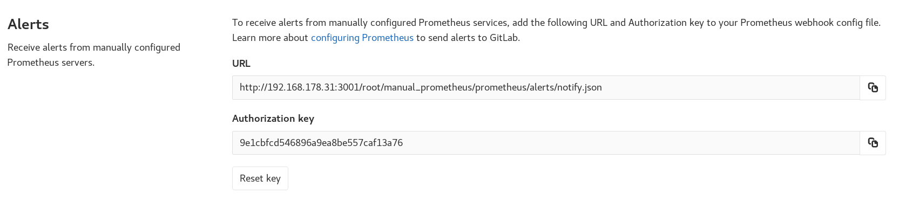

# Set up alerts for Prometheus metrics **(FREE)**

> [Moved](https://gitlab.com/gitlab-org/gitlab/-/issues/42640) to GitLab Free in 12.10.

After [configuring metrics for your CI/CD environment](index.md), you can set up
alerting for Prometheus metrics, and
[trigger actions from alerts](#trigger-actions-from-alerts) to notify
your team when environment performance falls outside of the boundaries you set.

## Prometheus cluster integrations

Alerts are not currently supported for [Prometheus cluster integrations](../../user/clusters/integrations.md).

## External Prometheus instances

> - [Introduced](https://gitlab.com/gitlab-org/gitlab/-/issues/9258) in GitLab Ultimate 11.8.
> - [Moved](https://gitlab.com/gitlab-org/gitlab/-/issues/42640) to GitLab Free in 12.10.

For manually configured Prometheus servers, GitLab provides a notify endpoint for
use with Prometheus webhooks. If you have manual configuration enabled, an
**Alerts** section is added to **Settings > Integrations > Prometheus**.
This section contains the needed **URL** and **Authorization Key**. The
**Reset Key** button invalidates the key and generates a new one.



To send GitLab alert notifications, copy the **URL** and **Authorization Key** into the
[`webhook_configs`](https://prometheus.io/docs/alerting/latest/configuration/#webhook_config)
section of your Prometheus Alertmanager configuration:

```yaml
receivers:
  - name: gitlab
    webhook_configs:
      - http_config:
          authorization:
            type: Bearer
            credentials: 9e1cbfcd546896a9ea8be557caf13a76
        send_resolved: true
        url: http://192.168.178.31:3001/root/manual_prometheus/prometheus/alerts/notify.json
        # Rest of configuration omitted
        # ...
```

For GitLab to associate your alerts with an [environment](../../ci/environments/index.md),
you must configure a `gitlab_environment_name` label on the alerts you set up in
Prometheus. The value of this should match the name of your environment in GitLab.

You can display alerts with a `gitlab_environment_name` of `production`
[on a dashboard](../../user/operations_dashboard/index.md#adding-a-project-to-the-dashboard).

In GitLab versions 13.1 and greater, you can configure your manually configured
Prometheus server to use the
[Generic alerts integration](../incident_management/integrations.md).

## Trigger actions from alerts **(ULTIMATE)**

> - [Introduced](https://gitlab.com/gitlab-org/gitlab/-/issues/4925) in [GitLab Ultimate](https://about.gitlab.com/pricing/) 11.11.

Alerts can be used to trigger actions, like opening an issue automatically
(disabled by default since `13.1`). To configure the actions:

1. Navigate to your project's **Settings > Monitor > Alerts**.
1. Enable the option to create issues.
1. Choose the [issue template](../../user/project/description_templates.md) to create the issue from.
1. Optionally, select whether to send an email notification to the developers of the project.
1. Click **Save changes**.

After enabling, GitLab automatically opens an issue when an alert is triggered containing
values extracted from the [`alerts` field in webhook payload](https://prometheus.io/docs/alerting/latest/configuration/#webhook_config):

- Issue author: `GitLab Alert Bot`
- Issue title: Extracted from the alert payload fields `annotations/title`, `annotations/summary`, or `labels/alertname`.
- Issue description: Extracted from alert payload field `annotations/description`.
- Alert `Summary`: A list of properties from the alert's payload.
  - `starts_at`: Alert start time from the payload's `startsAt` field
  - `full_query`: Alert query extracted from the payload's `generatorURL` field
  - Optional list of attached annotations extracted from `annotations/*`
- Alert [GFM](../../user/markdown.md): GitLab Flavored Markdown from the payload's `annotations/gitlab_incident_markdown` field.
- Alert Severity (introduced in GitLab version [13.9](https://gitlab.com/gitlab-org/gitlab/-/merge_requests/50871):
  Extracted from the alert payload field `labels/severity`. Maps case-insensitive
  value to [Alert's severity](../incident_management/alerts.md#alert-severity):
  - **Critical**: `critical`, `s1`, `p1`, `emergency`, `fatal`, or any value not in this list
  - **High**: `high`, `s2`, `p2`, `major`, `page`
  - **Medium**: `medium`, `s3`, `p3`, `error`, `alert`
  - **Low**: `low`, `s4`, `p4`, `warn`, `warning`
  - **Info**: `info`, `s5`, `p5`, `debug`, `information`, `notice`

To further customize the issue, you can add labels, mentions, or any other supported
[quick action](../../user/project/quick_actions.md) in the selected issue template,
which applies to all incidents. To limit quick actions or other information to
only specific types of alerts, use the `annotations/gitlab_incident_markdown` field.

Since [version 12.2](https://gitlab.com/gitlab-org/gitlab-foss/-/issues/63373),
GitLab tags each incident issue with the `incident` label automatically. If the label
does not yet exist, it is also created automatically.

If the metric exceeds the threshold of the alert for over 5 minutes, GitLab sends
an email to all [Maintainers and Owners](../../user/permissions.md#project-members-permissions)
of the project.

### Recovery alerts

> - [From GitLab Ultimate 12.5](https://gitlab.com/gitlab-org/gitlab/-/issues/13401), when GitLab receives a recovery alert, it automatically closes the associated issue.

The alert in GitLab will be automatically resolved when Prometheus
sends a payload with the field `status` set to `resolved`.

You can also configure the associated [incident to be closed automatically](../incident_management/incidents.md#automatically-close-incidents-via-recovery-alerts) when the alert resolves.
