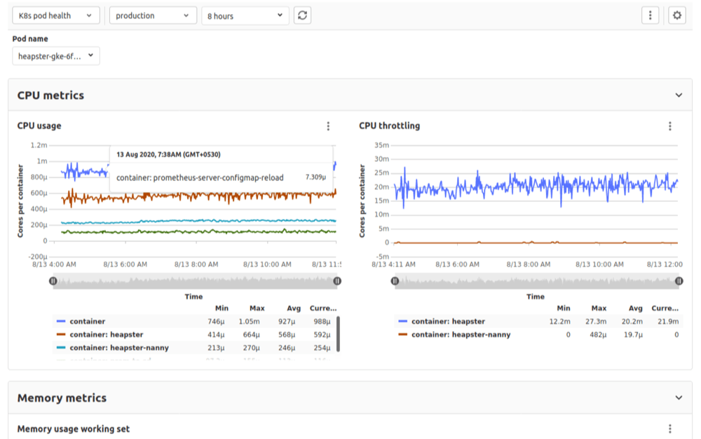

# GitLab-defined metrics dashboards **(FREE)**

GitLab provides some dashboards out-of-the-box for any project with
[Prometheus available](../../../user/project/integrations/prometheus.md). You can
[duplicate these GitLab-defined dashboards](index.md#duplicate-a-gitlab-defined-dashboard):

- [Overview dashboard](#overview-dashboard).
- [Kubernetes pod health dashboard](#kubernetes-pod-health-dashboard).

To learn about the components of a dashboard, read
[Metrics dashboard for your CI/CD environment](../index.md).

## Overview dashboard

This dashboard is the default metrics dashboard. It displays a large number of
metrics about the [deployed application](../index.md#configure-prometheus-to-gather-metrics).

## Kubernetes pod health dashboard

This dashboard requires Kubernetes v1.14 or higher, due to the
[change in metric labels](https://github.com/kubernetes/kubernetes/pull/69099)
in Kubernetes 1.14.

This dashboard displays CPU, memory, network and disk metrics for the pods in your
[connected K8s cluster](../../../user/project/clusters/index.md). It provides a
[variable selector](templating_variables.md#metric_label_values-variable-type)
at the top of the dashboard to select which pod's metrics to display.

