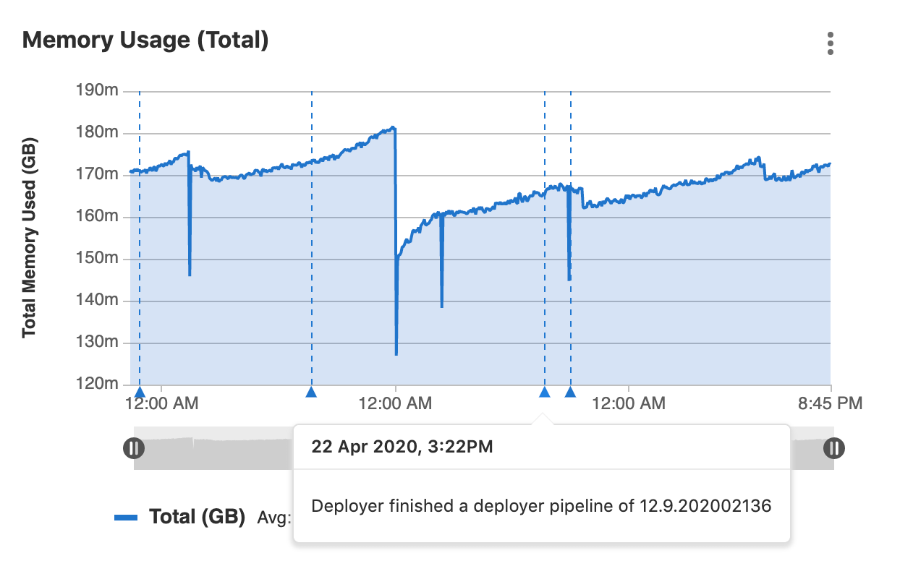
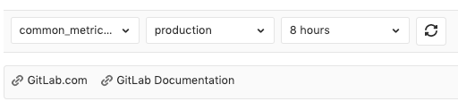

# Custom dashboards

> [Introduced](https://gitlab.com/gitlab-org/gitlab-foss/-/issues/59974) in GitLab 12.1.

By default, all projects include a GitLab-defined Prometheus dashboard, which
includes a few key metrics, but you can also define your own custom dashboards.

You may create a [new dashboard from scratch](#add-a-new-dashboard-to-your-project)
or [duplicate a GitLab-defined Prometheus dashboard](#duplicate-a-gitlab-defined-dashboard).

NOTE: **Note:**
The metrics as defined below do not support alerts, unlike
[custom metrics](../index.md#adding-custom-metrics).

## Add a new dashboard to your project

> UI option [introduced](https://gitlab.com/gitlab-org/gitlab/-/issues/223204) in GitLab 13.2.

You can configure a custom dashboard by adding a new YAML file into your project's
`.gitlab/dashboards/` directory. For the dashboard to display on your project's
**{cloud-gear}** **Operations > Metrics** page, the files must have a `.yml`
extension and be present in your project's **default** branch.

To create a new dashboard from the GitLab user interface:

1. Sign in to GitLab as a user with Maintainer or Owner
   [permissions](../../../user/permissions.md#project-members-permissions).
1. Navigate to your dashboard at **{cloud-gear}** **Operations > Metrics**.
1. In the top-right corner of your dashboard, click the **{file-addition-solid}** **Actions** menu,
   and select **Create new**:
   
1. In the modal window, click **Open Repository**, then follow the instructions
   for creating a new dashboard from the command line.

To create a new dashboard from the command line:

1. Create `.gitlab/dashboards/prom_alerts.yml` under your repository's root
   directory. Each YAML file should define the layout of the dashboard and the
   Prometheus queries used to populate data. This example dashboard displays a
   single area chart:

   ```yaml
   dashboard: 'Dashboard Title'
   panel_groups:
     - group: 'Group Title'
       panels:
         - type: area-chart
           title: "Chart Title"
           y_label: "Y-Axis"
           y_axis:
             format: number
             precision: 0
           metrics:
             - id: my_metric_id
               query_range: 'http_requests_total'
               label: "Instance: {{instance}}, method: {{method}}"
               unit: "count"
   ```

1. Save the file, commit, and push to your repository. The file must be present in your **default** branch.
1. Navigate to your project's **Operations > Metrics** and choose the custom
   dashboard from the dropdown.

Your custom dashboard is available at `https://example.com/project/-/metrics/custom_dashboard_name.yml`.

NOTE: **Note:**
Configuration files nested under subdirectories of `.gitlab/dashboards` are not
supported and won't be available in the UI.

## Duplicate a GitLab-defined dashboard

> - [Introduced](https://gitlab.com/gitlab-org/gitlab/-/issues/37238) in GitLab 12.7.
> - From [GitLab 12.8 onwards](https://gitlab.com/gitlab-org/gitlab/-/issues/39505), custom metrics are also duplicated when you duplicate a dashboard.

You can save a complete copy of a GitLab defined dashboard along with all custom metrics added to it.
The resulting `.yml` file can be customized and adapted to your project.
You can decide to save the dashboard `.yml` file in the project's **default** branch or in a
new branch.

1. Click **Duplicate dashboard** in the dashboard dropdown or in the actions menu.

   NOTE: **Note:**
   You can duplicate only GitLab-defined dashboards.

1. Enter the filename and other information, such as the new commit's message, and click **Duplicate**.
1. Select a branch to add your dashboard to:
   - *If you select your **default** branch,* the new dashboard becomes immediately available.
   - *If you select another branch,* this branch should be merged to your **default** branch first.

Your custom dashboard is available at `https://example.com/project/-/metrics/custom_dashboard_name.yml`.

## Manage the metrics dashboard settings

> [Introduced](https://gitlab.com/gitlab-org/gitlab/-/issues/223204) in GitLab 13.2.

To manage the settings for your metrics dashboard:

1. Sign in as a user with project Maintainer or Admin
   [permissions](../../../user/permissions.md#project-members-permissions).
1. Navigate to your dashboard at **{cloud-gear}** **Operations > Metrics**.
1. In the top-right corner of your dashboard, click **{settings}** **Metrics Settings**:

   

## Chart Context Menu

You can take action related to a chart's data by clicking the
**{ellipsis_v}** **More actions** dropdown box above the upper right corner of
any chart on a dashboard:


The options are:

- **Expand panel** - Displays a larger version of a visualization. To return to
  the dashboard, click the **Back** button in your browser, or press the <kbd>Esc</kbd> key.
  ([Introduced](https://gitlab.com/groups/gitlab-org/-/epics/3100) in GitLab 13.0.)
- **View logs** **(ULTIMATE)** - Displays [Logs](../../../user/project/clusters/kubernetes_pod_logs.md),
  if they are enabled. If used in conjunction with the [timeline zoom](#timeline-zoom-and-url-sharing)
  feature, logs narrow down to the selected time range. ([Introduced](https://gitlab.com/gitlab-org/gitlab/-/issues/122013) in GitLab 12.8.)
- **Download CSV** - Data from Prometheus charts on the metrics dashboard can be downloaded as CSV.
- [Copy link to chart](../embed.md#embedding-gitlab-managed-kubernetes-metrics)
- [Alerts](../alerts.md)

### Timeline zoom and URL sharing

> [Introduced](https://gitlab.com/gitlab-org/gitlab/-/issues/198910) in GitLab 12.8.

You can use the **Timeline zoom** function at the bottom of a chart to zoom in
on a date and time of your choice. When you click and drag the sliders to select
a different beginning or end date of data to display, GitLab adds your selected start
and end times to the URL, enabling you to share specific timeframes more easily.

## Dashboard Annotations

> - [Introduced](https://gitlab.com/gitlab-org/gitlab/-/issues/211330) in GitLab 12.10 (enabled by feature flag `metrics_dashboard_annotations`).
> - [Feature flag removed](https://gitlab.com/gitlab-org/gitlab/-/issues/215224) in GitLab 13.0.

You can use **Metrics Dashboard Annotations** to mark any important events on
every metrics dashboard by adding annotations to it. While viewing a dashboard,
annotation entries assigned to the selected time range will be automatically
fetched and displayed on every chart within that dashboard. On mouse hover, each
annotation presents additional details, including the exact time of an event and
its description.

You can create annotations by making requests to the
[Metrics dashboard annotations API](../../../api/metrics_dashboard_annotations.md)



### Annotation retention policy

> [Introduced](https://gitlab.com/gitlab-org/gitlab/-/issues/211433) in GitLab 13.01.

To avoid excessive storage space consumption by stale annotations, records attached
to time periods older than two weeks are removed daily. This recurring background
job runs at 1:00 a.m. local server time.

## Add related links to custom dashboards

> [Introduced](https://gitlab.com/gitlab-org/gitlab/-/issues/216385) in GitLab 13.1.

You can embed links to other dashboards or external services in your custom
dashboard by adding **Related links** to your dashboard's YAML file. Related links
open in the same tab as the dashboard. Related links can be displayed in the
following locations on your dashboard:

- At the top of your dashboard as the top level [`links` dashboard property](../../../operations/metrics/dashboards/yaml.md#dashboard-top-level-properties).
- In charts context menus as the [`links` property of a panel](../../../operations/metrics/dashboards/yaml.md#panel-panels-properties).

Related links can contain the following attributes:

- `url`: The full URL to the link. Required.
- `title`: A phrase describing the link. Optional. If this attribute is not set,
  the full URL is used for the link title.
- `type`: A string declaring the type of link. Optional. If set to `grafana`, the
  dashboard's time range values are converted to Grafana's time range format and
  appended to the `url`.

The dashboard's time range is appended to the `url` as URL parameters.

The following example shows two related links (`GitLab.com` and `GitLab Documentation`)
added to a dashboard:



### Links Syntax

```yaml
links:
  - title: GitLab.com
    url: https://gitlab.com
  - title: GitLab Documentation
    url: https://docs.gitlab.com
  - title: Public Grafana playground dashboard
    url: https://play.grafana.org/d/000000012/grafana-play-home?orgId=1
    type: grafana
```

## Troubleshooting

When troubleshooting issues with a managed Prometheus app, it is often useful to
[view the Prometheus UI](../../../development/prometheus.md#access-the-ui-of-a-prometheus-managed-application-in-kubernetes).

### "No data found" error on Metrics dashboard page

If the "No data found" screen continues to appear, it could be due to:

- No successful deployments have occurred to this environment.
- Prometheus does not have performance data for this environment, or the metrics
  are not labeled correctly. To test this, connect to the Prometheus server and
  [run a query](../../../user/project/integrations/prometheus_library/kubernetes.md#metrics-supported), replacing `$CI_ENVIRONMENT_SLUG`
  with the name of your environment.
- You may need to re-add the GitLab predefined common metrics. This can be done by running the [import common metrics Rake task](../../../administration/raketasks/maintenance.md#import-common-metrics).
