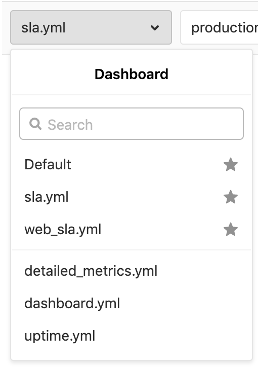
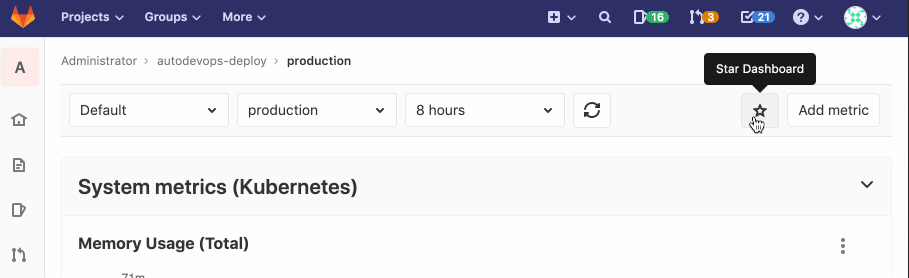

# Using the Metrics Dashboard

## Select an environment

The **Environment** dropdown box above the dashboard displays the list of all [environments](../../../user/project/integrations/prometheus.md#monitoring-cicd-environments).
It enables you to search as you type through all environments and select the one you're looking for.

## Select a dashboard

The **dashboard** dropdown box above the dashboard displays the list of all dashboards available for the project.
It enables you to search as you type through all dashboards and select the one you're looking for.

## Mark a dashboard as favorite

> [Introduced](https://gitlab.com/gitlab-org/gitlab/-/issues/214582) in GitLab 13.0.

When viewing a dashboard, click the empty **Star dashboard** **{star-o}** button to mark a
dashboard as a favorite. Starred dashboards display a solid star **{star}** button,
and appear at the top of the dashboard select list.

To remove dashboard from the favorites list, click the solid **Unstar Dashboard** **{star}** button.

## Manage the metrics dashboard settings

> [Introduced](https://gitlab.com/gitlab-org/gitlab/-/issues/223204) in GitLab 13.2.

To manage the settings for your metrics dashboard:

1. Sign in as a user with project Maintainer or Admin
   [permissions](../../../user/permissions.md#project-members-permissions).
1. Navigate to your dashboard at **{cloud-gear}** **Operations > Metrics**.
1. In the top-right corner of your dashboard, click **{settings}** **Metrics Settings**:

   

## Chart Context Menu

From each of the panels in the dashboard, you can access the context menu by clicking the **{ellipsis_v}** **More actions** dropdown box above the upper right corner of the panel to take actions related to the chart's data.

The options are:

- [Expand panel](#expand-panel)
- [View logs](#view-logs-ultimate)
- [Download CSV](#downloading-data-as-csv)
- [Copy link to chart](../embed.md#embedding-gitlab-managed-kubernetes-metrics)
- [Alerts](../../../user/project/integrations/prometheus.md#setting-up-alerts-for-prometheus-metrics)

### View and edit the source file of a custom dashboard

> [Introduced](https://gitlab.com/gitlab-org/gitlab/-/issues/34779) in GitLab 12.5.

When viewing a custom dashboard of a project, you can view the original
`.yml` file by clicking on the **Edit dashboard** button.

### Expand panel

> [Introduced](https://gitlab.com/groups/gitlab-org/-/epics/3100) in GitLab 13.0.

To view a larger version of a visualization, expand the panel by clicking the
**{ellipsis_v}** **More actions** icon and selecting **Expand panel**.

To return to the metrics dashboard, click the **Back** button in your
browser, or pressing the <kbd>Esc</kbd> key.

### View Logs **(ULTIMATE)**

> [Introduced](https://gitlab.com/gitlab-org/gitlab/-/issues/122013) in GitLab 12.8.

If you have [Logs](../../../user/project/clusters/kubernetes_pod_logs.md) enabled,
you can navigate from the charts in the dashboard to view Logs by
clicking on the context menu in the upper-right corner.

If you use the **Timeline zoom** function at the bottom of the chart, logs will narrow down to the time range you selected.

### Timeline zoom and URL sharing

> [Introduced](https://gitlab.com/gitlab-org/gitlab/-/issues/198910) in GitLab 12.8.

You can use the **Timeline zoom** function at the bottom of a chart to zoom in
on a date and time of your choice. When you click and drag the sliders to select
a different beginning or end date of data to display, GitLab adds your selected start
and end times to the URL, enabling you to share specific timeframes more easily.

### Downloading data as CSV

Data from Prometheus charts on the metrics dashboard can be downloaded as CSV.

## Dashboard Annotations

> - [Introduced](https://gitlab.com/gitlab-org/gitlab/-/issues/211330) in GitLab 12.10 (enabled by feature flag `metrics_dashboard_annotations`).
> - [Feature flag removed](https://gitlab.com/gitlab-org/gitlab/-/issues/215224) in GitLab 13.0.

You can use **Metrics Dashboard Annotations** to mark any important events on
every metrics dashboard by adding annotations to it. While viewing a dashboard,
annotation entries assigned to the selected time range will be automatically
fetched and displayed on every chart within that dashboard. On mouse hover, each
annotation presents additional details, including the exact time of an event and
its description.

You can create annotations by making requests to the
[Metrics dashboard annotations API](../../../api/metrics_dashboard_annotations.md)

### Retention policy

> [Introduced](https://gitlab.com/gitlab-org/gitlab/-/issues/211433) in GitLab 13.01.

To avoid excessive storage space consumption by stale annotations, records attached
to time periods older than two weeks are removed daily. This recurring background
job runs at 1:00 a.m. local server time.
