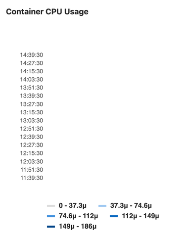

# Panel types for dashboards

The below panel types are supported in monitoring dashboards.

## Area or Line Chart

To add an area chart panel type to a dashboard, look at the following sample dashboard file:

```yaml
dashboard: 'Dashboard Title'
panel_groups:
  - group: 'Group Title'
    panels:
      - type: area-chart # or line-chart
        title: 'Area Chart Title'
        y_label: "Y-Axis"
        y_axis:
          format: number
          precision: 0
        metrics:
          - id: area_http_requests_total
            query_range: 'http_requests_total'
            label: "Instance: {{instance}}, Method: {{method}}"
            unit: "count"
```

Note the following properties:

| Property | Type | Required | Description |
| ------ | ------ | ------ | ------ |
| type | string | no | Type of panel to be rendered. Optional for area panel types |
| query_range | string | required | For area panel types, you must use a [range query](https://prometheus.io/docs/prometheus/latest/querying/api/#range-queries) |


Starting in [version 12.8](https://gitlab.com/gitlab-org/gitlab/-/issues/202696), the y-axis values will automatically scale according to the data. Previously, it always started from 0.

## Anomaly chart

> [Introduced](https://gitlab.com/gitlab-org/gitlab/-/merge_requests/16530) in GitLab 12.5.

To add an anomaly chart panel type to a dashboard, add a panel with *exactly* 3 metrics.

The first metric represents the current state, and the second and third metrics represent the upper and lower limit respectively:

```yaml
dashboard: 'Dashboard Title'
panel_groups:
  - group: 'Group Title'
    panels:
      - type: anomaly-chart
        title: "Chart Title"
        y_label: "Y-Axis"
        metrics:
          - id: anomaly_requests_normal
            query_range: 'http_requests_total'
            label: "# of Requests"
            unit: "count"
        metrics:
          - id: anomaly_requests_upper_limit
            query_range: 10000
            label: "Max # of requests"
            unit: "count"
        metrics:
          - id: anomaly_requests_lower_limit
            query_range: 2000
            label: "Min # of requests"
            unit: "count"
```

Note the following properties:

| Property | Type | Required | Description |
| ------ | ------ | ------ | ------ |
| type | string | required | Must be `anomaly-chart` for anomaly panel types |
| query_range | yes | required | For anomaly panel types, you must use a [range query](https://prometheus.io/docs/prometheus/latest/querying/api/#range-queries) in every metric. |


## Bar chart

To add a bar chart to a dashboard, look at the following sample dashboard file:

```yaml
dashboard: 'Dashboard Title'
panel_groups:
  - group: 'Group title'
    panels:
      - type: bar
        title: "Http Handlers"
        x_label: 'Response Size'
        y_axis:
          name: "Handlers"
        metrics:
          - id: prometheus_http_response_size_bytes_bucket
            query_range: "sum(increase(prometheus_http_response_size_bytes_bucket[1d])) by (handler)"
            unit: 'Bytes'
```

Note the following properties:

| Property | Type | Required | Description |
| ------ | ------ | ------ | ------ |
| `type` | string | yes | Type of panel to be rendered. For bar chart types, set to `bar` |
| `query_range` | yes | yes | For bar chart, you must use a [range query](https://prometheus.io/docs/prometheus/latest/querying/api/#range-queries)


## Column chart

To add a column panel type to a dashboard, look at the following sample dashboard file:

```yaml
dashboard: 'Dashboard Title'
panel_groups:
  - group: 'Group title'
    panels:
      - title: "Column"
        type: "column"
        metrics:
        - id: 1024_memory
          query: 'avg(sum(container_memory_usage_bytes{container_name!="POD",pod_name=~"^%{ci_environment_slug}-([^c].*|c([^a]|a([^n]|n([^a]|a([^r]|r[^y])))).*|)-(.*)",namespace="%{kube_namespace}"}) by (job)) without (job) / count(avg(container_memory_usage_bytes{container_name!="POD",pod_name=~"^%{ci_environment_slug}-([^c].*|c([^a]|a([^n]|n([^a]|a([^r]|r[^y])))).*|)-(.*)",namespace="%{kube_namespace}"}) without (job)) /1024/1024'
          unit: MB
          label: "Memory Usage"
```

Note the following properties:

| Property | Type | Required | Description |
| ------ | ------ | ------ | ------ |
| type | string | yes | Type of panel to be rendered. For column panel types, set to `column` |
| query_range | yes | yes | For column panel types, you must use a [range query](https://prometheus.io/docs/prometheus/latest/querying/api/#range-queries) |


## Stacked column

> [Introduced](https://gitlab.com/gitlab-org/gitlab/-/issues/30583) in GitLab 12.8.

To add a stacked column panel type to a dashboard, look at the following sample dashboard file:

```yaml
dashboard: 'Dashboard title'
priority: 1
panel_groups:
  - group: 'Group Title'
    priority: 5
    panels:
      - type: 'stacked-column'
        title: "Stacked column"
        y_label: "y label"
        x_label: 'x label'
        metrics:
          - id: memory_1
            query_range: 'memory_query'
            label: "memory query 1"
            unit: "count"
            series_name: 'group 1'
          - id: memory_2
            query_range: 'memory_query_2'
            label: "memory query 2"
            unit: "count"
            series_name: 'group 2'
```


| Property | Type | Required | Description |
| ------ | ------ | ------ | ------ |
| `type` | string | yes | Type of panel to be rendered. For stacked column panel types, set to `stacked-column` |
| `query_range` | yes | yes | For stacked column panel types, you must use a [range query](https://prometheus.io/docs/prometheus/latest/querying/api/#range-queries) |

## Single Stat

To add a single stat panel type to a dashboard, look at the following sample dashboard file:

```yaml
dashboard: 'Dashboard Title'
panel_groups:
  - group: 'Group Title'
    panels:
      - title: "Single Stat"
        type: "single-stat"
        metrics:
          - id: 10
            query: 'max(go_memstats_alloc_bytes{job="prometheus"})'
            unit: MB
            label: "Total"
```

Note the following properties:

| Property | Type | Required | Description |
| ------ | ------ | ------ | ------ |
| type | string | yes | Type of panel to be rendered. For single stat panel types, set to `single-stat` |
| field | string | no | Panels display the value of a metric. For a panel to display the value of a label instead, put the name of the label in this key. |
| query | string | yes | For single stat panel types, you must use an [instant query](https://prometheus.io/docs/prometheus/latest/querying/api/#instant-queries) |


## Percentile based results

> [Introduced](https://gitlab.com/gitlab-org/gitlab/-/issues/201946) in GitLab 12.8.

Query results sometimes need to be represented as a percentage value out of 100. You can use the `max_value` property at the root of the panel definition:

```yaml
dashboard: 'Dashboard Title'
panel_groups:
  - group: 'Group Title'
    panels:
      - title: "Single Stat"
        type: "single-stat"
        max_value: 100
        metrics:
          - id: 10
            query: 'max(go_memstats_alloc_bytes{job="prometheus"})'
            unit: '%'
            label: "Total"
```

For example, if you have a query value of `53.6`, adding `%` as the unit results in a single stat value of `53.6%`, but if the maximum expected value of the query is `120`, the value would be `44.6%`. Adding the `max_value` causes the correct percentage value to display.

## Heatmaps

> [Introduced](https://gitlab.com/gitlab-org/gitlab/-/issues/30581) in GitLab 12.5.

To add a heatmap panel type to a dashboard, look at the following sample dashboard file:

```yaml
dashboard: 'Dashboard Title'
panel_groups:
  - group: 'Group Title'
    panels:
      - title: "Heatmap"
        type: "heatmap"
        metrics:
          - id: 10
            query: 'sum(rate(nginx_upstream_responses_total{upstream=~"%{kube_namespace}-%{ci_environment_slug}-.*"}[60m])) by (status_code)'
            unit: req/sec
            label: "Status code"
```

Note the following properties:

| Property | Type | Required | Description |
| ------ | ------ | ------ | ------ |
| type | string | yes | Type of panel to be rendered. For heatmap panel types, set to `heatmap` |
| query_range | yes | yes | For area panel types, you must use a [range query](https://prometheus.io/docs/prometheus/latest/querying/api/#range-queries) |


CAUTION: **Warning:**
When a query returns too many data points, the heatmap data bucket dimensions tend downwards to 0, making the chart's data invisible, as shown in the image below. To fix this problem, limit the amount of data returned by changing the time range filter on the metrics dashboard UI, or adding the **step** property to your dashboard's YAML file.


