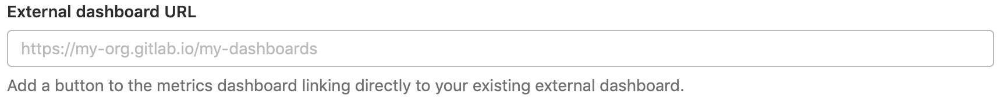

# Dashboard settings (deprecated) **(FREE)**

> [Deprecated](https://gitlab.com/gitlab-org/gitlab/-/issues/346541) in GitLab 14.7.

WARNING:
This feature is in its end-of-life process. It is [deprecated](https://gitlab.com/gitlab-org/gitlab/-/issues/346541)
in GitLab 14.7, and is planned for removal in GitLab 16.0.

You can configure your [Monitoring dashboard](../index.md) to
display the time zone of your choice, and the links of your choice.

To configure these settings you must have Manage Project
Operations [permissions](../../../user/permissions.md).

## Change the dashboard time zone

> [Introduced](https://gitlab.com/gitlab-org/gitlab/-/issues/214370) in GitLab 13.1.

By default, your monitoring dashboard displays dates and times in your local
time zone, but you can display dates and times in UTC format. To change the
time zone:

1. Sign in as a user with Manage Project Operations [permissions](../../../user/permissions.md).
1. Navigate to **Settings > Monitor**.
1. Scroll to **Metrics Dashboard** and select **Expand**.
1. In the **Dashboard timezone** select box, select *User's local timezone*
   or *UTC*:

   
1. Select **Save changes**.

## Link to an external dashboard

> [Introduced](https://gitlab.com/gitlab-org/gitlab-foss/-/issues/57171) in GitLab 12.0.

You can add a button on your monitoring dashboard that links directly to your
existing external dashboards:

1. Sign in as a user with Manage Project Operations [permissions](../../../user/permissions.md).
1. Navigate to **Settings > Monitor**.
1. Scroll to **Metrics Dashboard** and select **Expand**.
1. In **External dashboard URL**, provide the URL to your external dashboard:

   

1. Select **Save changes**.

GitLab displays a **View full dashboard** button in the upper-right corner of your
[monitoring dashboard](../../../ci/environments/index.md#monitor-environments)
which opens the URL you provided:

