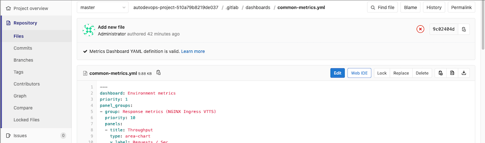

# Dashboard YAML properties **(FREE)**

Dashboards have several components:

- Templating variables.
- Panel groups, which consist of panels.
- Panels, which support one or more metrics.

The following tables outline the details of expected properties.

## **Dashboard (top-level) properties**

| Property | Type | Required | Description |
| ------ | ------ | ------ | ------ |
| `dashboard` | string | yes | Heading for the dashboard. Only one dashboard should be defined per file. |
| `panel_groups` | array | yes | The panel groups which should be on the dashboard. |
| `templating` | hash | no | Top level key under which templating related options can be added. |
| `links` | array | no | Add links to display on the dashboard. |

## **Templating (`templating`) properties**

| Property | Type | Required | Description |
| -------- | ---- | -------- | ----------- |
| `variables` | hash | yes | Variables can be defined here. |

Read the documentation on [templating](templating_variables.md).

## **Links (`links`) properties**

| Property | Type | Required | Description |
| -------- | ---- | -------- | ----------- |
| `url` | string | yes | The address of the link. |
| `title` | string | no | Display title for the link. |
| `type` | string | no | Type of the link. Specifies the link type, can be: `grafana` |

Read the documentation on [links](index.md#add-related-links-to-custom-dashboards).

## **Panel group (`panel_groups`) properties**

Dashboards display panel groups in the order they are listed in the dashboard YAML file.

In GitLab versions 13.3 and below, panel groups were ordered by a `priority` key, which
is no longer used.

| Property | Type | Required | Description |
| ------ | ------ | ------ | ------ |
| `group` | string | required | Heading for the panel group. |
| `panels` | array | required | The panels which should be in the panel group. |

Panels in a panel group are laid out in rows consisting of two panels per row. An exception to this rule are single panels on a row: these panels take the full width of their containing row.

## **Panel (`panels`) properties**

Dashboards display panels in the order they are listed in the dashboard YAML file.

In GitLab versions 13.3 and below, panels were ordered by a `weight` key, which
is no longer used.

| Property | Type | Required | Description |
| ------ | ------ | ------ | ------- |
| `type` | string | no, defaults to `area-chart` | Specifies the panel type to use, for example `area-chart`, `line-chart` or `anomaly-chart`. Only types listed among [all panel types](panel_types.md) are allowed. |
| `title` | string | yes | Heading for the panel. |
| `y_label` | string | no, but highly encouraged | Y-Axis label for the panel. |
| `y_axis` | string | no | Y-Axis configuration for the panel. |
| `max_value` | number | no | Denominator value used for calculating [percentile based results](panel_types.md#percentile-based-results) |
| `metrics` | array | yes | The metrics which should be displayed in the panel. Any number of metrics can be displayed when `type` is `area-chart` or `line-chart`, whereas only 3 can be displayed when `type` is `anomaly-chart`. |
| `links` | array | no | Add links to display on the chart's [context menu](index.md#chart-context-menu). |

## **Axis (`panels[].y_axis`) properties**

| Property    | Type   | Required                      | Description                                                          |
| ----------- | ------ | ----------------------------- | -------------------------------------------------------------------- |
| `name`      | string | no, but highly encouraged     | Y-Axis label for the panel. Replaces `y_label` if set.               |
| `format`    | string | no, defaults to `engineering` | Unit format used. See the [full list of units](yaml_number_format.md). |
| `precision` | number | no, defaults to `2`           | Number of decimal places to display in the number.                                          |                        |

## **Metrics (`metrics`) properties**

| Property | Type | Required | Description |
| ------ | ------ | ------ | ------ |
| `id` | string | no | Used for associating dashboard metrics with database records. Must be unique across dashboard configuration files. Required for [alerting](../alerts.md) (support not yet enabled, see [relevant issue](https://gitlab.com/gitlab-org/gitlab/-/issues/27980)). |
| `unit` | string | yes | Defines the unit of the query's return data. |
| `label` | string | no, but highly encouraged | Defines the legend-label for the query. Should be unique within the panel's metrics. Can contain time series labels as interpolated variables. |
| `query` | string/number | yes if `query_range` is not defined | Defines the Prometheus query to be used to populate the chart/panel. If defined, the `query` endpoint of the [Prometheus API](https://prometheus.io/docs/prometheus/latest/querying/api/) is used. |
| `query_range` | string/number | yes if `query` is not defined | Defines the Prometheus query to be used to populate the chart/panel. If defined, the `query_range` endpoint of the [Prometheus API](https://prometheus.io/docs/prometheus/latest/querying/api/) is used. |
| `step` | number | no, value is calculated if not defined | Defines query resolution step width in float number of seconds. Metrics on the same panel should use the same `step` value. |

## Dynamic labels

Dynamic labels are useful when multiple time series are returned from a Prometheus query.

When a static label is used and a query returns multiple time series, then all the legend items are labeled the same, which makes identifying each time series difficult:

```yaml
metrics:
  - id: my_metric_id
    query_range: 'http_requests_total'
    label: 'Time Series'
    unit: 'count'
```

This may render a legend like this:


For labels to be more explicit, using variables that reflect time series labels is a good practice. The variables are replaced by the values of the time series labels when the legend is rendered:

```yaml
metrics:
  - id: my_metric_id
    query_range: 'http_requests_total'
    label: 'Instance: {{instance}}, method: {{method}}'
    unit: 'count'
```

The resulting rendered legend looks like this:


There is also a shorthand value for dynamic dashboard labels that make use of only one time series label:

```yaml
metrics:
  - id: my_metric_id
    query_range: 'http_requests_total'
    label: 'Method'
    unit: 'count'
```

This works by converting the value of `label` to lower-case and, if there are more words separated by spaces, replacing those spaces with an underscore (`_`). The transformed value is then checked against the labels of the time series returned by the Prometheus query. If a time series label is found that is equal to the transformed value, then the label value renders in the legend like this:


## Dashboard YAML syntax validation

> [Introduced](https://gitlab.com/gitlab-org/gitlab/-/merge_requests/33202) in GitLab 13.1.

To confirm your dashboard definition contains valid YAML syntax:

1. Navigate to **{doc-text}** **Repository > Files**.
1. Navigate to your dashboard file in your repository.
1. Review the information pane about the file, displayed above the file contents.

Files with valid syntax display **Metrics Dashboard YAML definition is valid**,
and files with invalid syntax display **Metrics Dashboard YAML definition is invalid**.



When **Metrics Dashboard YAML definition is invalid** at least one of the following messages is displayed:

1. `dashboard: can't be blank` [learn more](#dashboard-top-level-properties)
1. `panel_groups: should be an array of panel_groups objects` [learn more](#dashboard-top-level-properties)
1. `group: can't be blank` [learn more](#panel-group-panel_groups-properties)
1. `panels: should be an array of panels objects` [learn more](#panel-group-panel_groups-properties)
1. `title: can't be blank` [learn more](#panel-panels-properties)
1. `metrics: should be an array of metrics objects` [learn more](#panel-panels-properties)
1. `query: can't be blank` [learn more](#metrics-metrics-properties)
1. `query_range: can't be blank` [learn more](#metrics-metrics-properties)
1. `unit: can't be blank` [learn more](#metrics-metrics-properties)
1. `YAML syntax: The parsed YAML is too big`

   This is displayed when the YAML file is larger than 1 MB.

1. `YAML syntax: Invalid configuration format`

   This is displayed when the YAML file is empty or does not contain valid YAML.

Metrics Dashboard YAML definition validation information is also available as a [GraphQL API field](../../../api/graphql/reference/index.md#metricsdashboard)
