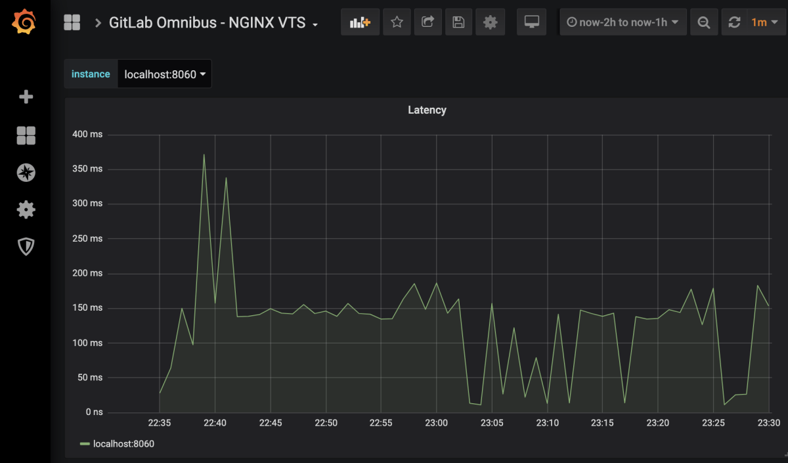
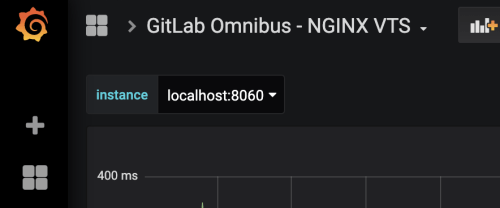
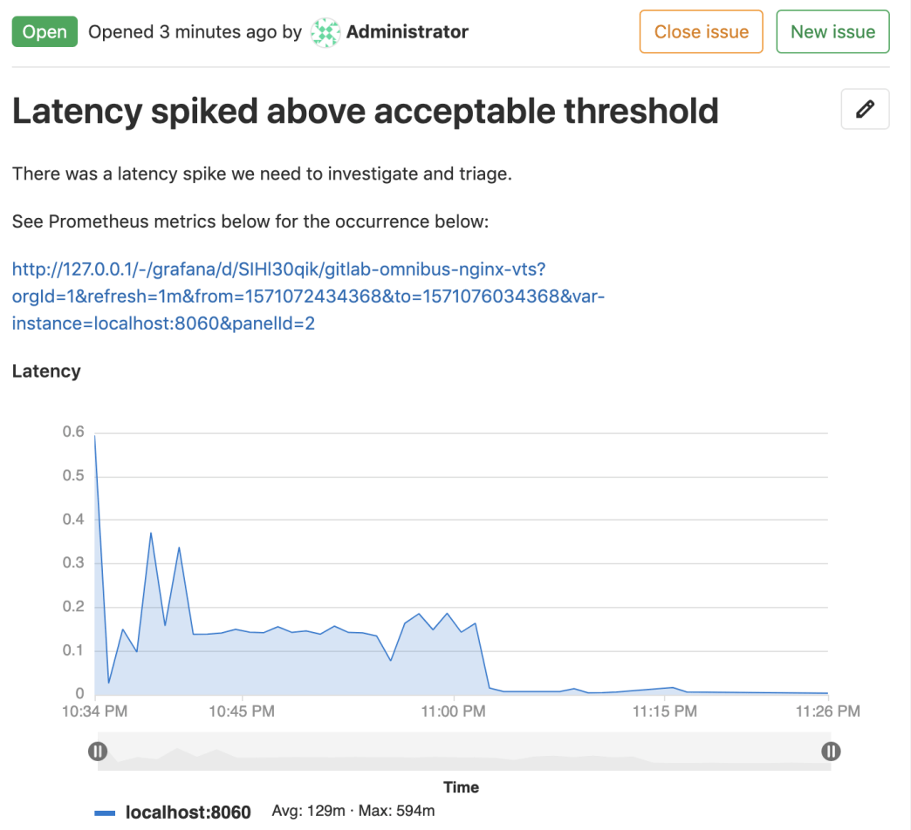

# Embedding Grafana charts **(CORE)**

Grafana metrics can be embedded in [GitLab Flavored Markdown](../../user/markdown.md).

## Embedding charts via Grafana rendered images

You can embed live [Grafana](https://docs.gitlab.com/omnibus/settings/grafana.html)
charts in issues as a
[direct linked rendered image](https://grafana.com/docs/grafana/latest/reference/share_panel/#direct-link-rendered-image). Your Grafana instance must be available to the
target user, either as a public dashboard or on the same network. The
**Direct link rendered image** sharing dialog within Grafana provides the link:


For this embed to display correctly, the

Copy the link and add an image tag as [inline HTML](../../user/markdown.md#inline-html)
in your Markdown. You can tweak the query parameters to meet your needs, such as
removing the `&from=` and `&to=` parameters to display a live chart. Here is example
markup for a live chart from GitLab's public dashboard:

```html

```

This markup renders a graph of `5xx` errors, like this:


## Embedding charts via integration with Grafana HTTP API

> [Introduced](https://gitlab.com/gitlab-org/gitlab/-/issues/31376) in GitLab 12.5.

Each project can support integration with one Grafana instance. This configuration
enables you to copy a link to a panel in Grafana, then paste it into a GitLab Markdown
field. The chart renders in the GitLab chart format. To embed charts
from a Grafana instance, the data source must:

1. Be a Prometheus instance.
1. Be proxyable, so the HTTP Access setting should be set to `Server`:

   

## Setting up the Grafana integration

1. In Grafana, [generate an Admin-level API Token](https://grafana.com/docs/grafana/latest/http_api/auth/#create-api-token).
1. In your GitLab project, navigate to **Settings > Operations > Grafana Authentication**.
1. To enable the integration, check the **Active** checkbox.
1. For **Grafana URL**, enter the base URL of the Grafana instance.
1. For **API Token**, enter the Admin API Token you just generated.
1. Click **Save Changes**.

## Generating a link to a chart

1. In Grafana, navigate to the dashboard you wish to embed a panel from.
   
1. In the upper-left corner of the page, select a specific value for each variable
   required for the queries in the chart.
   
1. In Grafana, click on a panel's title, then click **Share** to open the panel's
   sharing dialog to the **Link** tab. If you click the _dashboard's_ share panel
   instead, GitLab attempts to embed the first supported panel on the dashboard (if available).
1. If your Prometheus queries use Grafana's custom template variables, ensure the
   **Template variables** option is toggled to **On**. Of Grafana global template
   variables, only `$__interval`, `$__from`, and `$__to` are supported.
1. Toggle **On** the **Current time range** option to specify the time range of
   the chart. Otherwise, the default range is the last 8 hours.
   
1. Click **Copy** to copy the URL to the clipboard.
1. In GitLab, paste the URL into a Markdown field and save. The chart takes a few
   moments to render.
   
