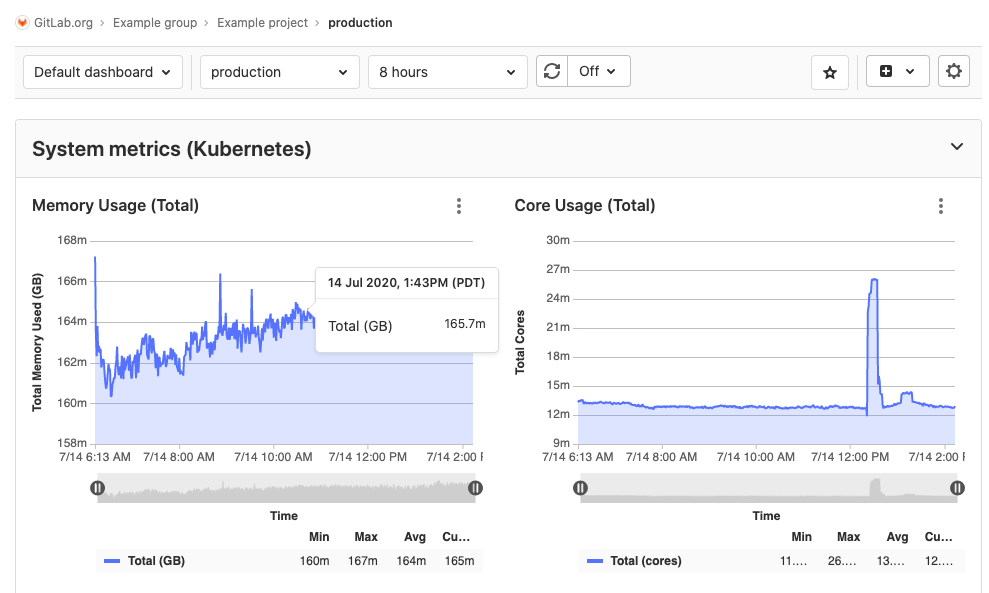

# Monitor metrics for your CI/CD environment

After [configuring Prometheus for a cluster](../../user/project/integrations/prometheus.md),
GitLab attempts to retrieve performance metrics for any [environment](../../ci/environments/index.md) with
a successful deployment.

GitLab scans the Prometheus server for metrics from known servers like Kubernetes
and NGINX, and attempts to identify individual environments. To learn more about
the supported metrics and scan processes, see the
[Prometheus Metrics Library documentation](../../user/project/integrations/prometheus_library/index.md).

To view the metrics dashboard for an environment that has
[completed at least one deployment](#populate-your-metrics-dashboard):

1. *If the metrics dashboard is only visible to project members,* sign in to
   GitLab as a member of a project. Learn more about [metrics dashboard visibility](#metrics-dashboard-visibility).
1. In your project, navigate to **{cloud-gear}** **Operations > Metrics**.

GitLab displays the default metrics dashboard for the environment, like the
following example:

The top of the dashboard contains a navigation bar. From left to right, the
navigation bar contains:

- **Dashboard** - A dropdown list of all dashboards available for the project,
  with starred dashboards listed first.
- **Environment** - A dropdown list of all [environments](../index.md) that searches
  through all environments as you type.
- **Range** - The time period of data to display.
- **Refresh dashboard** **{retry}** - Reload the dashboard with current data.
- **Set refresh rate** - Set a time frame for refreshing the data displayed.
- **Star dashboard** **{star-o}** - Click to mark a dashboard as a favorite.
  Starred dashboards display a solid star **{star}** button, and display first
  in the **Dashboard** dropdown list.
  ([Introduced](https://gitlab.com/gitlab-org/gitlab/-/issues/214582) in GitLab 13.0.)
- **Edit dashboard** - Edit the source YAML file of a custom dashboard. Only available on
  [custom dashboards](dashboards/index.md).
  ([Introduced](https://gitlab.com/gitlab-org/gitlab/-/issues/34779) in GitLab 12.5.)
- **Create dashboard** **{file-addition-solid}** - Create a
  [new custom dashboard for your project](dashboards/index.md#add-a-new-dashboard-to-your-project).
- **Metrics settings** **{settings}** - Configure the
  [settings for this dashboard](dashboards/index.md#manage-the-metrics-dashboard-settings).

## Populate your metrics dashboard

After [configuring Prometheus for a cluster](../../user/project/integrations/prometheus.md),
you must also deploy code for the **{cloud-gear}** **Operations > Metrics** page
to contain data. Setting up [Auto DevOps](../../topics/autodevops/index.md)
helps quickly create a deployment:

1. Navigate to your project's **{cloud-gear}** **Operations > Kubernetes** page.
1. Ensure that, in addition to Prometheus, you also have Runner and Ingress
   installed.
1. After installing Ingress, copy its endpoint.
1. Navigate to your project's **{settings}** **Settings > CI/CD** page. In the
   **Auto DevOps** section, select a deployment strategy and save your changes.
1. On the same page, in the **Variables** section, add a variable named
   `KUBE_INGRESS_BASE_DOMAIN` with the value of the Ingress endpoint you
   copied previously. Leave the type as **Variable**.
1. Navigate to your project's **{rocket}** **CI/CD > Pipelines** page, and run a
   pipeline on any branch.
1. When the pipeline has run successfully, graphs are available on the
   **{cloud-gear}** **Operations > Metrics** page.

## Customize your metrics dashboard

After creating your dashboard, you can customize it to meet your needs:

- **Add custom metrics**: In addition to the GitLab default metrics, you can
  [create custom metrics](#adding-custom-metrics) and display them on your metrics dashboard.
- **Configure alerts for metrics**: [Configure custom alerts](alerts.md) for your team when
  environment performance falls outside of the boundaries you set.
- **Trigger actions from alerts**: [Open new issues for your team](alerts.md#trigger-actions-from-alerts-ultimate) **(ULTIMATE)**
  when environment performance falls outside of the boundaries you set.

## Metrics dashboard visibility

> [Introduced](https://gitlab.com/gitlab-org/gitlab/-/issues/201924) in GitLab 13.0.

You can set the visibility of the metrics dashboard to **Only Project Members**
or **Everyone With Access**. When set to **Everyone with Access**, the metrics
dashboard is visible to authenticated and non-authenticated users.

## Adding custom metrics

> - [Introduced](https://gitlab.com/gitlab-org/gitlab/-/merge_requests/3799) in [GitLab Premium](https://about.gitlab.com/pricing/) 10.6.
> - [Moved](https://gitlab.com/gitlab-org/gitlab/-/merge_requests/28527) to [GitLab Core](https://about.gitlab.com/pricing/) 12.10.

Custom metrics can be monitored by adding them on the monitoring dashboard page.
After saving them, they display on the environment metrics dashboard provided that either:

- A [connected Kubernetes cluster](../../user/project/clusters/add_remove_clusters.md)
  with the matching [environment scope](../../ci/environments/index.md#scoping-environments-with-specs) is used and
  [Prometheus installed on the cluster](../../user/project/integrations/prometheus.md#enabling-prometheus-integration).
- Prometheus is [manually configured](../../user/project/integrations/prometheus.md#manual-configuration-of-prometheus).

A few fields are required:

- **Name**: Chart title
- **Type**: Type of metric. Metrics of the same type will be shown together.
- **Query**: Valid [PromQL query](https://prometheus.io/docs/prometheus/latest/querying/basics/).
- **Y-axis label**: Y axis title to display on the dashboard.
- **Unit label**: Query units, for example `req / sec`. Shown next to the value.

Multiple metrics can be displayed on the same chart if the fields **Name**, **Type**,
and **Y-axis label** match between metrics. For example, a metric with **Name**
`Requests Rate`, **Type** `Business`, and **Y-axis label** `rec / sec` would display
on the same chart as a second metric with the same values. A **Legend label** is
suggested if this feature is used.

## Editing additional metrics from the dashboard

> [Introduced](https://gitlab.com/gitlab-org/gitlab/-/issues/208976) in GitLab 12.9.

You can edit existing additional custom metrics for your dashboard by clicking the
**{ellipsis_v}** **More actions** dropdown and selecting **Edit metric**.

## Keyboard shortcuts for charts

> [Introduced](https://gitlab.com/gitlab-org/gitlab/-/issues/202146) in GitLab 13.2.

You can use keyboard shortcuts to interact more quickly with your currently-focused
chart panel. To activate keyboard shortcuts, use keyboard tabs to highlight the
**{ellipsis_v}** **More actions** dropdown menu, or hover over the dropdown menu
with your mouse, then press the key corresponding to your desired action:

- **Expand panel** - <kbd>e</kbd>
- **View logs** - <kbd>l</kbd> (lowercase 'L')
- **Download CSV** - <kbd>d</kbd>
- **Copy link to chart** - <kbd>c</kbd>
- **Alerts** - <kbd>a</kbd>
