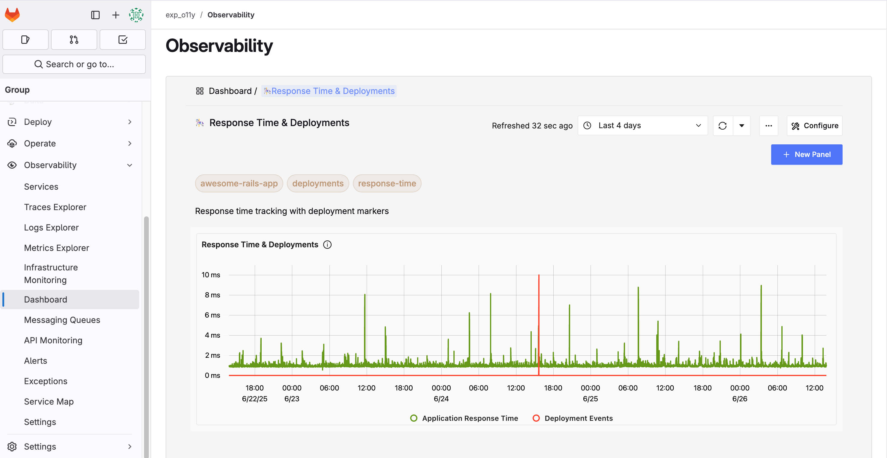



- Tier: Free
- Offering: GitLab.com, GitLab Self-Managed
- Status: Experimental





- [Introduced](https://gitlab.com/experimental-observability/documentation/-/issues/6) in GitLab 18.1. This feature is an [experiment](../policy/development_stages_support.md).





The availability of this feature is controlled by a feature flag.
For more information, see the history.
This feature is available for testing, but not ready for production use.



Use GitLab Observability (O11y) to:

- Monitor application performance through a unified observability dashboard.
- View distributed traces, logs, and metrics in a single platform.
- Identify and troubleshoot performance bottlenecks in your applications.



By adding observability to GitLab itself users can gain [these (planned) features](https://gitlab.com/gitlab-org/embody-team/experimental-observability/gitlab_o11y/-/issues/8).

<i class="fa-youtube-play" aria-hidden="true"></i>
For an overview, see [GitLab Experimental Observability (O11y) Introduction](https://www.youtube.com/watch?v=XI9ZruyNEgs).
<!-- Video published on 2025-06-18 -->

Join the conversation about interesting ways to use GitLab O11y in the GitLab O11y [Discord channel](https://discord.com/channels/778180511088640070/1379585187909861546).

## Why GitLab Observability

- **Cost-effective open source model**: Only pay for compute resources rather than per-seat licensing, making observability accessible for teams of any size. Contribute features and fixes directly, helping ensure the platform evolves to meet your specific needs.
- **Simplified access management**: New engineers automatically gain access to production observability data when they receive code repository access, helping eliminate lengthy provisioning processes. This unified access model helps ensure team members can immediately contribute to troubleshooting and monitoring efforts without administrative delays.
- **Enhanced development workflow**: Developers can correlate code changes directly with application performance metrics, helping to more easily identify when deployments introduce issues. This tight integration between code commits and runtime behavior accelerates debugging and reduces mean time to resolution.
- **Shift-left observability**: Teams can catch performance issues and anomalies earlier in the development cycle, by integrating observability data into their development process. This proactive approach reduces the cost and impact of fixing problems. The open source nature can make it easier and more cost-effective to orchestrate comprehensive staging environments that mirror production observability.
- **Streamlined incident response**: When issues occur, teams can more quickly have context about recent deployments, code changes, and the developers involved, helping with faster triage and resolution. The integration provides a single pane of glass for both code and operational data.
- **Data next to decisions**: Real-time performance metrics and user behavior data become accessible in the development environment, helping teams make informed decisions about feature prioritization, technical debt, and optimization efforts.
- **Compliance and audit trails**: The integration creates comprehensive audit trails that link code changes to system behavior, which can be valuable for compliance requirements and post-incident analysis.
- **Reduced tool switching**: Your development teams can access monitoring data, alerts, and performance insights without leaving their familiar GitLab environment, helping to improve productivity and reduce cognitive overhead.





## Prerequisites

- You must have Developer role or higher to the group
- Your group must have GitLab Observability enabled

## Request access to GitLab Observability

If GitLab Observability is not yet enabled for your group:

1. On the left sidebar, select **Search or go to** and find your group.
1. On the left sidebar, select **Observability**.
1. Select **Request Access**.
1. Select **Enable Observability**.
1. Wait for an email notification confirming your observability instance is ready.

The email includes your OpenTelemetry (`OTEL`) endpoint URL for instrumenting your applications.


## Access GitLab Observability

Once access is granted:

1. On the left sidebar, select **Search or go to** and find your group.
1. On the left sidebar, select **Observability**.

If **Observability** isn't displayed on the left sidebar, go directly to `https://gitlab.com/groups/<group_path>/-/observability/services`.



## Send telemetry data to GitLab.com Observability

Use the OTEL endpoint URL provided in your access confirmation email to configure your application's OpenTelemetry instrumentation.

### Example configuration

Replace `YOUR_OTEL_ENDPOINT_URL` with the URL from your confirmation email:

```ruby
require 'opentelemetry/sdk'
require 'opentelemetry/exporter/otlp'

OpenTelemetry::SDK.configure do |c|
resource = OpenTelemetry::SDK::Resources::Resource.create({
'service.name' => 'your-service-name',
'service.version' => '1.0.0',
'deployment.environment' => 'production'
})
c.resource = resource

c.add_span_processor(
OpenTelemetry::SDK::Trace::Export::BatchSpanProcessor.new(
OpenTelemetry::Exporter::OTLP::Exporter.new(
endpoint: 'YOUR_OTEL_ENDPOINT_URL'
)
)
)
end
```

For other programming languages, refer to the [OpenTelemetry documentation](https://opentelemetry.io/docs/instrumentation/).





## Set up a GitLab Observability instance

Observability data is collected in a separate application outside of your GitLab.com instance. Problems with your GitLab instance do not impact collecting or viewing your observability data and vice-versa.

Prerequisites:

- You must have an EC2 instance or similar virtual machine with:
  - Minimum: t3.large (2 vCPU, 8 GB RAM).
  - Recommended: t3.xlarge (4 vCPU, 16 GB RAM) for production use.
  - At least 100 GB storage space.
- Docker and Docker Compose must be installed.
- Your GitLab version must be 18.1 or later
- Your GitLab instance must be connected to the Observability instance.

### Provision server and storage

For AWS EC2:

1. Launch an EC2 instance with at least 2 vCPU and 8 GB RAM.
1. Add an EBS volume of at least 100 GB.
1. Connect to your instance using SSH.

### Mount storage volume

```shell
sudo mkdir -p /mnt/data
sudo mount /dev/xvdbb /mnt/data  # Replace xvdbb with your volume name
sudo chown -R $(whoami):$(whoami) /mnt/data
```

For permanent mounting, add to `/etc/fstab`:

```shell
echo '/dev/xvdbb /mnt/data ext4 defaults,nofail 0 2' | sudo tee -a /etc/fstab
```

### Install Docker

For Ubuntu/Debian:

```shell
sudo apt update
sudo apt install -y docker.io docker-compose
sudo systemctl enable docker
sudo systemctl start docker
sudo usermod -aG docker $(whoami)
```

For Amazon Linux:

```shell
sudo dnf update
sudo dnf install -y docker
sudo systemctl enable docker
sudo systemctl start docker
sudo usermod -aG docker $(whoami)
```

Log out and log back in, or run:

```shell
newgrp docker
```

### Configure Docker to use the mounted volume

```shell
sudo mkdir -p /mnt/data/docker
sudo bash -c 'cat > /etc/docker/daemon.json << EOF
{
  "data-root": "/mnt/data/docker"
}
EOF'
sudo systemctl restart docker
```

Verify with:

```shell
docker info | grep "Docker Root Dir"
```

### Install GitLab Observability

```shell
cd /mnt/data
git clone -b main https://gitlab.com/gitlab-org/embody-team/experimental-observability/gitlab_o11y.git
cd gitlab_o11y/deploy/docker
docker-compose up -d
```

If you encounter timeout errors, use:

```shell
COMPOSE_HTTP_TIMEOUT=300 docker-compose up -d
```

### Optional: Use an external ClickHouse database

If you'd prefer, you can use your own ClickHouse database.

Prerequisites:

- Ensure your external ClickHouse instance is accessible and properly configured with
  any required authentication credentials.

Before you run `docker-compose up -d`, complete the following steps:

1. Open `docker-compose.yml` file.
1. Open `docker-compose.yml` and comment out:
   - The `clickhouse` and `zookeeper` services.
   - The `x-clickhouse-defaults` and `x-clickhouse-depend` sections.
1. Replace all occurrences of `clickhouse:9000` with your relevant ClickHouse endpoint and TCP port (for example, `my-clickhouse.example.com:9000`) in the following files. If your ClickHouse instance requires authentication, you may also need to update connection strings to include credentials:
   - `docker-compose.yml`
   - `otel-collector-config.yaml`
   - `prometheus-config.yml`

### Configure network access for GitLab Observability

To properly receive telemetry data, you need to open specific ports in your GitLab O11y instance's security group:

1. Go to **AWS Console** > **EC2** > **Security Groups**.
1. Select the security group attached to your GitLab O11y instance.
1. Select **Edit inbound rules**.
1. Add the following rules:
   - Type: Custom TCP, Port: 8080, Source: Your IP or 0.0.0.0/0 (for UI access)
   - Type: Custom TCP, Port: 4317, Source: Your IP or 0.0.0.0/0 (for OTLP gRPC)
   - Type: Custom TCP, Port: 4318, Source: Your IP or 0.0.0.0/0 (for OTLP HTTP)
   - Type: Custom TCP, Port: 9411, Source: Your IP or 0.0.0.0/0 (for Zipkin - optional)
   - Type: Custom TCP, Port: 14268, Source: Your IP or 0.0.0.0/0 (for Jaeger HTTP - optional)
   - Type: Custom TCP, Port: 14250, Source: Your IP or 0.0.0.0/0 (for Jaeger gRPC - optional)
1. Select **Save rules**.

### Access GitLab Observability

Access the GitLab O11y UI at:

```plaintext
http://[your-instance-ip]:8080
```

## Connect GitLab to GitLab Observability

### Configure GitLab and Enable the feature flag

Configure the GitLab O11y URL for your group and enable the feature flag using the Rails console:

1. Access the Rails console:

   ```shell
   docker exec -it gitlab gitlab-rails console
   ```

1. Configure the observability settings for your group and enable the feature flag:

   ```ruby
   group = Group.find_by_path('your-group-name')

   Observability::GroupO11ySetting.create!(
     group_id: group.id,
     o11y_service_url: 'your-o11y-instance-url',
     o11y_service_user_email: 'your-email@example.com',
     o11y_service_password: 'your-secure-password',
     o11y_service_post_message_encryption_key: 'your-super-secret-encryption-key-here-32-chars-minimum'
   )

   Feature.enable(:observability_sass_features, group)

   Feature.enabled?(:observability_sass_features, group)
   ```

   Replace:
   - `your-group-name` with your actual group path
   - `your-o11y-instance-url` with your GitLab O11y instance URL (for example: `http://192.168.1.100:8080`)
   - Email and password with your preferred credentials
   - Encryption key with a secure 32+ character string

   The last command should return `true` to confirm the feature is enabled.





## Use Observability with GitLab

After you have configured GitLab O11y, to access the dashboard embedded in GitLab:

1. On the left sidebar, select **Search or go to** and find your group where the feature flag is enabled.
1. On the left sidebar, select **Observability**.

If **Observability** isn't displayed on the left sidebar,
go directly to `http://<gitlab_instance>/groups/<group_path>/-/observability/services`.


## Send telemetry data to GitLab Observability

You can test your GitLab O11y installation by sending sample telemetry data using the OpenTelemetry SDK. This example uses Ruby, but OpenTelemetry has SDKs for many languages.

Prerequisites:

- Ruby installed on your local machine
- Required gems:

  ```shell
  gem install opentelemetry-sdk opentelemetry-exporter-otlp
  ```

### Create a basic test script

Create a file named `test_o11y.rb` with the following content:

```ruby
require 'opentelemetry/sdk'
require 'opentelemetry/exporter/otlp'

OpenTelemetry::SDK.configure do |c|
  # Define service information
  resource = OpenTelemetry::SDK::Resources::Resource.create({
    'service.name' => 'test-service',
    'service.version' => '1.0.0',
    'deployment.environment' => 'production'
  })
  c.resource = resource

  # Configure OTLP exporter to send to GitLab O11y
  c.add_span_processor(
    OpenTelemetry::SDK::Trace::Export::BatchSpanProcessor.new(
      OpenTelemetry::Exporter::OTLP::Exporter.new(
        endpoint: 'http://[your-o11y-instance-ip]:4318/v1/traces'
      )
    )
  )
end

# Get tracer and create spans
tracer = OpenTelemetry.tracer_provider.tracer('basic-demo')

# Create parent span
tracer.in_span('parent-operation') do |parent|
  parent.set_attribute('custom.attribute', 'test-value')
  puts "Created parent span: #{parent.context.hex_span_id}"

  # Create child span
  tracer.in_span('child-operation') do |child|
    child.set_attribute('custom.child', 'child-value')
    puts "Created child span: #{child.context.hex_span_id}"
    sleep(1)
  end
end

puts "Waiting for export..."
sleep(5)
puts "Done!"
```

Replace `[your-o11y-instance-ip]` with your GitLab O11y instance's IP address or hostname.

### Run the test

1. Run the script:

   ```shell
   ruby test_o11y.rb
   ```

1. Check your GitLab O11y dashboard:
   - Open `http://[your-o11y-instance-ip]:8080`
   - Go to the "Services" section
   - Look for the "test-service" service
   - Select on it to see traces and spans

## Instrument your application

To add OpenTelemetry instrumentation to your applications:

1. Add the OpenTelemetry SDK for your language.
1. Configure the OTLP exporter to point to your GitLab O11y instance.
1. Add spans and attributes to track operations and metadata.

Refer to the [OpenTelemetry documentation](https://opentelemetry.io/docs/instrumentation/) for language-specific guidelines.

## GitLab Observability Templates

GitLab provides pre-built dashboard templates to help you get started with observability quickly. These templates are available at [Experimental Observability O11y Templates](https://gitlab.com/gitlab-org/embody-team/experimental-observability/o11y-templates/).

### Available templates

**Standard OpenTelemetry dashboards**: If you instrument your application with standard OpenTelemetry libraries, you can use these plug-and-play dashboard templates:

- Application performance monitoring dashboards
- Service dependency visualizations
- Error rate and latency tracking

**GitLab-specific dashboards**: When you send GitLab OpenTelemetry data to your GitLab O11y instance, use these dashboards for out-of-the-box insights:

- GitLab application performance metrics
- GitLab service health monitoring
- GitLab-specific trace analysis

**CI/CD observability**: The repository includes an example GitLab CI/CD pipeline with OpenTelemetry instrumentation that works with the GitLab O11y CI/CD dashboard template JSON file. This helps you monitor your CI/CD pipeline performance and identify bottlenecks.

### Using the templates

1. Clone or download the templates from the repository.
1. Update the service name in the example application dashboards to match your service name.
1. Import the JSON files into your GitLab O11y instance.
1. Configure your applications to send telemetry data using standard OpenTelemetry libraries as described in the [Instrument your application](#instrument-your-application) section.
1. The dashboards are now available with your application's telemetry data in GitLab O11y.

## Troubleshooting

### GitLab Observability instance issues

Check container status:

```shell
docker ps
```

View container logs:

```shell
docker logs [container_name]
```

### Menu doesn't appear

1. Verify the feature flag is enabled for your group:

   ```ruby
   Feature.enabled?(:observability_sass_features, Group.find_by_path('your-group-name'))
   ```

1. Check that the O11Y_URL environment variable is set:

   ```ruby
   group = Group.find_by_path('your-group-name')
   group.observability_group_o11y_setting&.o11y_service_url
   ```

1. Ensure the routes are properly registered:

   ```ruby
   Rails.application.routes.routes.select { |r| r.path.spec.to_s.include?('observability') }.map(&:path)
   ```

### Performance issues

If experiencing SSH connection issues or poor performance:

- Verify instance type meets minimum requirements (2 vCPU, 8 GB RAM)
- Consider resizing to a larger instance type
- Check disk space and increase if needed

### Telemetry doesn't show up

If your telemetry data isn't appearing in GitLab O11y:

1. Verify ports 4317 and 4318 are open in your security group.
1. Test connectivity with:

   ```shell
   nc -zv [your-o11y-instance-ip] 4317
   nc -zv [your-o11y-instance-ip] 4318
   ```

1. Check container logs for any errors:

   ```shell
   docker logs otel-collector-standard
   docker logs o11y-otel-collector
   docker logs o11y
   ```

1. Try using the HTTP endpoint (4318) instead of gRPC (4317).
1. Add more debugging information to your OpenTelemetry setup.
