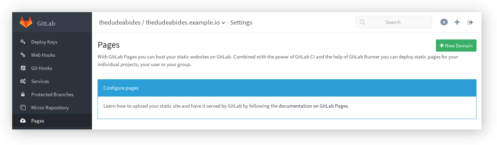

# GitLab Pages

> **Note:**
> This feature was [introduced][ee-80] in GitLab EE 8.3.
> Custom CNAMEs with TLS support were [introduced][ee-173] in GitLab EE 8.5.

> **Note:**
> This document is about the user guide. To learn how to enable GitLab Pages
> across your GitLab instance, visit the [administrator documentation](administration.md).

With GitLab Pages you can host for free your static websites on GitLab.
Combined with the power of [GitLab CI] and the help of [GitLab Runner] you can
deploy static pages for your individual projects, your user or your group.

---

<!-- START doctoc generated TOC please keep comment here to allow auto update -->
<!-- DON'T EDIT THIS SECTION, INSTEAD RE-RUN doctoc TO UPDATE -->
**Table of Contents**  *generated with [DocToc](https://github.com/thlorenz/doctoc)*

- [Getting started with GitLab Pages](#getting-started-with-gitlab-pages)
    - [GitLab Pages requirements](#gitlab-pages-requirements)
    - [User or group Pages](#user-or-group-pages)
    - [Project Pages](#project-pages)
    - [Explore the contents of `.gitlab-ci.yml`](#explore-the-contents-of-gitlab-ciyml)
        - [How `.gitlab-ci.yml` looks like when the static content is in your repository](#how-gitlab-ciyml-looks-like-when-the-static-content-is-in-your-repository)
    - [How `.gitlab-ci.yml` looks like when using a static generator](#how-gitlab-ciyml-looks-like-when-using-a-static-generator)
        - [How to set up GitLab Pages in a repository where there's also actual code](#how-to-set-up-gitlab-pages-in-a-repository-where-there-s-also-actual-code)
- [Next steps](#next-steps)
    - [Example projects](#example-projects)
    - [Add a custom domain to your Pages website](#add-a-custom-domain-to-your-pages-website)
    - [Secure your custom domain website with TLS](#secure-your-custom-domain-website-with-tls)
    - [Custom error codes pages](#custom-error-codes-pages)
    - [Remove the contents of your pages](#remove-the-contents-of-your-pages)
- [Limitations](#limitations)
- [Frequently Asked Questions](#frequently-asked-questions)
    - [Can I download my generated pages?](#can-i-download-my-generated-pages)
    - [Can I use GitLab Pages if my project is private?](#can-i-use-gitlab-pages-if-my-project-is-private)
    - [Q: Do I have to create a project named `username.example.io` in order to host a project website?](#q-do-i-have-to-create-a-project-named-username-example-io-in-order-to-host-a-project-website)

<!-- END doctoc generated TOC please keep comment here to allow auto update -->

## Getting started with GitLab Pages

> **Note:**
> In the rest of this document we will assume that the general domain name that
> is used for GitLab Pages is `example.io`. If you are using GitLab.com to
> host your website, replace `example.io` with `gitlab.io`.

In general there are two types of pages one might create:

- Pages per user (`username.example.io`) or per group (`groupname.example.io`)
- Pages per project (`username.example.io/projectname` or `groupname.example.io/projectname`)

In GitLab, usernames and groupnames are unique and we often refer to them
as namespaces. There can be only one namespace in a GitLab instance. Below you
can see the connection between the type of GitLab Pages, what the project name
that is created on GitLab looks like and the website URL it will be ultimately
be served on.

| Type of GitLab Pages | The name of the project created in GitLab | Website URL |
| -------------------- | ------------ | ----------- |
| User pages  | `username.example.io`  | `http(s)://username.example.io`  |
| Group pages | `groupname.example.io` | `http(s)://groupname.example.io` |
| Project pages owned by a user  | `projectname` | `http(s)://username.example.io/projectname` |
| Project pages owned by a group | `projectname` | `http(s)://groupname.example.io/projectname`|

> **Warning:**
> There are some known [limitations](#limitations) regarding namespaces served
> under the general domain name and HTTPS. Make sure to read that section.

### GitLab Pages requirements

In brief, this is what you need to upload your website in GitLab Pages:

1. Find out the general domain name that is used for GitLab Pages
   (ask your administrator). This is very important, so you should first make
   sure you get that right.
1. Create a project
1. Push a [`.gitlab-ci.yml` file](../ci/yaml/README.md) in the root directory
   of your repository with a specific job named [`pages`][pages].
1. Set up a GitLab Runner to build your website

> **Note:**
> If [shared runners](../ci/runners/README.md) are enabled by your GitLab
> administrator, you should be able to use them instead of bringing your own.

### User or group Pages

For user and group pages, the name of the project should be specific to the
username or groupname and the general domain name that is used for GitLab Pages.
Head over your GitLab instance that supports GitLab Pages and create a
repository named `username.example.io`, where `username` is your username on
GitLab. If the first part of the project name doesn't match exactly your
username, it won’t work, so make sure to get it right.

To create a group page, the steps are the same like when creating a website for
users. Just make sure that you are creating the project within the group's
namespace.


---

After you push some static content to your repository and GitLab Runner uploads
the artifacts to GitLab CI, you will be able to access your website under
`http(s)://username.example.io`. Keep reading to find out how.

>**Note:**
If your username/groupname contains a dot, for example `foo.bar`, you will not
be able to use the wildcard domain HTTPS, read more at [limitations](#limitations).

### Project Pages

GitLab Pages for projects can be created by both user and group accounts.
The steps to create a project page for a user or a group are identical:

1. Create a new project
1. Push a [`.gitlab-ci.yml` file](../ci/yaml/README.md) in the root directory
   of your repository with a specific job named [`pages`][pages].
1. Set up a GitLab Runner to build your website

A user's project will be served under `http(s)://username.example.io/projectname`
whereas a group's project under `http(s)://groupname.example.io/projectname`.

### Explore the contents of `.gitlab-ci.yml`

The key thing about GitLab Pages is the `.gitlab-ci.yml` file, something that
gives you absolute control over the build process. You can actually watch your
website being built live by following the CI build traces.

> **Note:**
> Before reading this section, make sure you familiarize yourself with GitLab CI
> and the specific syntax of[`.gitlab-ci.yml`](../ci/yaml/README.md) by
> following our [quick start guide](../ci/quick_start/README.md).

To make use of GitLab Pages, the contents of `.gitlab-ci.yml` must follow the
rules below:

1. A special job named [`pages`][pages] must be defined
1. Any static content which will be served by GitLab Pages must be placed under
   a `public/` directory
1. `artifacts` with a path to the `public/` directory must be defined

In its simplest form, `.gitlab-ci.yml` looks like:

```yaml
pages:
  script:
  - my_commands
  artifacts:
    paths:
    - public
```

When the Runner reaches to build the `pages` job, it executes whatever is
defined in the `script` parameter and if the build completes with a non-zero
exit status, it then uploads the `public/` directory to GitLab Pages.

The `public/` directory should contain all the static content of your website.
Depending on how you plan to publish your website, the steps defined in the
[`script` parameter](../ci/yaml/README.md#script) may differ.

Be aware that Pages are by default branch/tag agnostic and their deployment
relies solely on what you specify in `.gitlab-ci.yml`. If you don't limit the
`pages` job with the [`only` parameter](../ci/yaml/README.md#only-and-except),
whenever a new commit is pushed to whatever branch or tag, the Pages will be
overwritten. In the example below, we limit the Pages to be deployed whenever
a commit is pushed only on the `master` branch:

```yaml
pages:
  script:
  - my_commands
  artifacts:
    paths:
    - public
  only:
  - master
```

We then tell the Runner to treat the `public/` directory as `artifacts` and
upload it to GitLab. And since all these parameters were all under a `pages`
job, the contents of the `public` directory will be served by GitLab Pages.

#### How `.gitlab-ci.yml` looks like when the static content is in your repository

Supposedly your repository contained the following files:

```
├── index.html
├── css
│   └── main.css
└── js
    └── main.js
```

Then the `.gitlab-ci.yml` example below simply moves all files from the root
directory of the project to the `public/` directory. The `.public` workaround
is so `cp` doesn't also copy `public/` to itself in an infinite loop:

```yaml
pages:
  script:
  - mkdir .public
  - cp -r * .public
  - mv .public public
  artifacts:
    paths:
    - public
  only:
  - master
```

### How `.gitlab-ci.yml` looks like when using a static generator

In general, GitLab Pages support any kind of [static site generator][staticgen],
since the Runner can be configured to run any possible command.

In the root directory of your Git repository, place the source files of your
favorite static generator. Then provide a `.gitlab-ci.yml` file which is
specific to your static generator.

The example below, uses [Jekyll] to build the static site:

```yaml
pages:
  images: jekyll/jekyll:latest
  script:
  - jekyll build -d public/
  artifacts:
    paths:
    - public
  only:
  - master
```

Here, we used the Docker executor and in the first line we specified the base
image against which our builds will run.

You have to make sure that the generated static files are ultimately placed
under the `public` directory, that's why in the `script` section we run the
`jekyll` command that builds the website and puts all content in the `public/`
directory.

We then tell the Runner to treat the `public/` directory as `artifacts` and
upload it to GitLab.

---

See the [jekyll example project][pages-jekyll] to better understand how this
works.

For a list of Pages projects, see [example projects](#example-projects) to get
you started.

#### How to set up GitLab Pages in a repository where there's also actual code

You can have your project's code in the `master` branch and use an orphan
`pages` branch that will host your static generator site.

## Next steps

### Example projects

Below is a list of example projects for GitLab Pages with a plain HTML website
or various static site generators. Contributions are very welcome.

- [Plain HTML](https://gitlab.com/gitlab-examples/pages-plain-html)
- [Jekyll](https://gitlab.com/gitlab-examples/pages-jekyll)
- [Hugo](https://gitlab.com/gitlab-examples/pages-hugo)
- [Middleman](https://gitlab.com/gitlab-examples/pages-middleman)
- [Hexo](https://gitlab.com/gitlab-examples/pages-hexo)
- [Brunch](https://gitlab.com/gitlab-examples/pages-brunch)
- [Metalsmith](https://gitlab.com/gitlab-examples/pages-metalsmith)
- [Harp](https://gitlab.com/gitlab-examples/pages-harp)

### Add a custom domain to your Pages website

If this setting is enabled by your GitLab administrator, you should be able to
see the **New Domain** button when visiting your project's **Settings > Pages**.



---

You are not limited to one domain per can add multiple domains pointing to your
website hosted under GitLab.

### Secure your custom domain website with TLS

### Use a static generator to develop your website

#### Example projects

Below is a list of example projects for GitLab Pages with a plain HTML website
or various static site generators. Contributions are very welcome.

- [Plain HTML](https://gitlab.com/gitlab-examples/pages-plain-html)
- [Jekyll](https://gitlab.com/gitlab-examples/pages-jekyll)
- [Hugo](https://gitlab.com/gitlab-examples/pages-hugo)
- [Middleman](https://gitlab.com/gitlab-examples/pages-middleman)
- [Hexo](https://gitlab.com/gitlab-examples/pages-hexo)
- [Brunch](https://gitlab.com/gitlab-examples/pages-brunch)
- [Metalsmith](https://gitlab.com/gitlab-examples/pages-metalsmith)
- [Harp](https://gitlab.com/gitlab-examples/pages-harp)

### Custom error codes pages

You can provide your own 403 and 404 error pages by creating the `403.html` and
`404.html` files respectively in the `public/` directory that will be included
in the artifacts.

### Remove the contents of your pages

If you ever feel the need to purge your Pages content, you can do so by going
to your project's **Settings > Pages** and hit **Remove pages**. Simple as that.


## Limitations

When using Pages under the general domain of a GitLab instance (`*.example.io`),
you _cannot_ use HTTPS with sub-subdomains. That means that if your
username/groupname contains a dot, for example `foo.bar`, the domain
`https://foo.bar.example.io` will _not_ work. This is a limitation of the
[HTTP Over TLS protocol][rfc]. HTTP pages will continue to work provided you
don't redirect HTTP to HTTPS.

[rfc]: https://tools.ietf.org/html/rfc2818#section-3.1 "HTTP Over TLS RFC"

## Frequently Asked Questions

### Can I download my generated pages?

Sure. All you need to do is download the artifacts archive from the build page.

### Can I use GitLab Pages if my project is private?

Yes. GitLab Pages don't care whether you set your project's visibility level
to private, internal or public.

### Q: Do I have to create a project named `username.example.io` in order to host a project website?

No. You can create a new project named `foo` and have it served under
`http(s)://username.example.io/foo` without having previously created a
user page.

---

[jekyll]: http://jekyllrb.com/
[ee-80]: https://gitlab.com/gitlab-org/gitlab-ee/merge_requests/80
[ee-173]: https://gitlab.com/gitlab-org/gitlab-ee/merge_requests/173
[pages-daemon]: https://gitlab.com/gitlab-org/gitlab-pages
[gitlab ci]: https://about.gitlab.com/gitlab-ci
[gitlab runner]: https://gitlab.com/gitlab-org/gitlab-ci-multi-runner
[pages]: ../ci/yaml/README.md#pages
[staticgen]: https://www.staticgen.com/
[pages-jekyll]: https://gitlab.com/gitlab-examples/pages-jekyll
