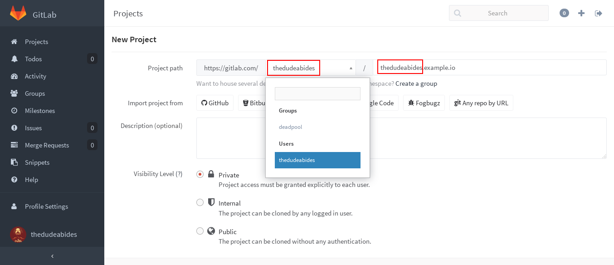

# GitLab Pages

> **Note:**
> This feature was [introduced][ee-80] in GitLab EE 8.3.
> Custom CNAMEs with TLS support were [introduced][ee-173] in GitLab EE 8.5.

> **Note:**
> This document is about the user guide. To learn how to enable GitLab Pages
> across your GitLab instance, visit the [administrator documentation](administration.md).

With GitLab Pages you can host for free your static websites on GitLab.
Combined with the power of [GitLab CI] and the help of [GitLab Runner] you can
deploy static pages for your individual projects, your user or your group.

The key thing about GitLab Pages is the [`.gitlab-ci.yml`](../ci/yaml/README.md)
file, something that gives you absolute control over the build process. You can
actually watch your website being built live by following the CI build traces.

GitLab Pages support any kind of [static site generator][staticgen].

---

<!-- START doctoc generated TOC please keep comment here to allow auto update -->
<!-- DON'T EDIT THIS SECTION, INSTEAD RE-RUN doctoc TO UPDATE -->
**Table of Contents**  *generated with [DocToc](https://github.com/thlorenz/doctoc)*

- [Getting started with GitLab Pages](#getting-started-with-gitlab-pages)
    - [GitLab Pages requirements](#gitlab-pages-requirements)
    - [User or group Pages](#user-or-group-pages)
    - [Project Pages](#project-pages)
    - [Explore the contents of .gitlab-ci.yml](#explore-the-contents-of-gitlab-ci-yml)
- [Next steps](#next-steps)
    - [Adding a custom domain to your Pages website](#adding-a-custom-domain-to-your-pages-website)
    - [Securing your custom domain website with TLS](#securing-your-custom-domain-website-with-tls)
    - [Example projects](#example-projects)
    - [Custom error codes pages](#custom-error-codes-pages)
    - [Remove the contents of your pages](#remove-the-contents-of-your-pages)
- [Limitations](#limitations)
- [Frequently Asked Questions](#frequently-asked-questions)

<!-- END doctoc generated TOC please keep comment here to allow auto update -->

## Getting started with GitLab Pages

> **Note:**
> In the rest of this document we will assume that the general domain name that
> is used for GitLab Pages is `example.io`. If you are using GitLab.com to
> host your website, replace `example.io` with `gitlab.io`.

In general there are two types of pages one might create:

- Pages per user/group (`username.example.io`)
- Pages per project (`username.example.io/projectname`)

In GitLab, usernames and groupnames are unique and we often refer to them
as namespaces. There can be only one namespace in a GitLab instance.

| Type of GitLab Pages | Project name created in GitLab | Website URL |
| -------------------- | ------------ | ----------- |
| User pages  | `username.example.io`  | `http(s)://username.example.io`  |
| Group pages | `groupname.example.io` | `http(s)://groupname.example.io` |
| Project pages owned by a user  | `projectname` | `http(s)://username.example.io/projectname` |
| Project pages owned by a group | `projectname` | `http(s)://groupname.example.io/projectname`|

> **Warning:**
> There are some known [limitations](#limitations) regarding namespaces served
> under the general domain name and HTTPS. Make sure to read that section.

### GitLab Pages requirements

In brief, this is what you need to upload your website in GitLab Pages:

1. Find out the general domain name that is used for GitLab Pages
   (ask your administrator). This is very important, so you should first make
   sure you get that right.
1. Create a project
1. Provide a specific job named [`pages`][pages] in
   [`.gitlab-ci.yml`](../ci/yaml/README.md)
1. A GitLab Runner to build GitLab Pages

> **Note:**
> If [shared runners](../ci/runners/README.md) are enabled by your GitLab
> administrator, you should be able to use them instead of bringing your own.

### User or group Pages

Head over your GitLab instance that supports GitLab Pages and create a
repository named `username.example.io`, where `username` is your username on
GitLab. If the first part of the project name doesn't match exactly your
username, it won’t work, so make sure to get it right.



---

To create a group page, the steps are the same like when creating a website for
users. Just make sure that you are creating the project within the group's
namespace.

After you push some static content to your repository and GitLab Runner uploads
the artifacts to GitLab CI, you will be able to access your website under
`http(s)://username.example.io`. Keep reading to find out how.

### Project Pages

> **Note:**
> You do _not_ have to create a project named `username.example.io` in order to
> serve a project's page.


### Explore the contents of .gitlab-ci.yml

> **Note:**
> Before reading this section, make sure you familiarize yourself with GitLab CI
> and the specific syntax of[`.gitlab-ci.yml`](../ci/yaml/README.md) by
> following our [quick start guide](../ci/quick_start/README.md).

To make use of GitLab Pages, your `.gitlab-ci.yml` must follow the rules below:

1. A special [`pages`][pages] job must be defined
1. Any static content must be placed under a `public/` directory
1. `artifacts` with a path to the `public/` directory must be defined

Be aware that Pages are by default branch/tag agnostic and their deployment
relies solely on what you specify in `.gitlab-ci.yml`. If you don't limit the
`pages` job with the [`only` parameter](../ci/yaml/README.md#only-and-except),
whenever a new commit is pushed to whatever branch or tag, the Pages will be
overwritten. In the examples below, we limit the Pages to be deployed whenever
a commit is pushed only on the `master` branch, which is advisable to do so.

The pages are created after the build completes successfully and the artifacts
for the `pages` job are uploaded to GitLab.

The example below uses [Jekyll][] and generates the created HTML files
under the `public/` directory.

```yaml
image: ruby:2.1

pages:
  script:
  - gem install jekyll
  - jekyll build -d public/
  artifacts:
    paths:
    - public
  only:
  - master
```

The example below doesn't use any static site generator, but simply moves all
files from the root of the project to the `public/` directory. The `.public`
workaround is so `cp` doesn't also copy `public/` to itself in an infinite
loop.

```yaml
pages:
  stage: deploy
  script:
  - mkdir .public
  - cp -r * .public
  - mv .public public
  artifacts:
    paths:
    - public
  only:
  - master
```

### Remove the contents of your pages

Pages can be explicitly removed from a project by clicking **Remove Pages**
in your project's **Settings > Pages**.


## Next steps

### Adding a custom domain to your Pages website


### Securing your custom domain website with TLS

### Example projects

Below is a list of example projects for GitLab Pages with a plain HTML website
or various static site generators. Contributions are very welcome.

- [Plain HTML](https://gitlab.com/gitlab-examples/pages-plain-html)
- [Jekyll](https://gitlab.com/gitlab-examples/pages-jekyll)

### Custom error codes pages

You can provide your own 403 and 404 error pages by creating the `403.html` and
`404.html` files respectively in the `public/` directory that will be included
in the artifacts.

### Remove the contents of your pages

If you ever feel the need to purge your Pages content, you can do so by going
to your project's **Settings > Pages** and hit **Remove pages**. Simple as that.


## Limitations

When using Pages under the general domain of a GitLab instance (`*.example.io`),
you _cannot_ use HTTPS with sub-subdomains. That means that if your
username/groupname contains a dot, for example `foo.bar`, the domain
`https://foo.bar.example.io` will _not_ work. This is a limitation of the
[HTTP Over TLS protocol][rfc]. HTTP pages will continue to work provided you
don't redirect HTTP to HTTPS.

[rfc]: https://tools.ietf.org/html/rfc2818#section-3.1 "HTTP Over TLS RFC"

## Frequently Asked Questions

**Q: Can I download my generated pages?**

Sure. All you need to do is download the artifacts archive from the build page.


**Q: Can I use GitLab Pages if my project is private?**

Yes. GitLab Pages doesn't care whether you set your project's visibility level
to private, internal or public.

---

[jekyll]: http://jekyllrb.com/
[ee-80]: https://gitlab.com/gitlab-org/gitlab-ee/merge_requests/80
[ee-173]: https://gitlab.com/gitlab-org/gitlab-ee/merge_requests/173
[pages-daemon]: https://gitlab.com/gitlab-org/gitlab-pages
[gitlab ci]: https://about.gitlab.com/gitlab-ci
[gitlab runner]: https://gitlab.com/gitlab-org/gitlab-ci-multi-runner
[pages]: ../ci/yaml/README.md#pages
[staticgen]: https://www.staticgen.com/
