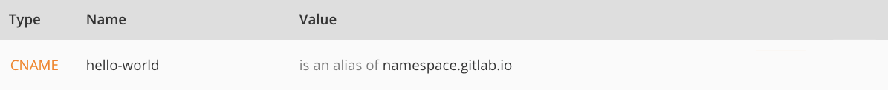

# GitLab Pages from A to Z: Part 1

- **Part 1: Static Sites, Domains, DNS Records, and SSL/TLS Certificates**
- _[Part 2: Quick Start Guide - Setting Up GitLab Pages](getting_started_part_two.md)_
- _[Part 3: Creating and Tweaking `.gitlab-ci.yml` for GitLab Pages](getting_started_part_three.md)_

----

This is a comprehensive guide, made for those who want to
publish a website with GitLab Pages but aren't familiar with
the entire process involved.

To **enable** GitLab Pages for GitLab CE (Community Edition)
and GitLab EE (Enterprise Edition), please read the
[admin documentation](https://docs.gitlab.com/ce/administration/pages/index.html),
and/or watch this [video tutorial](https://youtu.be/dD8c7WNcc6s).

>**Note:**
For this guide, we assume you already have GitLab Pages
server up and running for your GitLab instance.

## What you need to know before getting started

Before we begin, let's understand a few concepts first.

### Static sites

GitLab Pages only supports static websites, meaning,
your output files must be HTML, CSS, and JavaScript only.

To create your static site, you can either hardcode in HTML,
CSS, and JS, or use a [Static Site Generator (SSG)](https://www.staticgen.com/)
to simplify your code and build the static site for you,
which is highly recommendable and much faster than hardcoding.

---

- Read through this technical overview on [Static versus Dynamic Websites](https://about.gitlab.com/2016/06/03/ssg-overview-gitlab-pages-part-1-dynamic-x-static/)
- Understand [how modern Static Site Generators work](https://about.gitlab.com/2016/06/10/ssg-overview-gitlab-pages-part-2/) and what you can add to your static site
- You can use [any SSG with GitLab Pages](https://about.gitlab.com/2016/06/17/ssg-overview-gitlab-pages-part-3-examples-ci/)
- Fork an [example project](https://gitlab.com/pages) to build your website based upon

### GitLab Pages domain

If you set up a GitLab Pages project on GitLab.com,
it will automatically be accessible under a
[subdomain of `namespace.pages.io`](https://docs.gitlab.com/ce/user/project/pages/).
The `namespace` is defined by your username on GitLab.com,
or the group name you created this project under.

>**Note:**
If you use your own GitLab instance to deploy your
site with GitLab Pages, check with your sysadmin what's your
Pages wildcard domain. This guide is valid for any GitLab instance,
you just need to replace Pages wildcard domain on GitLab.com
(`*.gitlab.io`) with your own.

#### Practical examples

**Project Websites:**

- You created a project called `blog` under your username `john`,
therefore your project URL is `https://gitlab.com/john/blog/`.
Once you enable GitLab Pages for this project, and build your site,
it will be available under `https://john.gitlab.io/blog/`.
- You created a group for all your websites called `websites`,
and a project within this group is called `blog`. Your project
URL is `https://gitlab.com/websites/blog/`. Once you enable
GitLab Pages for this project, the site will live under
`https://websites.gitlab.io/blog/`.

**User and Group Websites:**

- Under your username, `john`, you created a project called
`john.gitlab.io`. Your project URL will be `https://gitlab.com/john/john.gitlab.io`.
Once you enable GitLab Pages for your project, your website
will be published under `https://john.gitlab.io`.
- Under your group `websites`, you created a project called
`websites.gitlab.io`. your project's URL will be `https://gitlab.com/websites/websites.gitlab.io`. Once you enable GitLab Pages for your project,
your website will be published under `https://websites.gitlab.io`.

**General example:**

- On GitLab.com, a project site will always be available under
`https://namespace.gitlab.io/project-name`
- On GitLab.com, a user or group website will be available under
`https://namespace.gitlab.io/`
- On your GitLab instance, replace `gitlab.io` above with your
Pages server domain. Ask your sysadmin for this information.

### DNS Records

A Domain Name System (DNS) web service routes visitors to websites
by translating domain names (such as `www.example.com`) into the
numeric IP addresses (such as `192.0.2.1`) that computers use to
connect to each other.

A DNS record is created to point a (sub)domain to a certain location,
which can be an IP address or another domain. In case you want to use
GitLab Pages with your own (sub)domain, you need to access your domain's
registrar control panel to add a DNS record pointing it back to your
GitLab Pages site.

Note that **how to** add DNS records depends on which server your domain
is hosted on. Every control panel has its own place to do it. If you are
not an admin of your domain, and don't have access to your registrar,
you'll need to ask for the technical support of your hosting service
to do it for you.

To help you out, we've gathered some instructions on how to do that
for the most popular hosting services:

- [Amazon](http://docs.aws.amazon.com/gettingstarted/latest/swh/getting-started-configure-route53.html)
- [Bluehost](https://my.bluehost.com/cgi/help/559)
- [CloudFlare](https://support.cloudflare.com/hc/en-us/articles/200169096-How-do-I-add-A-records-)
- [cPanel](https://documentation.cpanel.net/display/ALD/Edit+DNS+Zone)
- [DreamHost](https://help.dreamhost.com/hc/en-us/articles/215414867-How-do-I-add-custom-DNS-records-)
- [Go Daddy](https://www.godaddy.com/help/add-an-a-record-19238)
- [Hostgator](http://support.hostgator.com/articles/changing-dns-records)
- [Inmotion hosting](https://my.bluehost.com/cgi/help/559)
- [Media Temple](https://mediatemple.net/community/products/dv/204403794/how-can-i-change-the-dns-records-for-my-domain)
- [Microsoft](https://msdn.microsoft.com/en-us/library/bb727018.aspx)

If your hosting service is not listed above, you can just try to
search the web for "how to add dns record on <my hosting service>".

#### DNS A record

In case you want to point a root domain (`example.com`) to your
GitLab Pages site, deployed to `namespace.gitlab.io`, you need to
log into your domain's admin control panel and add a DNS `A` record
pointing your domain to Pages' server IP address. For projects on
GitLab.com, this IP is `104.208.235.32`. For projects leaving in
other GitLab instances (CE or EE), please contact your sysadmin
asking for this information (which IP address is Pages server
running on your instance).

**Practical Example:**

#### DNS CNAME record

In case you want to point a subdomain (`hello-world.example.com`)
to your GitLab Pages site initially deployed to `namespace.gitlab.io`,
you need to log into your domain's admin control panel and add a DNS
`CNAME` record pointing your subdomain to your website URL
(`namespace.gitlab.io`) address.

Notice that, despite it's a user or project website, the `CNAME`
should point to your Pages domain (`namespace.gitlab.io`),
without any `/project-name`.

**Practical Example:**

#### TL;DR

| From | DNS Record | To |
| ---- | ---------- | -- |
| domain.com | A | 104.208.235.32 |
| subdomain.domain.com | CNAME | namespace.gitlab.io |

> **Notes**:
>
> - **Do not** use a CNAME record if you want to point your
`domain.com` to your GitLab Pages site. Use an `A` record instead.
> - **Do not** add any special chars after the default Pages
domain. E.g., **do not** point your `subdomain.domain.com` to
`namespace.gitlab.io.` or `namespace.gitlab.io/`.

### SSL/TLS Certificates

Every GitLab Pages project on GitLab.com will be available under
HTTPS for the default Pages domain (`*.gitlab.io`). Once you set
up your Pages project with your custom (sub)domain, if you want
it secured by HTTPS, you will have to issue a certificate for that
(sub)domain and install it on your project.

>**Note:**
Certificates are NOT required to add to your custom
(sub)domain on your GitLab Pages project, though they are
highly recommendable.

The importance of having any website securely served under HTTPS
is explained on the introductory section of the blog post
[Secure GitLab Pages with StartSSL](https://about.gitlab.com/2016/06/24/secure-gitlab-pages-with-startssl/#https-a-quick-overview).

The reason why certificates are so important is that they encrypt
the connection between the **client** (you, me, your visitors)
and the **server** (where you site lives), through a keychain of
authentications and validations.

### Issuing Certificates

GitLab Pages accepts [PEM](https://support.quovadisglobal.com/kb/a37/what-is-pem-format.aspx) certificates issued by
[Certificate Authorities (CA)](https://en.wikipedia.org/wiki/Certificate_authority)
and self-signed certificates. Of course,
[you'd rather issue a certificate than generate a self-signed](https://en.wikipedia.org/wiki/Self-signed_certificate),
for security reasons and for having browsers trusting your
site's certificate.

There are several different kinds of certificates, each one
with certain security level. A static personal website will
not require the same security level as an online banking web app,
for instance. There are a couple Certificate Authorities that
offer free certificates, aiming to make the internet more secure
to everyone. The most popular is [Let's Encrypt](https://letsencrypt.org/),
which issues certificates trusted by most of browsers, it's open
source, and free to use. Please read through this tutorial to
understand [how to secure your GitLab Pages website with Let's Encrypt](https://about.gitlab.com/2016/04/11/tutorial-securing-your-gitlab-pages-with-tls-and-letsencrypt/).

With the same popularity, there are [certificates issued by CloudFlare](https://www.cloudflare.com/ssl/),
which also offers a [free CDN service](https://blog.cloudflare.com/cloudflares-free-cdn-and-you/).
Their certs are valid up to 15 years. Read through the tutorial on
[how to add a CloudFlare Certificate to your GitLab Pages website](https://about.gitlab.com/2017/02/07/setting-up-gitlab-pages-with-cloudflare-certificates/).

### Adding certificates to your project

Regardless the CA you choose, the steps to add your certificate to
your Pages project are the same.

#### What do you need

1. A PEM certificate
1. An intermediate certificate
1. A public key

These fields are found under your **Project**'s **Settings** > **Pages** > **New Domain**.

#### What's what?

- A PEM certificate is the certificate generated by the CA,
which needs to be added to the field **Certificate (PEM)**.
- An [intermediate certificate](https://en.wikipedia.org/wiki/Intermediate_certificate_authority) (aka "root certificate") is
the part of the encryption keychain that identifies the CA.
Usually it's combined with the PEM certificate, but there are
some cases in which you need to add them manually.
[CloudFlare certs](https://about.gitlab.com/2017/02/07/setting-up-gitlab-pages-with-cloudflare-certificates/)
are one of these cases.
- A public key is an encrypted key which validates
your PEM against your domain.

#### Now what?

Now that you hopefully understand why you need all
of this, it's simple:

- Your PEM certificate needs to be added to the first field
- If your certificate is missing its intermediate, copy
and paste the root certificate (usually available from your CA website)
and paste it in the [same field as your PEM certificate](https://about.gitlab.com/2017/02/07/setting-up-gitlab-pages-with-cloudflare-certificates/),
just jumping a line between them.
- Copy your public key and paste it in the last field

>**Note:**
**Do not** open certificates or encryption keys in
regular text editors. Always use code editors (such as
Sublime Text, Atom, Dreamweaver, Brackets, etc).

|||
|:--|--:|
||[**Part 2: Quick start guide - Setting up GitLab Pages →**](getting_started_part_two.md)|
