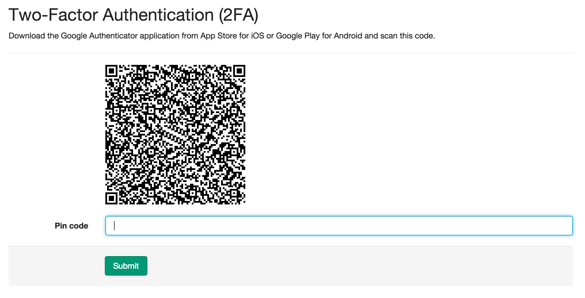
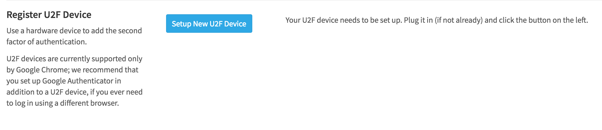
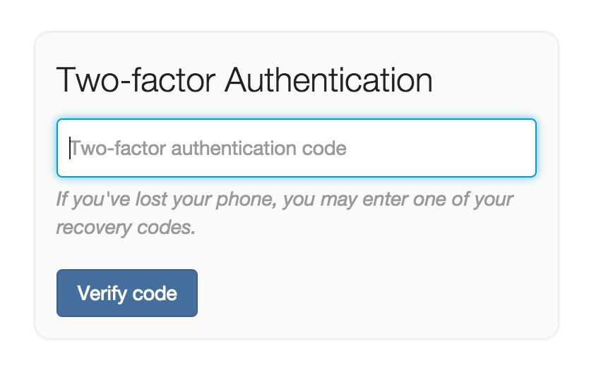
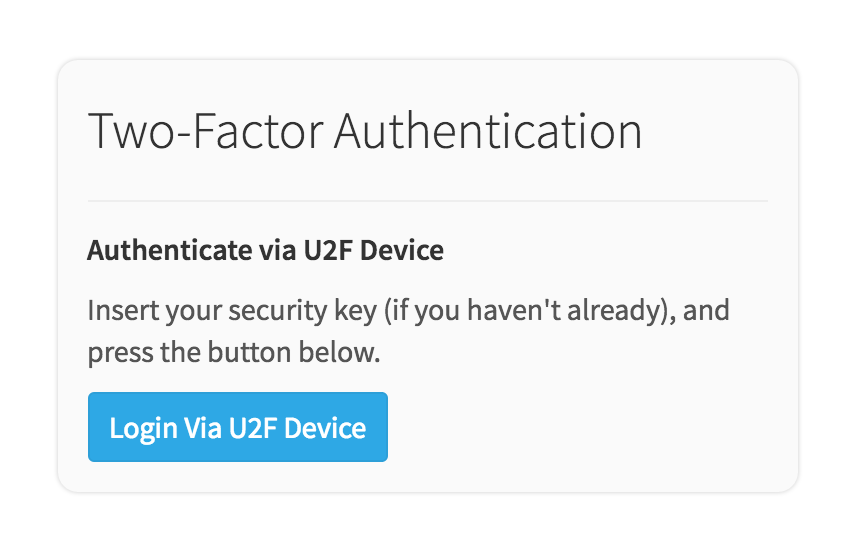

# Two-factor Authentication (2FA)

Two-factor Authentication (2FA) provides an additional level of security to your
GitLab account. Once enabled, in addition to supplying your username and
password to login, you'll be prompted for a code generated by an application on
your phone.

By enabling 2FA, the only way someone other than you can log into your account
is to know your username and password *and* have access to your phone.

> **Note:**
When you enable 2FA, don't forget to back up your recovery codes. For your safety, if you
lose your codes for GitLab.com, we can't disable or recover them.  

In addition to a phone application, GitLab supports U2F (universal 2nd factor) devices as
the second factor of authentication. Once enabled, in addition to supplying your username and
password to login, you'll be prompted to activate your U2F device (usually by pressing
a button on it), and it will perform secure authentication on your behalf.

> **Note:** Support for U2F devices was added in version 8.8

The U2F workflow is only supported by Google Chrome at this point, so we _strongly_ recommend 
that you set up both methods of two-factor authentication, so you can still access your account 
from other browsers.

> **Note:** GitLab officially only supports [Yubikey] U2F devices.

## Enabling 2FA

### Enable 2FA via mobile application

**In GitLab:**

1. Log in to your GitLab account.
1. Go to your **Profile Settings**.
1. Go to **Account**.
1. Click **Enable Two-factor Authentication**.

**On your phone:**

1. Install a compatible application. We recommend [Google Authenticator]
\(proprietary\) or [FreeOTP] \(open source\).
1. In the application, add a new entry in one of two ways:
    * Scan the code with your phone's camera to add the entry automatically.
    * Enter the details provided to add the entry manually.

**In GitLab:**

1. Enter the six-digit pin number from the entry on your phone into the **Pin
   code** field.
1. Click **Submit**.

If the pin you entered was correct, you'll see a message indicating that
Two-Factor Authentication has been enabled, and you'll be presented with a list
of recovery codes.

### Enable 2FA via U2F device

**In GitLab:**

1. Log in to your GitLab account.
1. Go to your **Profile Settings**.
1. Go to **Account**.
1. Click **Enable Two-Factor Authentication**.
1. Plug in your U2F device.
1. Click on **Setup New U2F Device**.
1. A light will start blinking on your device. Activate it by pressing its button.

You will see a message indicating that your device was successfully set up. 
Click on **Register U2F Device** to complete the process.

## Recovery Codes

Should you ever lose access to your phone, you can use one of the ten provided
backup codes to login to your account. We suggest copying or printing them for
storage in a safe place. **Each code can be used only once** to log in to your
account.

If you lose the recovery codes or just want to generate new ones, you can do so
from the **Profile Settings** > **Account** page where you first enabled 2FA.

> **Note:** Recovery codes are not generated for U2F devices.

## Logging in with 2FA Enabled

Logging in with 2FA enabled is only slightly different than a normal login.
Enter your username and password credentials as you normally would, and you'll
be presented with a second prompt, depending on which type of 2FA you've enabled.

### Log in via mobile application

Enter the pin from your phone's application or a recovery code to log in.

### Log in via U2F device

1. Click **Login via U2F Device**
1. A light will start blinking on your device. Activate it by pressing its button.

You will see a message indicating that your device responded to the authentication request.
Click on **Authenticate via U2F Device** to complete the process.

## Disabling 2FA

1. Log in to your GitLab account.
1. Go to your **Profile Settings**.
1. Go to **Account**.
1. Click **Disable**, under **Two-Factor Authentication**.

This will clear all your two-factor authentication registrations, including mobile
applications and U2F devices.

## Note to GitLab administrators

You need to take special care to that 2FA keeps working after
[restoring a GitLab backup](../raketasks/backup_restore.md).

[Google Authenticator]: https://support.google.com/accounts/answer/1066447?hl=en
[FreeOTP]: https://fedorahosted.org/freeotp/
[YubiKey]: https://www.yubico.com/products/yubikey-hardware/
