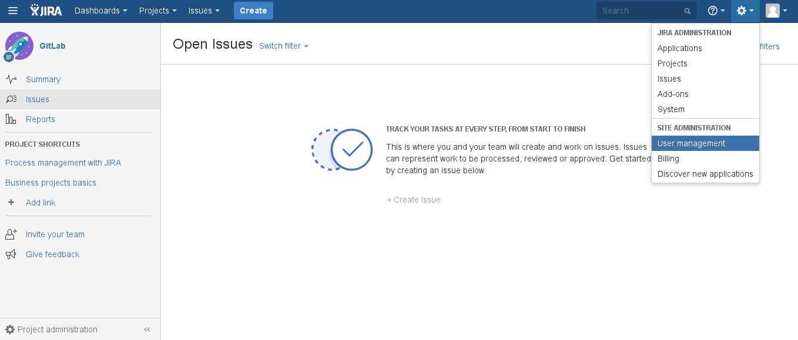
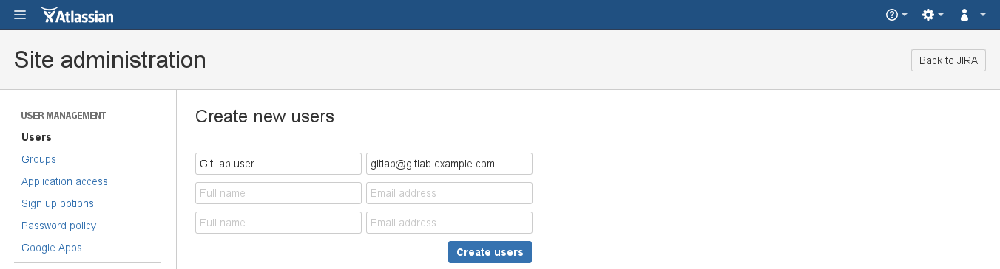
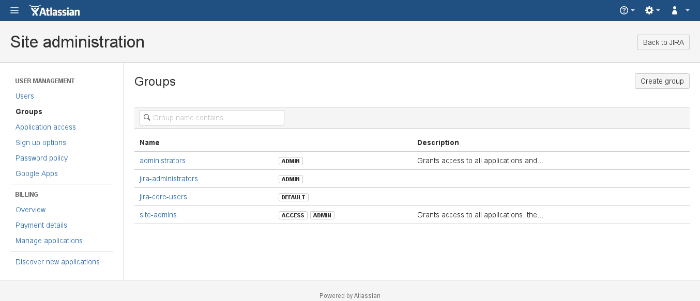
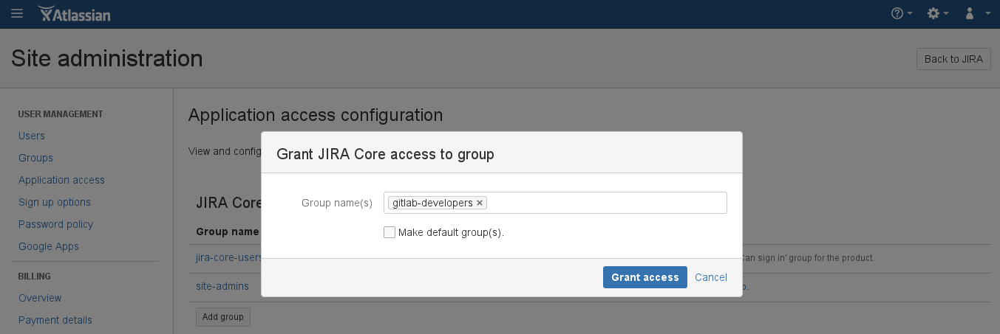
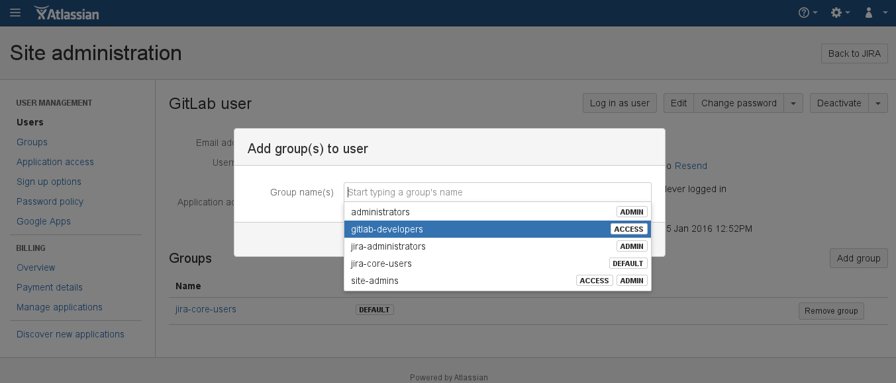
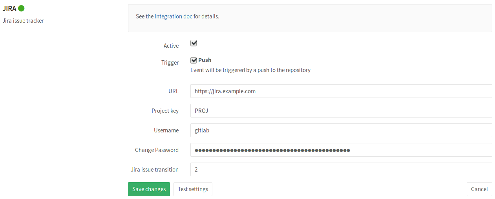
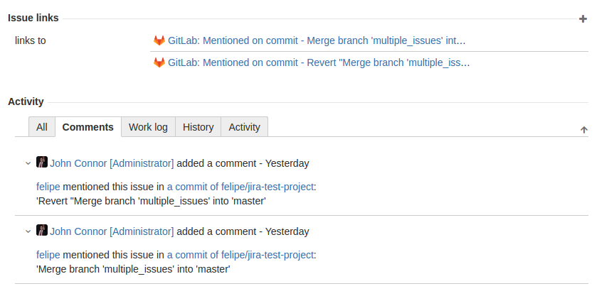
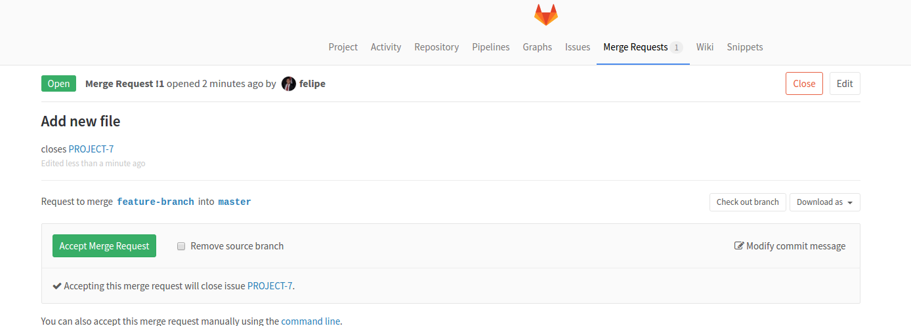
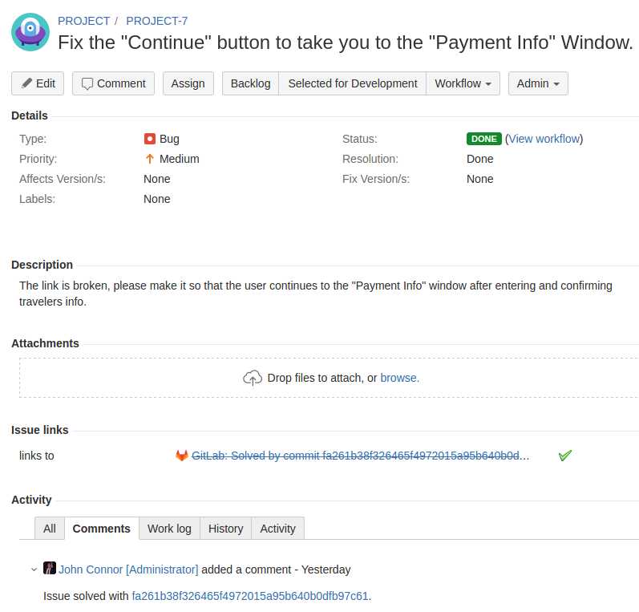

# GitLab JIRA integration

GitLab can be configured to interact with [JIRA]. Configuration happens via
username and password. Connecting to a JIRA server via CAS is not possible.

Each project can be configured to connect to a different JIRA instance or, in
case you have one JIRA instance, you can pre-fill the JIRA service settings page
with a default template. To configure the template, see the
[Services Templates documentation][services-templates].

Once the project is connected to JIRA, you can reference and close the issues
in JIRA directly from GitLab's Merge requests.

## Configuration

The configuration consists of two parts:

- [JIRA configuration](#configuring-jira)
- [GitLab configuration](#configuring-gitlab)

### Configuring JIRA

First things first, we need to create a user in JIRA which will have access to
all projects that need to integrate with GitLab.

We have split this stage in steps so it could be easier to follow.

---

1. Login to your JIRA instance as an administrator and under **Administration**
   go to **User Management** and create a new user.

     

     ---

1. The next step is to create a new user (e.g., `gitlab`) who has write-access
   to projects in JIRA. Enter the user's name and a valid e-mail address in
   order to set-up their password.
   _**Note:** JIRA creates the username automatically by using the e-mail
   prefix. You can change the username later if you want._

     

     ---

1. Now, let's create a `gitlab-developers` group which will have write-access
   to projects in JIRA. Go to the **Groups** tab and select **Create group**.

     

     ---

     Give it an optional description and hit **Create group**.

     

     ---

1. Give the newly-created group write access by going to
   **Application access > View configuration** and adding the `gitlab-developers`
   group to JIRA Core.

     

     ---

1. Add the `gitlab` user to `gitlab-developers` group by going to
   **Users > GitLab user > Add group** and selecting the `gitlab-developers`
   group from the dropdown menu. Notice that the group says _Access_ which is
   what we aim for.

     

---

The JIRA configuration is over. Note the new user `gitlab` and its password as
they will be needed when configuring GitLab in the next section.

### Configuring GitLab

JIRA configuration in GitLab is done via a project's
[**Services**](../project_services/project_services.md).

#### GitLab 7.8 and up

_The currently supported JIRA versions are v6.x and v7.x._

To enable JIRA integration in a project, navigate to the project's
**Settings > Services > JIRA**.

Fill in the required details on the page as described in the table below.

| Field | Description |
| ----- | ----------- |
| `description` | A name for the issue tracker (to differentiate between instances, for instance). |
| `project url` | The URL to the JIRA project which is being linked to this GitLab project. |
| `issues url`  | The URL to the JIRA project issues overview for the project that is linked to this GitLab project. |
| `new issue url` | This is the URL to create a new issue in JIRA for the project linked to this GitLab project. |
| `api url`     | The base URL of the JIRA API. It may be omitted, in which case GitLab will automatically use API version `2` based on the `project url`, i.e. `https://jira.example.com/rest/api/2`. |
| `username` | The username of the user created in [configuring JIRA step](#configuring-jira). |
| `password` |The password of the user created in [configuring JIRA step](#configuring-jira). |
| `JIRA issue transition` | This is the ID of a transition that moves issues to a closed state. You can find this number under JIRA workflow administration ([see screenshot](img/jira_workflow_screenshot.png)).  By default, this ID is `2` (in the example image, this is `2` as well) |

After saving the configuration, your GitLab project will be able to interact
with the linked JIRA project.



---

#### GitLab 6.x-7.7 with JIRA v6.x

_**Note:** GitLab versions 7.8 and up contain various integration improvements.
We strongly recommend upgrading._

In the unfortunate event that you are still using GitLab < 7.8, consult the
[jira_old document](jira_old.md) on how to configure JIRA.

## JIRA issues

### Referencing JIRA Issues

When GitLab project has JIRA issue tracker configured and enabled, mentioning
JIRA issue in GitLab will automatically add a comment in JIRA issue with the
link back to GitLab. This means that in comments in merge requests and commits
referencing an issue, eg. `PROJECT-7`, will add a comment in JIRA issue in the
format:

```
 USER mentioned this issue in LINK_TO_THE_MENTION
```

Where:

| Format | Description |
| ------ | ----------- |
| `USER` | A user that mentioned the issue. This is the link to the user profile in GitLab. |
| `LINK_TO_THE_MENTION` | Link to the origin of mention with a name of the entity where JIRA issue was mentioned. Can be commit or merge request. |



---

### Closing JIRA Issues

JIRA issues can be closed directly from GitLab by using trigger words, eg.
`Resolves PROJECT-1`, `Closes PROJECT-1` or `Fixes PROJECT-1`, in commits and
merge requests. When a commit which contains the trigger word in the commit
message is pushed, GitLab will add a comment in the mentioned JIRA issue.

For example, for project named `PROJECT` in JIRA, we implemented a new feature
and created a merge request in GitLab.

This feature was requested in JIRA issue `PROJECT-7`. Merge request in GitLab
contains the improvement and in merge request description we say that this
merge request `Closes PROJECT-7` issue.

Once this merge request is merged, the JIRA issue will be automatically closed
with a link to the commit that resolved the issue.



---



---

[services-templates]: ../project_services/services_templates.md "Services templates documentation"
[JIRA]: https://www.atlassian.com/software/jira/core "The JIRA Core website"
