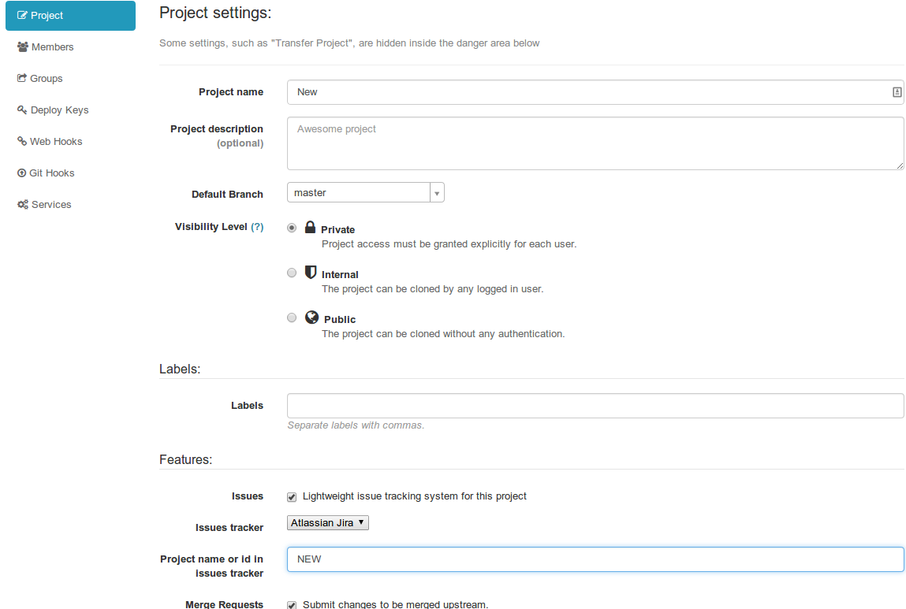
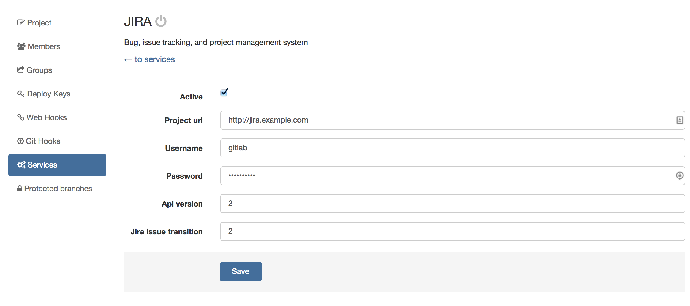

# GitLab 6.x-7.7 with JIRA v6.x

**NOTE: This method is deprecated. GitLab versions 7.8 and up, contain various
integration improvements and we strongly recommend upgrading. The official
supported document on JIRA integration can be found under [JIRA](jira.md).**

---

In `gitlab.yml` enable the JIRA issue tracker section by
[uncommenting these lines][jira-gitlab-yml]. This will make sure that all
issues within GitLab are pointing to the JIRA issue tracker.

After you set this, you will be able to close issues in JIRA by a commit in
GitLab.

Go to your project's **Settings** page and fill in the project name for the
JIRA project:

---

You can also enable the JIRA service that will allow you to interact with JIRA
issues. Go to the **Settings > Services > JIRA** and:

1. Tick the active check box to enable the service
1. Supply the URL to JIRA server, for example https://jira.example.com
1. Supply the username of a user we created under `Configuring JIRA` section,
   for example `gitlab`
1. Supply the password of the user
1. Optional: supply the JIRA API version, default is version `2`
1. Optional: supply the JIRA issue transition ID (issue transition to closed).
   This is dependent on JIRA settings, default is `2`
1. Hit save

[jira-gitlab-yml]: https://gitlab.com/subscribers/gitlab-ee/blob/6-8-stable-ee/config/gitlab.yml.example#L111-115
