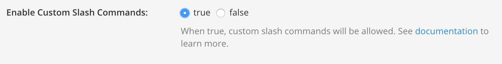

# Mattermost Commands

Mattermost commands give users an extra interface to perform common operations
from the chat environment. This allows one to, for example, create an issue as
soon as the idea was discussed in Mattermost.

## Configuration

### On Mattermost

On Mattermost, an administrator has to enable custom slash commands. To do this,
log on, and go to the system console.

Click **Custom integrations**, and enable the custom slash commands and don't
forget to save your settings.

Now go back to your team page, and go the the configuration page for a new
slash command.

**Integrations** > **Slash Command** > **Add Slash Command**

### On GitLab

On the project you want to configure the slash commands for, go to the
Mattermost Command service. Under settings > **Project Services**.

A screen will appear with all the values you can copy to the Mattermost page you
have just opened.

**Insert screenshot here**

## Usage

A users first interaction with the newly created slash commands will trigger an
authorisation process. This process connects your Mattermost user with your
GitLab user.

After these steps are performed, you can start interacting with GitLab. Maybe
start with `/your-trigger issue show 1` and see what your first issue was on
this project!
