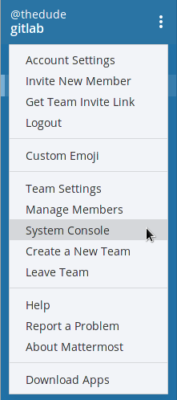
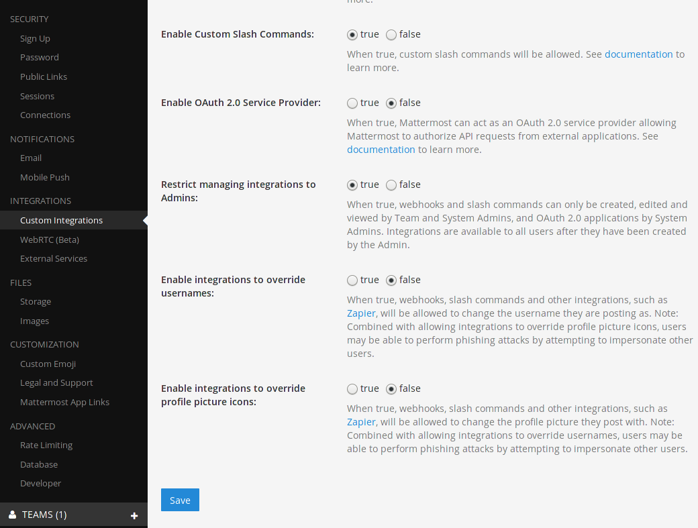
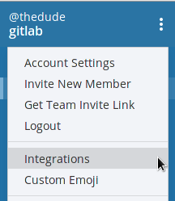
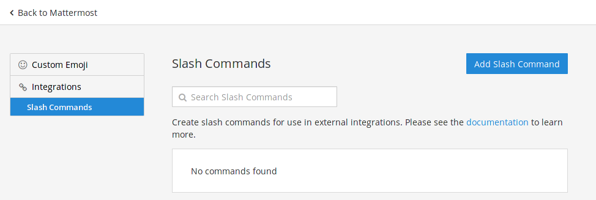
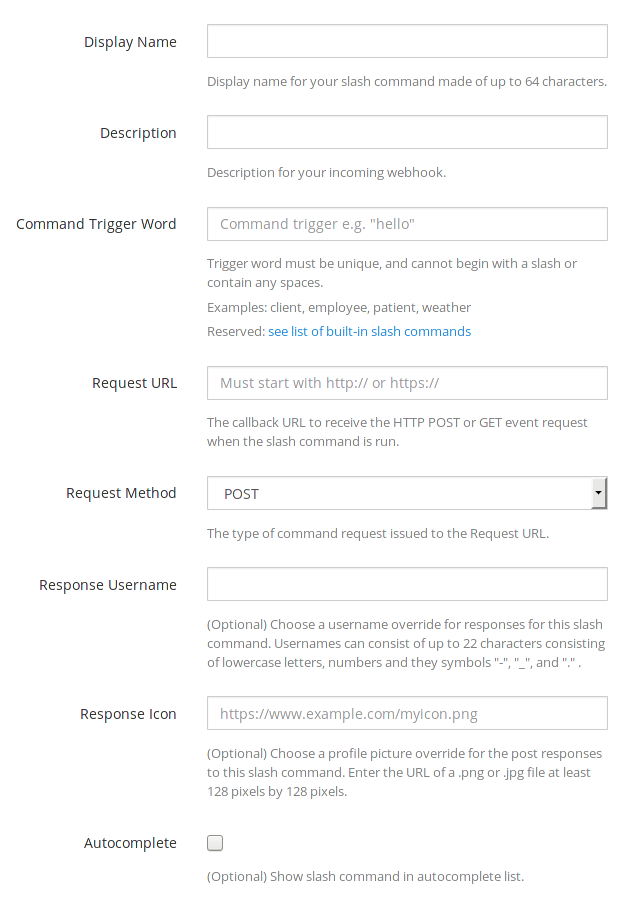
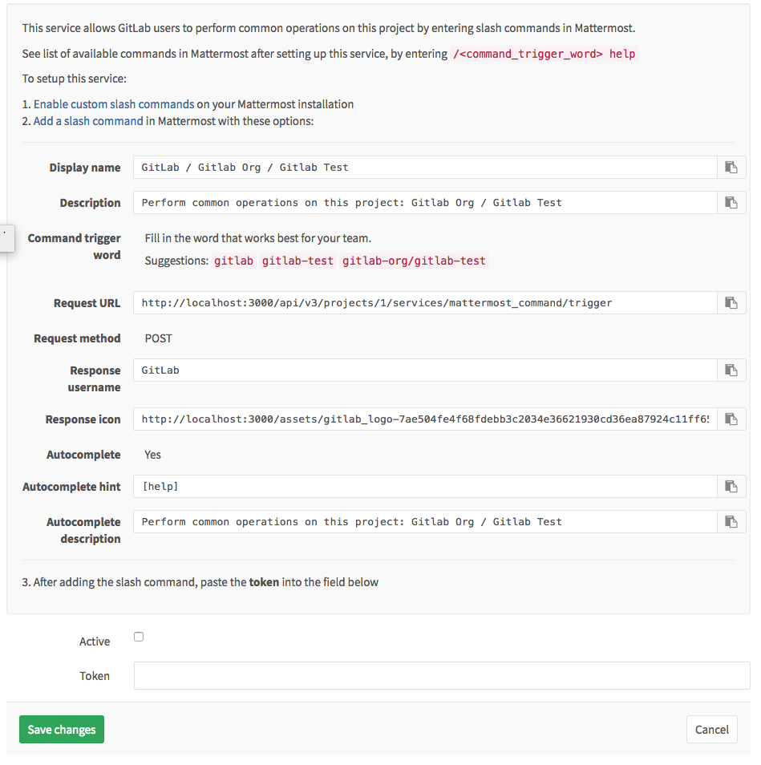
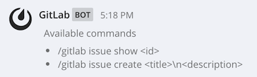

# Mattermost slash commands

> Introduced in GitLab 8.14

Mattermost commands give users an extra interface to perform common operations
from the chat environment. This allows one to, for example, create an issue as
soon as the idea was discussed in Mattermost.

## Prerequisites

Mattermost 3.4 and up is required.

If you have the Omnibus GitLab package installed, Mattermost is already bundled
in it. All you have to do is configure it. Read more in the
[Omnibus GitLab Mattermost documentation][omnimatdocs].

## Configuration

The configuration consists of two parts. First you need to enable the slash
commands in Mattermost and then enable the service in GitLab.


### Step 1. Enable custom slash commands in Mattermost

The first thing to do in Mattermost is to enable the custom slash commands from
the administrator console.

1. Log in with an account that has admin privileges and navigate to the system
   console.

    

    ---

1. Click **Custom integrations** and set **Enable Custom Slash Commands** to
   true.

    

    ---

1. Click **Save** at the bottom to save the changes.

### Step 2. Create a new custom command in Mattermost

Now that you have enabled the custom slash commands:

1. Back to your team page settings, you should see the **Integrations** option.

    

    ---

1. Go to the **Slash Command** integration and add a new one by clicking the
   **Add Slash Command** button.

    

    ---

1. Fill in the options for the custom command.

    

    > **Note:**
    When configuring the GitLab Mattermost command service in the next step,
    you will be presented with some predefined values to paste into the
    Mattermost slash command settings.

1. After you setup all the values, copy the token (we will use it below) and
   click **Done**.

>
[**➔ Read more on Mattermost slash commands**][mmslashdocs].

### Step 3. Configure GitLab

1. Go to your project's settings **Services ➔ Mattermost command**. A screen
   will appear with all the values you can copy to the Mattermost page in the
   previous step.

    

1. Paste the Mattermost token you copied when setting up the Mattermost slash
   command and check the **Active** checkbox.
1. Click **Save changes** for the changes to take effect.

## Authorizing Mattermost to interact with GitLab

The first time a user will interact with the newly created slash commands,
Mattermost will trigger an authorization process.


This will connect connect your Mattermost user with your GitLab user. You can
see all authorized chat accounts in your profile's page under **Chat**.

When the authorization process is complete, you can start interacting with
GitLab using the Mattermost commands.

## Available slash commands

The available slash commands so far are:

- `/<trigger> issue create <title>\n<description>` - Create a new issue to the
  project that `<trigger>` is tied to.
- `/<trigger> issue show <issue-number>` - Show the issue with ID `<issue-number>`
  from the project that `<trigger>` is tied to.
- `/<trigger> deploy <environment> to <environment>` - Start the CI job that
  deploys from an environment to another, for example `staging` to `production`.
  CI must be properly configured.

If you enabled autocomplete when you created the Mattermost command, you can
use the autocomplete hint to see the available commands that can interact
with GitLab. If for example the autocomplete hint was set to `help` and the
command trigger word to `my-project`, then to see all available command type:

```
/my-project help
```



## Permissions

The permissions to run the [available commands](#available-commands) derive from
the [permissions you have on the project](../user/permissions.md#project).

[omnimatdocs]: https://docs.gitlab.com/omnibus/gitlab-mattermost/
[mmslashdocs]: https://docs.mattermost.com/developer/slash-commands.html
