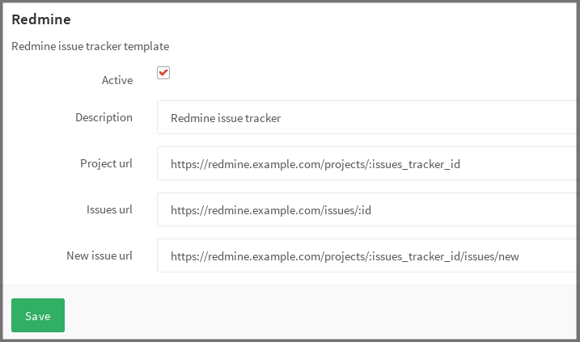

# Services Templates

A GitLab administrator can add a service template that sets a default for each
project. This makes it much easier to configure individual projects.

After the template is created, the template details will be pre-filled on a
project's Service page.

## Enable a Service template

In GitLab's Admin area, navigate to **Service Templates** and choose the
service template you wish to create.

For example, in the image below you can see Redmine.

---

**NOTE:** For each project, you will still need to configure the issue tracking
URLs by replacing `:issues_tracker_id` in the above screenshot with the ID used
by your external issue tracker. Prior to GitLab v7.8, this ID was configured in
the project settings, and GitLab would automatically update the URL configured
in `gitlab.yml`. This behavior is now deprecated and all issue tracker URLs
must be configured directly within the project's **Services** settings.
