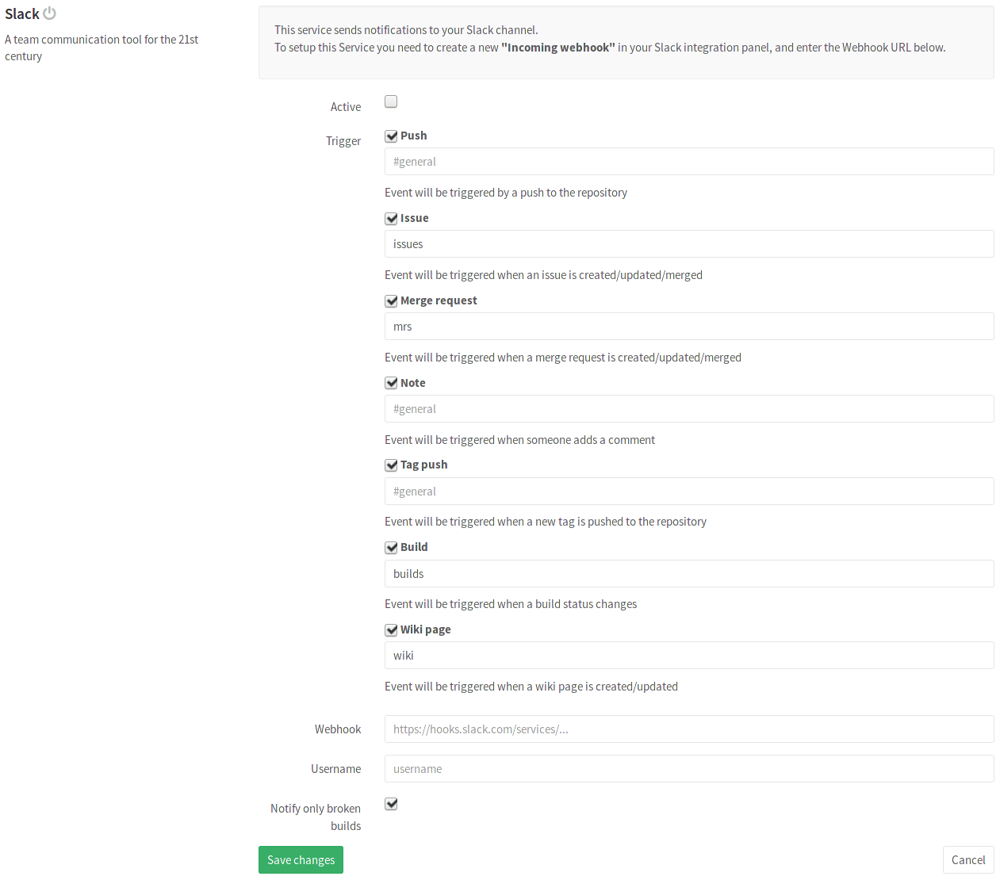

# Slack Service

## On Slack

To enable Slack integration you must create an incoming webhook integration on
Slack:

1. [Sign in to Slack](https://slack.com/signin)
1. Visit [Incoming WebHooks](https://my.slack.com/services/new/incoming-webhook/)
1. Choose the channel name you want to send notifications to.
1. Click **Add Incoming WebHooks Integration**
1. Copy the **Webhook URL**, we'll need this later for GitLab.

## On GitLab

After you set up Slack, it's time to set up GitLab.

Go to your project's **Settings > Services > Slack** and you will see a
checkbox with the following events that can be triggered:

- Push
- Issue
- Merge request
- Note
- Tag push
- Build
- Wiki page

Bellow each of these event checkboxes, you will have an input field to insert
which Slack channel you want to send that event message, with `#general`
being the default. Enter your preferred channel **without** the hash sign (`#`).

At the end, fill in your Slack details:

| Field | Description |
| ----- | ----------- |
| **Webhook**  | The [incoming webhook URL][slackhook] which you have to setup on Slack. |
| **Username** | Optional username which can be on messages sent to slack. Fill this in if you want to change the username of the bot. |
| **Notify only broken builds** | If you choose to enable the **Build** event and you want to be only notified about failed builds. |

After you are all done, click **Save changes** for the changes to take effect.

>**Note:**
You can set "branch,pushed,Compare changes" as highlight words on your Slack
profile settings, so that you can be aware of new commits when somebody pushes
them.

[slackhook]: https://my.slack.com/services/new/incoming-webhook
