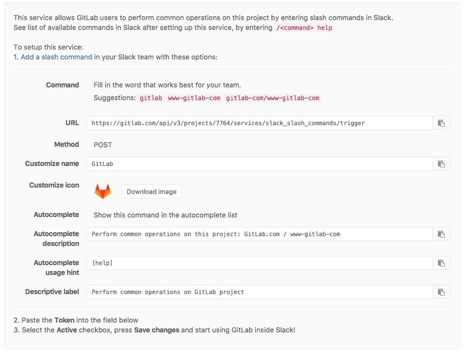

# Slack slash commands

> Introduced in GitLab 8.15

Slack commands give users an extra interface to perform common operations
from the chat environment. This allows one to, for example, create an issue as
soon as the idea was discussed in chat.
For all available commands try the help subcommand, for example: `/gitlab help`, 
all review the [full list of commands](../integrations/chat_commands.md).

## Prerequisites

A [team](https://get.slack.help/hc/en-us/articles/217608418-Creating-a-team) in Slack should be created beforehand, GitLab cannot create it for you.

## Configuration

First, navigate to the Slack Slash commands service page, found at your project's
**Settings** > **Services**, and you find the instructions there:

   

Once you've followed the instructions, mark the service as active and insert the token
you've received from Slack. After saving the service you are good to go!
