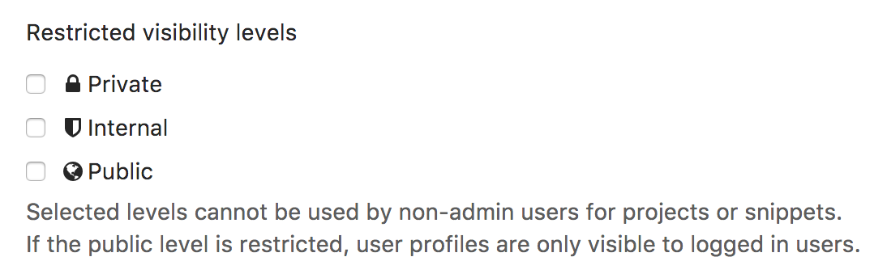

# Public access

GitLab allows [Owners](../user/permissions.md) to set a projects' visibility as **public**, **internal**
or **private**. These visibility levels affect who can see the project in the
public access directory (`/public` under your GitLab instance), like at [https://gitlab.com/public]().

## Visibility of projects

### Public projects

Public projects can be cloned **without any** authentication.

They will be listed in the public access directory (`/public`) for all users.

**Any logged in user** will have [Guest permissions](../user/permissions.md)
on the repository.

### Internal projects

Internal projects can be cloned by any logged in user.

They will also be listed in the public access directory (`/public`), but only for logged
in users.

Any logged in user will have [Guest permissions](../user/permissions.md)
on the repository.

NOTE: **Note:**
From July 2019, the `Internal` visibility setting is disabled for new projects, groups,
and snippets on GitLab.com. Existing projects, groups, and snippets using the `Internal`
visibility setting keep this setting. You can read more about the change in the
[relevant issue](https://gitlab.com/gitlab-org/gitlab-ee/issues/12388).

### Private projects

Private projects can only be cloned and viewed by project members (except for guests).

They will appear in the public access directory (`/public`) for project members only.

### How to change project visibility

1. Go to your project's **Settings**
1. Change "Visibility Level" to either Public, Internal or Private

## Visibility of groups

NOTE: **Note:**
[Starting with](https://gitlab.com/gitlab-org/gitlab-ce/merge_requests/3323) GitLab 8.6,
the group visibility has changed and can be configured the same way as projects.
In previous versions, a group's page was always visible to all users.

Like with projects, the visibility of a group can be set to dictate whether
anonymous users, all signed in users, or only explicit group members can view
it. The restriction for visibility levels on the application setting level also
applies to groups, so if that's set to internal, the explore page will be empty
for anonymous users. The group page now has a visibility level icon.

## Visibility of users

The public page of a user, located at `/username`, is always visible whether
you are logged in or not.

When visiting the public page of a user, you can only see the projects which
you are privileged to.

If the public level is restricted, user profiles are only visible to logged in users.

## Restricting the use of public or internal projects

In the Admin area under **Settings** (`/admin/application_settings`), you can
restrict the use of visibility levels for users when they create a project or a
snippet:

This is useful to prevent people exposing their repositories to public
by accident. The restricted visibility settings do not apply to admin users.

<!-- ## Troubleshooting

Include any troubleshooting steps that you can foresee. If you know beforehand what issues
one might have when setting this up, or when something is changed, or on upgrading, it's
important to describe those, too. Think of things that may go wrong and include them here.
This is important to minimize requests for support, and to avoid doc comments with
questions that you know someone might ask.

Each scenario can be a third-level heading, e.g. `### Getting error message X`.
If you have none to add when creating a doc, leave this section in place
but commented out to help encourage others to add to it in the future. -->
