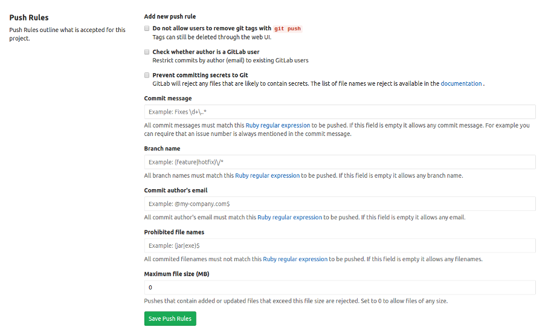

# Push Rules

Sometimes you need additional control over pushes to your repository.
GitLab already offers protected branches.
But there are cases when you need some specific rules like preventing git tag removal or enforcing a special format for commit messages.
GitLab Enterprise Edition offers a user-friendly interface for such cases.

Push Rules are defined per project so you can have different rules applied to different projects depends on your needs.
Push Rules settings can be found at Project settings -> Push Rules page.

## New hooks

If you are a subscriber and need a hook that is not there yet we would be glad to add it for free, please contact support to request one.

## How to use

Let's assume you have the following requirements for your workflow:

* every commit should reference a reference JIRA issue. For example: `Refactored css. Fixes JIRA-123. `
* users should not be able to remove git tags with `git push`

All you need to do is write simple regular expression that requires mention of JIRA issue in a commit message.
It can be something like this `/JIRA\-\d+/`.
Just paste regular expression into commit message textfield(without start and ending slash) and save changes.
See the screenshot below:

Now when a user tries to push a commit like `Bugfix` - their push will be declined.
And pushing commit with message like `Bugfix according to JIRA-123` will be accepted.
