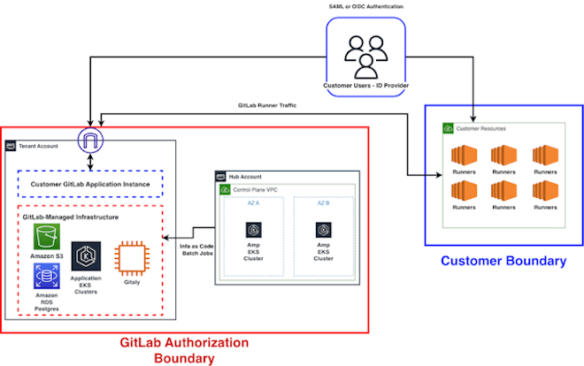



- Tier: Ultimate
- Offering: GitLab Dedicated for Government



GitLab Dedicated for Government maintains a FedRAMP Moderate Authorization that encompasses a
shared responsibility model with federal agencies. Federal agencies must understand their
responsibilities when operating a Dedicated for Government GitLab instance, and which
responsibilities they can inherit from the GitLab authorization. This document helps you understand:

- The authorization boundary and high-level components.
- Your responsibilities for managing security and compliance within your GitLab instance.
- Optional features and functionality that could affect the shared responsibility model.

## Resources

For a detailed breakdown of customer responsibilities tied to NIST 800-53 controls,
request the GitLab Dedicated for Government FedRAMP package using the
[FedRAMP package request form](https://www.fedramp.gov/resources/documents/Agency_Package_Request_Form.pdf).
The GitLab package ID is `FR2411959145`. The Control Implementation Summary/Customer Responsibility
Matrix Excel template, available in the FedRAMP package on Connect.gov, is essential for any
federal agency that needs to understand their responsibilities.

The [GitLab Dedicated for Government secure configuration guide](dedicated_for_government_secure_config_guide.md)
builds on this responsibility guide with specific configuration guidance and mappings to GitLab
documentation.

## Authorization boundary

## Responsibility overview

The following sections are intended to help federal agencies understand the broad responsibilities covered by customers and GitLab in a standard GitLab Dedicated for Government deployment. The sections will be broken out into functional sections which outline the customer and GitLab-owned responsibilities. It is important for federal agencies to work with their GitLab partners to validate responsibilities as applicable to their specific deployment. Optional features and customizations that may impact customer responsibilities:

1. [Bring Your Own Domain](../subscriptions/gitlab_dedicated/_index.md#custom-domains) - Customers can configure a custom domain rather than using the default domain.
1. [Self-managed runners](../subscriptions/gitlab_dedicated/_index.md#self-managed-runners) - Customers can connect runners to support CI/CD workloads. 
1. Federal agency identity provider - GitLab supports the use of SAML and OpenID Connect (OIDC) providers for Single Sign-On. In order to support PIV/CAC authentication, customers must bring their own identity provider. 
1. [Enhanced network connectivity](../subscriptions/gitlab_dedicated/_index.md#secure-networking) - Customers may elect to configure IP Allowlists with the assistance of GitLab engineers, either through application configurations or infrastructure settings. Private connectivity is supported via PrivateLink for inbound and outbound connections. 
1. [Bring-Your-Own-Keys (BYOK)](../administration/dedicated/encryption.md#customer-managed-encryption) - Customers may elect to provide their own encryption keys.

### Infrastructure management

**GitLab Responsibilities**

GitLab is responsible for the following:

- Virtual Machine and K8s patching - Dedicated for Government engineers manage the underlying infrastructure on AWS for each customer tenant. Maintenance is scheduled weekly to keep underlying infrastructure updated with the latest security patches. 
- Infrastructure hardening, including application of STIG/CIS benchmarks. 
- Encryption of data at rest and in transit with FIPS-validated ciphers.
- Platform Uptime - Dedicated for Government is responsible for managing backups, failovers, and any testing to validate RTO and RPO for the environment.
- Maintenance of IP Allowlists within the AWS network infrastructure. Customers can provide domains and customer IP lists that should be explicitly allowed to connect to their GitLab instance. GitLab is responsible for configuring those allowlists, once requested. 
- Maintenance of Cloudflare Web Application Firewall and DNS.
- If electing to use BYOK, GitLab must provide an AWS account ID.
- Configuring DMARC and Spam protections for outbound emails generated by the GitLab application.

**Customer Responsibilities**

Customers are responsible for the following:

- Maintenance of any infrastructure connected to the Dedicated for Government boundary.
- Configuring IP Allowlists within the application.
- If electing to use the Bring Your Own Domain feature, the domain must be configured in compliance with FedRAMP requirements such as DNSSEC. 
- If electing to use BYOK, creating and managing KMS keys and key policies, granting access to the GitLab-provided AWS account ID.
- Requesting specific infrastructure configurations via support issues, such as:
  - Reference architecture
  - Total repository capacity
  - Tenant name
  - Availability zones
  - License keys

## Responsibilities

The following sections help federal agencies understand the broad responsibilities covered by
customers and GitLab in a standard GitLab Dedicated for Government deployment. Each section is
organized by functional area and outlines customer and GitLab-owned responsibilities. Work with
your GitLab partners to validate responsibilities as applicable to your specific deployment.

Optional features and customizations that may affect customer responsibilities:

- [Custom domains](../subscriptions/gitlab_dedicated/_index.md#custom-domains): Configure
  a custom domain rather than using the default domain.
- [Self-managed runners](../subscriptions/gitlab_dedicated/_index.md#self-managed-runners):
  Connect runners to support CI/CD workloads.
- Federal agency identity provider: GitLab supports SAML and OpenID Connect (OIDC) for single
  sign-on. To support PIV/CAC authentication, you must bring your own identity provider.
- [Enhanced network connectivity](../subscriptions/gitlab_dedicated/_index.md#secure-networking):
  Configure IP allowlists with the assistance of GitLab engineers, either through application
  configurations or infrastructure settings. Private connectivity is supported via PrivateLink
  for inbound and outbound connections.
- [Customer-managed encryption](../administration/dedicated/encryption.md#customer-managed-encryption):
  Provide your own encryption keys.

### Infrastructure management

GitLab is responsible for the following:

- Dedicated for Government engineers manage virtual machine and Kubernetes patching for each
  customer tenant on AWS. Maintenance is scheduled weekly to keep underlying infrastructure
  updated with the latest security patches.
- Infrastructure is hardened with STIG and CIS benchmarks applied.
- Data at rest and in transit is encrypted with FIPS-validated ciphers.
- Dedicated for Government manages backups, failovers, and testing to validate RTO and RPO
  for the environment.
- IP allowlists are maintained within the AWS network infrastructure. You can provide domains
  and IP lists to be explicitly allowed to connect to your GitLab instance. GitLab configures
  those allowlists after you request them.
- The Cloudflare Web Application Firewall and DNS are maintained by GitLab.
- If you elect to use BYOK, GitLab provides an AWS account ID.
- DMARC and spam protections are configured for outbound emails generated by the GitLab
  application.

Customers are responsible for the following:

- Maintaining any infrastructure connected to the Dedicated for Government boundary.
- Configuring IP allowlists within the application.
- If you use the Bring Your Own Domain feature, configuring the domain in compliance with
  FedRAMP requirements such as DNSSEC.
- If you use BYOK, creating and managing KMS keys and key policies, and granting access to
  the GitLab-provided AWS account ID.
- Requesting specific infrastructure configurations through support issues, such as:
  - Reference architecture
  - Total repository capacity
  - Tenant name
  - Availability zones
  - License keys
  - Root user passwords
  - Release rollout and maintenance schedule

### GitLab application

GitLab is responsible for the following:

- The GitLab application is upgraded during weekly maintenance windows.

Customers are responsible for the following:

- Configuring the GitLab application, including CI/CD and group and project-level settings.
- Pulling the latest GitLab-provided containers, which may run in customer-managed workloads.

### Monitoring

GitLab is responsible for the following:

- Security events generated by AWS infrastructure and security tooling are monitored by
  GitLab.
- Infrastructure metrics, including uptime and platform stability metrics, are monitored by
  GitLab.
- Audit logs are retained in compliance with regulatory requirements.
- GitLab responds to security incidents from the underlying infrastructure components within
  the authorization boundary, including reporting incidents to affected customers and US-CERT
  in compliance with NIST 800-61.

Customers are responsible for the following:

- Consuming application logs. Request log access in S3 through GitLab Support tickets.
- Monitoring any self-managed infrastructure.
- Retaining any audit logs generated by self-managed infrastructure connected to the customer
  instance.
- Reporting incidents detected within GitLab application logs or self-managed infrastructure
  that could affect the FedRAMP boundary.
  
### Vulnerability management

GitLab is responsible for the scanning and patching of the following:

- Web application. GitLab scans a representative web application with GitLab DAST and patches
  identified vulnerabilities.
- Containers. GitLab scans and patches all container images in AWS Elastic Container Registry,
  which are used to build the running containers within production workloads. GitLab also
  scans and patches the following container images, which you can pull from GitLab and run in
  your own infrastructure and CI/CD workloads:
  - GitLab Dynamic Application Security Testing image
  - GitLab Container Scanner image
  - GitLab API Security image
  - GitLab Static Application Security Testing image
  - GitLab Infrastructure as Code Analyzer image
  - GitLab Secrets Detection image
  - GitLab Runner and Runner Helper images
  - GitLab Dependency Scanning image
- Infrastructure. GitLab scans all VMs and AMIs in use within the Dedicated for Government
  authorization boundary.

Customers are responsible for the following:

- Scanning and patching assets deployed outside of, but connected to, the authorization
  boundary.
- Establishing a process to detect and remediate vulnerabilities in deployed images.
- Triaging and remediating vulnerabilities specific to code managed within your GitLab
  instance or generated from your CI/CD workloads.
- Scanning any GitLab-provided images you pull and run in your own infrastructure.
- Coordinating with GitLab when you find vulnerabilities in GitLab-provided images to
  determine patching timelines.
  
### Identity and access management

GitLab is responsible for the following:

- Supporting integrations through SAML and OIDC.
- Provisioning the first administrator for your GitLab instance.
- Managing access to the infrastructure within the authorization boundary.

Customers are responsible for the following:

- Managing your identity and access management solution.
- Distributing authenticators to employees, including FIPS-compliant and phishing-resistant
  second factors.
- Managing user access within your GitLab instance.

### Compliance

GitLab is responsible for the following:

- Conducting annual audits and penetration tests of the authorization boundary.
- Submitting significant change requests.
- Maintaining continuous monitoring artifacts, including the Plan of Actions and Milestones.
- Maintaining the System Security Plan and attachments.

Customers are responsible for the following:

- Submitting agency authorization paperwork and materials, including any infrastructure
  connected to the Dedicated for Government authorization boundary.
- Reviewing monthly continuous monitoring submissions with the GitLab Information System
  Security Officer (ISSO).
