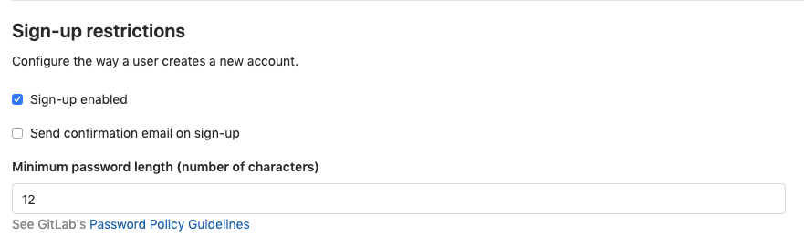

# Custom password length limits **(FREE SELF)**

By default, GitLab supports passwords with the following lengths:

- Minimum: 8 characters
- Maximum: 128 characters

GitLab administrators can modify password lengths:

- Using the GitLab UI. [From](https://gitlab.com/gitlab-org/gitlab/-/merge_requests/20661) GitLab
  12.6, this is the only available option.
- Using configuration file. Up to GitLab 12.5.

Changing the minimum or maximum length does not affect existing user passwords. Existing users are
not asked to reset their password to adhere to the new limits. The new limit restriction applies
only during new user sign-ups and when an existing user performs a password reset.

## Modify minimum password length using GitLab UI

> [Introduced](https://gitlab.com/gitlab-org/gitlab/-/merge_requests/20661) in GitLab 12.6

The user password length is set to a minimum of 8 characters by default.

To change the minimum password length using GitLab UI:

1. On the top bar, select **Menu >** **{admin}** **Admin**.
1. On the left sidebar, select **Settings > General** and expand **Sign-up restrictions**.

   

1. Enter a **Minimum password length** value greater than or equal to `8`.
1. Select **Save changes**.

## Modify maximum password length using configuration file

From GitLab 12.6, the minimum password length set in this configuration file is ignored. Minimum password lengths must instead be modified via the [GitLab UI](#modify-minimum-password-length-using-gitlab-ui).

The user password length is set to a maximum of 128 characters by default.
To change that for installations from source:

1. Edit `devise_password_length.rb`:

   ```shell
   cd /home/git/gitlab
   sudo -u git -H cp config/initializers/devise_password_length.rb.example config/initializers/devise_password_length.rb
   sudo -u git -H editor config/initializers/devise_password_length.rb
   ```

1. Change the new password length limits:

   ```ruby
   config.password_length = 12..135
   ```

   In this example, the minimum length is 12 characters, and the maximum length
   is 135 characters.

1. [Restart GitLab](../administration/restart_gitlab.md#installations-from-source)
   for the changes to take effect.

<!-- ## Troubleshooting

Include any troubleshooting steps that you can foresee. If you know beforehand what issues
one might have when setting this up, or when something is changed, or on upgrading, it's
important to describe those, too. Think of things that may go wrong and include them here.
This is important to minimize requests for support, and to avoid doc comments with
questions that you know someone might ask.

Each scenario can be a third-level heading, e.g. `### Getting error message X`.
If you have none to add when creating a doc, leave this section in place
but commented out to help encourage others to add to it in the future. -->
