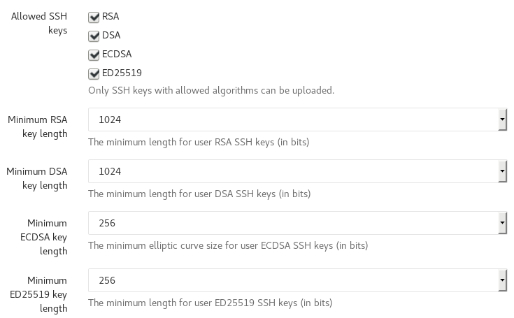

# Restrict allowed SSH key technologies and minimum length

`ssh-keygen` allows users to create RSA keys with as few as 768 bits, which
falls well below recommendations from certain standards groups (such as the US
NIST). Some organizations deploying GitLab will need to enforce minimum key
strength, either to satisfy internal security policy or for regulatory
compliance.

Similarly, certain standards groups recommend using RSA, ECDSA, or ED25519 over
the older DSA, and administrators may need to limit the allowed SSH key
algorithms.

GitLab allows you to restrict the allowed SSH key technology as well as specify
the minimum key length for each technology.

In the Admin area under **Settings** (`/admin/application_settings`), look for
the "Visibility and Access Controls" area:

