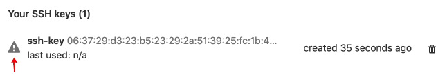

# Restrict allowed SSH key technologies and minimum length

`ssh-keygen` allows users to create RSA keys with as few as 768 bits, which
falls well below recommendations from certain standards groups (such as the US
NIST). Some organizations deploying GitLab need to enforce minimum key
strength, either to satisfy internal security policy or for regulatory
compliance.

Similarly, certain standards groups recommend using RSA, ECDSA, or ED25519 over
the older DSA, and administrators may need to limit the allowed SSH key
algorithms.

GitLab allows you to restrict the allowed SSH key technology as well as specify
the minimum key length for each technology:

1. On the top bar, select **Menu >** **{admin}** **Admin**.
1. On the left sidebar, select **Settings > General** (`/admin/application_settings/general`).
1. Expand the **Visibility and access controls** section:

   

If a restriction is imposed on any key type, users cannot upload new SSH keys that don't meet the
requirement. Any existing keys that don't meet it are disabled but not removed and users cannot to
pull or push code using them.

An icon is visible to the user of a restricted key in the SSH keys section of their profile:

Hovering over this icon tells you why the key is restricted.

<!-- ## Troubleshooting

Include any troubleshooting steps that you can foresee. If you know beforehand what issues
one might have when setting this up, or when something is changed, or on upgrading, it's
important to describe those, too. Think of things that may go wrong and include them here.
This is important to minimize requests for support, and to avoid doc comments with
questions that you know someone might ask.

Each scenario can be a third-level heading, e.g. `### Getting error message X`.
If you have none to add when creating a doc, leave this section in place
but commented out to help encourage others to add to it in the future. -->
