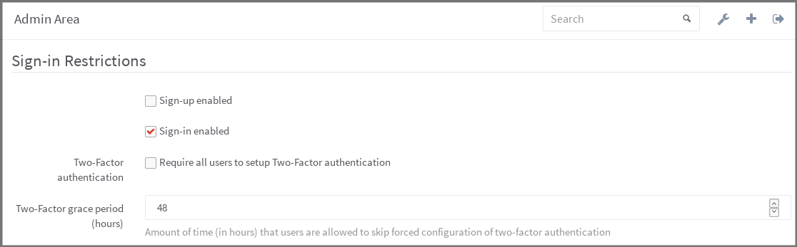

# Enforce Two-factor Authentication (2FA)

Two-factor Authentication (2FA) provides an additional level of security to your
users' GitLab account. Once enabled, in addition to supplying their username and
password to login, they'll be prompted for a code generated by an application on
their phone.

You can read more about it here:
[Two-factor Authentication (2FA)](../profile/two_factor_authentication.md)

## Enabling 2FA

Users on GitLab, can enable it without any admin's intervention. If you want to
enforce everyone to setup 2FA, you can choose from two different ways:

 1. Enforce on next login
 2. Suggest on next login, but allow a grace period before enforcing.

In the Admin area under **Settings** (`/admin/application_settings`), look for
the "Sign-in Restrictions" area, where you can configure both.

If you want 2FA enforcement to take effect on next login, change the grace
period to `0`.

---



---

## Disabling 2FA for everyone

There may be some special situations where you want to disable 2FA for everyone
even when forced 2FA is disabled. There is a rake task for that:

```
# Omnibus installations
sudo gitlab-rake gitlab:two_factor:disable_for_all_users

# Installations from source
sudo -u git -H bundle exec rake gitlab:two_factor:disable_for_all_users RAILS_ENV=production
```

**IMPORTANT: this is a permanent and irreversible action. Users will have to
    reactivate 2FA from scratch if they want to use it again.**
