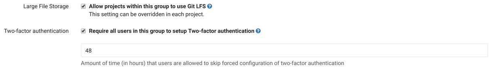

# Enforce Two-factor Authentication (2FA)

Two-factor Authentication (2FA) provides an additional level of security to your
users' GitLab account. Once enabled, in addition to supplying their username and
password to login, they'll be prompted for a code generated by an application on
their phone.

You can read more about it here:
[Two-factor Authentication (2FA)](../profile/two_factor_authentication.md)

## Enforcing 2FA for all users

Users on GitLab, can enable it without any admin's intervention. If you want to
enforce everyone to set up 2FA, you can choose from two different ways:

- Enforce on next login.
- Suggest on next login, but allow a grace period before enforcing.

In the Admin area under **Settings** (`/admin/application_settings`), look for
the "Sign-in Restrictions" area, where you can configure both.

If you want 2FA enforcement to take effect on next login, change the grace
period to `0`.

---


---

## Enforcing 2FA for all users in a group

If you want to enforce 2FA only for certain groups, you can enable it in the
group settings and specify a grace period as above. To change this setting you
need to be administrator or owner of the group.

If there are multiple 2FA requirements (i.e. group + all users, or multiple
groups) the shortest grace period will be used.

---



---

## Disabling 2FA for everyone

There may be some special situations where you want to disable 2FA for everyone
even when forced 2FA is disabled. There is a rake task for that:

```
# Omnibus installations
sudo gitlab-rake gitlab:two_factor:disable_for_all_users

# Installations from source
sudo -u git -H bundle exec rake gitlab:two_factor:disable_for_all_users RAILS_ENV=production
```

**IMPORTANT: this is a permanent and irreversible action. Users will have to
    reactivate 2FA from scratch if they want to use it again.**
