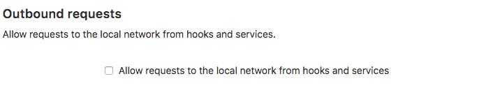

# Webhooks and insecure internal web services

If you have non-GitLab web services running on your GitLab server or within its local network, these may be vulnerable to exploitation via Webhooks.

With [Webhooks](../user/project/integrations/webhooks.md), you and your project masters and owners can set up URLs to be triggered when specific things happen to projects. Normally, these requests are sent to external web services specifically set up for this purpose, that process the request and its attached data in some appropriate way.

Things get hairy, however, when a Webhook is set up with a URL that doesn't point to an external, but to an internal service, that may do something completely unintended when the webhook is triggered and the POST request is sent.

Because Webhook requests are made by the GitLab server itself, these have complete access to everything running on the server (http://localhost:123) or within the server's local network (http://192.168.1.12:345), even if these services are otherwise protected and inaccessible from the outside world.

If a web service does not require authentication, Webhooks can be used to trigger destructive commands by getting the GitLab server to make POST requests to endpoints like "http://localhost:123/some-resource/delete".

To prevent this type of exploitation from happening, starting with GitLab 10.6, all Webhook requests to the current GitLab instance server address and/or in a private network will be forbidden by default. That means that all requests made to 127.0.0.1, ::1 and 0.0.0.0, as well as IPv4 10.0.0.0/8, 172.16.0.0/12, 192.168.0.0/16 and IPv6 site-local (ffc0::/10) addresses won't be allowed.

This behavior can be overridden by enabling the option *"Allow requests to the local network from hooks and services"* in the *"Outbound requests"* section inside the Admin area under **Settings** (`/admin/application_settings`):

>**Note:**
*System hooks* are exempt from this protection because they are set up by admins.
