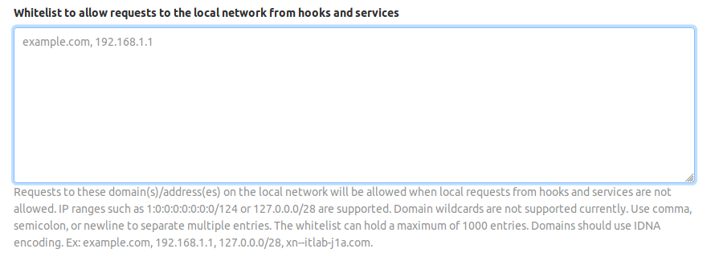

# Webhooks and insecure internal web services

If you have non-GitLab web services running on your GitLab server or within its
local network, these may be vulnerable to exploitation via Webhooks.

With [Webhooks](../user/project/integrations/webhooks.md), you and your project
maintainers and owners can set up URLs to be triggered when specific changes
occur in your projects. Normally, these requests are sent to external web
services specifically set up for this purpose, that process the request and its
attached data in some appropriate way.

Things get hairy, however, when a Webhook is set up with a URL that doesn't
point to an external, but to an internal service, that may do something
completely unintended when the webhook is triggered and the POST request is
sent.

Webhook requests are made by the GitLab server itself and use a single
(optional) secret token per hook for authorization (instead of a user or
repo-specific token). As a result, these may have broader access than
intended to everything running on the server hosting the webhook (which
may include the GitLab server or API itself, e.g., `http://localhost:123`).
Depending on the called webhook, this may also result in network access
to other servers within that webhook server's local network (e.g.,
`http://192.168.1.12:345`), even if these services are otherwise protected
and inaccessible from the outside world.

If a web service does not require authentication, Webhooks can be used to
trigger destructive commands by getting the GitLab server to make POST requests
to endpoints like `http://localhost:123/some-resource/delete`.

To prevent this type of exploitation from happening, starting with GitLab 10.6,
all Webhook requests to the current GitLab instance server address and/or in a
private network will be forbidden by default. That means that all requests made
to `127.0.0.1`, `::1` and `0.0.0.0`, as well as IPv4 `10.0.0.0/8`, `172.16.0.0/12`,
`192.168.0.0/16` and IPv6 site-local (`ffc0::/10`) addresses won't be allowed.

This behavior can be overridden by enabling the option *"Allow requests to the
local network from web hooks and services"* in the *"Outbound requests"* section
inside the Admin area under **Settings**
(`/admin/application_settings/network`):


NOTE: **Note:**
*System hooks* are enabled to make requests to local network by default since they are
set up by administrators. However, you can turn this off by disabling the
**Allow requests to the local network from system hooks** option.

## Whitelist for local requests

> [Introduced](https://gitlab.com/gitlab-org/gitlab-foss/issues/44496) in GitLab 12.2

You can allow certain domains and IP addresses to be accessible to both *system hooks*
and *webhooks* even when local requests are not allowed by adding them to the
whitelist. Navigate to **Admin Area > Settings > Network** (`/admin/application_settings/network`)
and expand **Outbound requests**:



The whilelist entries can be separated by semicolons, commas or whitespaces
(including newlines) and be in different formats like hostnames, IP addresses and/or
IP ranges. IPv6 is supported. Hostnames that contain unicode characters should
use IDNA encoding.

The whitelist can hold a maximum of 1000 entries. Each entry can be a maximum of
255 characters.

Example:

```text
example.com;gitlab.example.com
127.0.0.1,1:0:0:0:0:0:0:1
127.0.0.0/8 1:0:0:0:0:0:0:0/124
```

NOTE: **Note:**
Wildcards (`*.example.com`) and ports (`127.0.0.1:3000`) are not currently supported.

<!-- ## Troubleshooting

Include any troubleshooting steps that you can foresee. If you know beforehand what issues
one might have when setting this up, or when something is changed, or on upgrading, it's
important to describe those, too. Think of things that may go wrong and include them here.
This is important to minimize requests for support, and to avoid doc comments with
questions that you know someone might ask.

Each scenario can be a third-level heading, e.g. `### Getting error message X`.
If you have none to add when creating a doc, leave this section in place
but commented out to help encourage others to add to it in the future. -->
